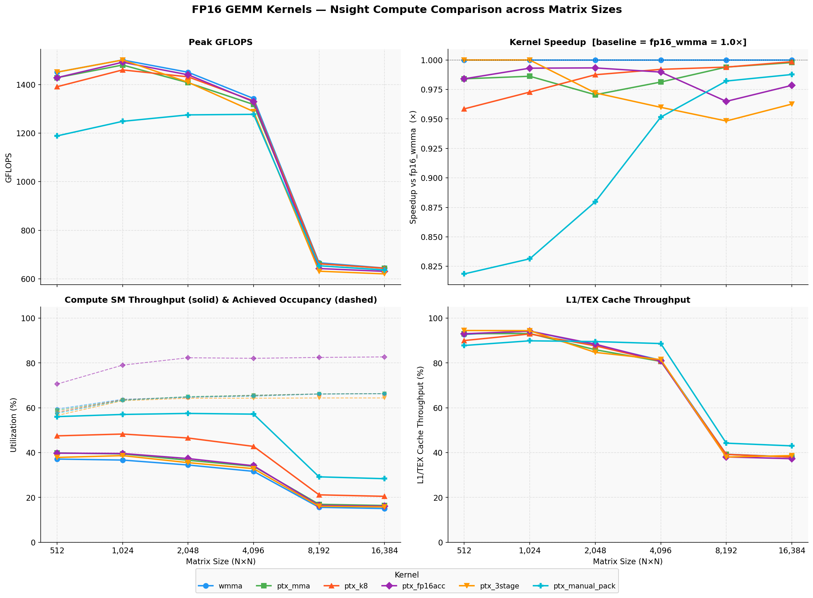

# TensorCorePTX — PTX-first Tensor Core GEMM Exploration

This repository collects findings, experiments, and design notes for implementing high-performance PTX GEMM kernels using cp.async, ldmatrix, and mma.sync on modern NVIDIA architectures (Ada/L4/SM89). The focus is a clean PTX-first path: FP16 baseline, then expand per-precision (FP8, INT8, INT4).

## Table of Contents
- [Overview](#overview)
- [Run 1 — FP16 Profiling Results](#run-1--fp16---profiling-results)
- [Run 2 — INT8 Profiling Results](#run-2--int8---profiling-results)
- [Data Movement](#data-movement)
- [Shared Memory Layout](#shared-memory-layout)
- [mma.sync Tile Shapes](#mmasync-tile-shapes)
- [Async Pipeline Stages](#async-pipeline-stages)
- [Per-Precision Investigation](#per-precision-investigation)
- [Advanced Topics](#advanced-topics)
- [Profiling Checkpoints](#profiling-checkpoints)
- [Natural Build Order](#natural-build-order)

## Overview

Goal: implement a production-grade GEMM with PTX using `cp.async` → `ldmatrix` → `mma.sync` primitives, minimizing host-side transformations. `fp16_wmma` (CUDA WMMA intrinsics) serves as the performance baseline; the PTX-first path is benchmarked against it to determine whether explicit PTX control over instruction selection and scheduling can exceed what the compiler generates. Evaluate trade-offs across precisions and pipeline depths.

---

## Run 1 — fp16 - Profiling Results

> Full Summary: [`prof/md/run1/ncu_summary.md`](prof/md/run1/ncu_summary.md)



Six FP16 GEMM kernels were profiled with Nsight Compute across matrix sizes N = 512 → 16384 (square, FP16 inputs, FP32 accumulation). The four tracked metrics — GFLOPS, Compute (SM) Throughput %, Achieved Occupancy %, and L1/TEX Cache Throughput % — reveal two distinct operating regimes separated by an L2 capacity cliff between N = 4096 and N = 8192.

**Compute-bound regime (N ≤ 4096):** All kernels sustain 1,280–1,500 GFLOPS. `fp16_ptx_manual_pack` has the highest Compute (SM) % (~57%) and `fp16_ptx_k8` is second (~47%), but both are still slower than `fp16_wmma` — the baseline WMMA intrinsic path. The penalty ranges from +1% (`ptx_mma`, `ptx_k8`) up to +22% (`ptx_manual_pack`) at N = 512 due to unrecovered packing overhead at small tile counts. No hand-written PTX variant outperforms the compiler-optimised WMMA path in this regime.

**Memory-bound regime (N ≥ 8192):** Once the matrices (~537 MB combined at N = 8192, FP16 A/B + FP32 C) exceed L2 capacity, every kernel stalls on DRAM. L1/TEX throughput collapses from ~90% to ~38%, GFLOPS halves to 620–666, and all slowdown differences shrink to < 1%. The instruction mix becomes irrelevant — bandwidth is the sole bottleneck.

**`fp16_ptx_fp16acc` occupancy anomaly:** Using FP16 accumulators halves the accumulator register count, lifting Achieved Occupancy to 70–82% vs 56–66% for all other kernels. Despite this, GFLOPS are not higher — confirming that occupancy alone does not drive throughput when the kernel is not latency-limited by a warp-count shortage.

**Next steps:** (1) verify tensor-core `mma` instructions are actually being issued via `inst_executed_pipe_tensor`; (2) profile DRAM bandwidth to quantify saturation at large sizes; (3) improve shared-memory tiling to recover L1/TEX utilisation in the compute-bound region; (4) extend triple-buffered `cp.async` pipeline (`ptx_3stage`) more aggressively to mask L2 latency at the cliff boundary.

| Kernel | SRAM→Regs | mma.sync shape | Acc type | Pipeline | Notes |
|---|---|---|---|---|---|
| `fp16_wmma` | `wmma::load_matrix_sync` | m16n16k16 (WMMA) | f32 | 2-stage cp.async | WMMA baseline; no explicit PTX |
| `fp16_ptx_mma` | `ldmatrix.x4` / `.x2.trans` | m16n8k16 × 2 | f32 | 2-stage cp.async | First pure-PTX kernel |
| `fp16_ptx_k8` | `ldmatrix.x2` / `.x1.trans` | m16n8k8 × 4 | f32 | 2-stage cp.async | Narrower K tile; 4 MMA calls per K-step |
| `fp16_ptx_fp16acc` | `ldmatrix.x4` / `.x2.trans` | m16n8k16 × 2 | f16 (packed) | 2-stage cp.async | Half the accumulator registers vs f32 |
| `fp16_ptx_3stage` | `ldmatrix.x4` / `.x2.trans` | m16n8k16 × 2 | f32 | **3-stage** cp.async | `wait_group 1`; one extra SRAM buffer to hide L2 latency |
| `fp16_ptx_manual_pack` | 4+2 scalar `ld.shared` + `mov.b32` | m16n8k16 × 2 | f32 | 2-stage cp.async | No `ldmatrix`; exposes its instruction-count cost |

---

## Run 2 — INT8 - Profiling Results

> Full Analysis: [`prof/md/run2/ncu_details.md`](prof/md/run2/ncu_details.md)

Six INT8 GEMM kernels were profiled with Nsight Compute across matrix sizes N = 512 → 8192 (square, INT8 A/B inputs, INT32 accumulation, no in-kernel dequant). Performance is measured relative to `int8_wmma` (the WMMA-API baseline).


**Speedup / slowdown vs `int8_wmma` (negative = faster):**

| Size | k32 | k16 | manual_pack | 3stage |
|---|---|---|---|---|
| 512 | **−23%** | +35% | +5% | ~0% |
| 1024 | **−29%** | +20% | +5% | +4% |
| 2048 | **−30%** | +12% | +4% | +20% |
| 4096 | **−33%** | +7% | +2% | +37% |
| 8192 | **−43%** | −32% | −28% | −4% |

**`int8_ptx_mma_k32` is the fastest kernel at every size**, ranging from 23% faster than `int8_wmma` at N=512 up to 43% faster at N=8192. Its advantage is rooted in instruction count: it executes 25–43% fewer instructions than wmma by decomposing each K=32 tile step into two tightly unrolled `m16n8k16` MMA calls, eliminating most of the overhead present in the other kernels. Its coalescing is also exceptional — only 0.4% wasted global sectors at N=8192, vs ~50% for every other kernel.

**`int8_ptx_mma_k16` is *slower* than `int8_wmma` at small–medium sizes** (+7% to +35% at N=512–4096) but overtakes it at N=8192 (−32%). Its uncoalesced global load pattern (1 of 32 bytes used per sector) generates enormous excess traffic; at large sizes a 76% L1 hit rate absorbs this and the kernel recovers. NCU estimates an 80–85% potential speedup from fixing the access pattern alone.

**`int8_ptx_3stage` degrades sharply at N=4096** (+37% vs wmma) due to MIO queue saturation — its triple-buffer prefetch schedule generates heavy shared-memory pressure that the scheduler cannot hide. It recovers at N=8192 (−4% vs wmma) but never leads the field.

**`int8_ptx_manual_pack`** (scalar `ld.shared` + `prmt.b32` packing, no `ldmatrix`) **is within 2–5% of `int8_wmma`** across all sizes and achieves the highest IPC of all kernels (1.93 at N=512, 1.72 at N=8192). Its dense ALU packing sequence keeps the scheduler fed consistently.

**`int8_dp4a` is never competitive** — even at N=8192 it is 175% slower than wmma (4.8×). Scalar DP4A instructions emit 3–5× more instructions per unit of arithmetic work than MMA, saturate the MIO queue, and cannot exploit tensor cores.

**Occupancy is not the performance predictor.** `int8_wmma` achieves the highest occupancy at every size yet is consistently outrun by `k32` (which is register-capped at 66.7% theoretical). The bottleneck is instruction efficiency and memory latency, not warp count.

**Average DRAM Active Cycles is the N=8192 performance fingerprint.** At N ≤ 4096 all kernels show essentially identical DRAM active cycle counts (within ~1% of each other), confirming the compute-bound regime. At N=8192 the spread becomes enormous: `k32` logs 1.57B DRAM-active cycles vs `wmma`'s 2.80B — a −43.9% reduction that tracks almost exactly with its −43% wall-clock speedup. The same correspondence holds for every kernel (k16: −34.8% DRAM / −32% wall-clock; manual_pack: −32.6% / −28%; 3stage: −6.4% / −4%). This is the clearest evidence that N=8192 is purely DRAM-latency-bound and that the performance ranking is entirely explained by coalescing quality: `k32` wastes only 0.4% of global sectors vs ~50% for the others.

| Kernel | SRAM→Regs | mma.sync shape | Acc type | Pipeline | Notes |
|---|---|---|---|---|---|
| `int8_wmma` | `wmma::load_matrix_sync` | m16n16k16 (WMMA) | int32 | 2-stage cp.async | WMMA baseline |
| `int8_ptx_mma_k16` | `ldmatrix.x2` / `.x1.trans` | m16n8k16 × 2 | int32 | 2-stage cp.async | Fastest at N=8192 behind k32; poor coalescing |
| `int8_ptx_mma_k32` | 2×`ldmatrix.x2` / 4×`.x1.trans` | m16n8k16 × 4 (k32 decomposed) | int32 | 2-stage cp.async | **Fastest overall**; fewest instructions; best coalescing |
| `int8_ptx_manual_pack` | 4+4 scalar `ld.shared` + `prmt.b32` | m16n8k16 × 2 | int32 | 2-stage cp.async | Highest IPC; no `ldmatrix`; within 5% of wmma |
| `int8_ptx_3stage` | `ldmatrix.x2` / `.x1.trans` | m16n8k16 × 2 | int32 | **3-stage** cp.async | MIO-saturated at mid sizes; recovers at N=8192 |
| `int8_dp4a` | scalar `ld.shared` | `dp4a.s32.s32` × K/4 | int32 | none | Scalar only; no tensor cores; 4.8× slower than wmma at N=8192 |

---

## Data Movement

- Global → SRAM
	- `cp.async` transaction sizes: 4B, 8B, 16B — trade instruction count vs conflict exposure.
	- Coalescing patterns: investigate cases where global layout forces sub-optimal packing.
	- Manual `ld.global.v4` + `st.shared` vs `cp.async`: compare latency and instruction count.

- SRAM → Registers
	- `ldmatrix.sync.aligned.m8n8.x1|x2|x4`: load 1, 2, or 4 matrix fragments per instruction.
	- `ldmatrix.sync.aligned.m8n8.x4.trans`: transposed load for B operand — removes explicit SRAM transpose.
	- Manual register packing vs `ldmatrix`: determine when manual packing is preferable.

## Shared Memory Layout

- Derive conflict-free layouts from the lane→bank mapping (build on SparseMoE analytical results).
- Chunk/row-size recommendations:
	- FP16: 16B chunks
	- FP8 / INT8: 16B chunks at 32-element rows
	- INT4: 32B rows
- Padding (row stride) vs swizzle: both are orthogonal; profile both solutions.

## mma.sync Tile Shapes

Available shapes (L4 / SM89) by precision:

| Precision | Typical mma.sync shapes |
|-----------|-------------------------|
| FP16      | m16n8k8, m16n8k16      |
| FP8 (e4m3, e5m2) | m16n8k32         |
| INT8      | m16n8k16, m16n8k32      |
| INT4      | m16n8k32, m16n8k64      |

Notes:
- Larger K reduces `mma.sync` call count but increases register pressure; find the crossover empirically.
- Accumulator type choices (f32 vs f16 for FP16) affect precision and register pressure.

## Async Pipeline Stages

- Compare 2-stage (double buffer) vs 3-stage (triple buffer) pipelines: does an extra stage hide latency or only increase register usage?
- `cp.async.commit_group` + `cp.async.wait_group N`: profile different `N` values to understand their effect.
- `bar.sync` vs `__syncthreads()`: measure PTX-level overhead differences.

## Per-Precision Investigation

### FP16
- Clean PTX GEMM pipeline: `cp.async` → `ldmatrix` → `mma.sync.m16n8k16` → epilogue (no WMMA).
- Consider `ldmatrix.trans` for B — compare to storing B transposed in SRAM.
- Epilogue: accumulate in F32 registers; pack stores with `st.global.v4`.

### FP8 (e4m3, e5m2)
- Native Ada support: evaluate conversion and packing sequences such as `cvt.rn.satfinite.e4m3x2.f32`.
- Example PTX opcode: `mma.sync.aligned.m16n8k32.row.col.f32.e4m3.e4m3.f32`.
- Trade-offs: `e4m3` vs `e5m2` (range vs precision). SparseMoE observed FP8 slower than FP16 due to conversion overhead — investigate whether end-to-end FP8 inputs avoid that penalty.

### INT8
- Compare `dp4a` (vadd4 family) vs `mma.sync` for INT8 workloads: `dp4a` is flexible; `mma.sync` offers higher Tensor Core throughput.
- Byte packing / unpacking: `prmt` instructions enable efficient 4×INT8 → INT32 packing.
- Watch for INT32 accumulator overflow for typical activation ranges using `mma.sync.m16n8k32`.

#### INT8 Precision Loss Measurement

Quantization error is measured via the full round-trip pipeline, fixed at 512³ (single batch):

1. **Generate FP32 inputs** A (M×K) and B_T (N×K) with uniform values in [−1, 1].
2. **CPU FP32 reference GEMM** on the original inputs — this is the ground truth.
3. **Quantize per-tensor (absmax)**: `scale = max(|x|) / 127`, `x_int8 = round(x / scale)`, clamped to [−127, 127]. Separate scales for A and B.
4. **Upload** int8 matrices to GPU. Scales are scalar floats kept on the host.
5. **Run INT8 GEMM** → INT32 accumulator. No dequant inside the kernel — the kernel stays a pure integer compute unit so throughput measurements are not skewed.
6. **Download** INT32 output; **dequantize on host**: `C_fp32[i] = scale_A × scale_B × C_int32[i]`.
7. **Compare** dequantized vs FP32 reference: `max_abs_err`, `rmse`, `mean relative error %`.

Measuring at a single size is sufficient — quantization error is driven by the value distribution and K depth (accumulation length), not matrix dimension.

### INT4
- Nibble packing: two INT4 values per byte using `prmt` + shift/mask idioms.
- High-density arithmetic: `mma.sync.m16n8k64` performs 64 INT4 MACs per MMA instruction.
- Examine quantization error vs INT8; consider an accuracy appendix for findings.

## Advanced Topics

- Warp Specialization
	- Split warps into producer (runs `cp.async`, feeds SRAM) and consumer (runs `ldmatrix` + `mma.sync`).
	- Explore named-barrier (`bar.arrive` / `bar.wait`) synchronization vs `__syncthreads()`.
	- Determine whether warp specialization yields benefits on Ada or only at larger architectures.

- Instruction-Level Parallelism (ILP)
	- Issue multiple independent `mma.sync` operations before synchronization; analyze scoreboard stalls with NCU.
	- Evaluate register-file pressure: how many live fragments before occupancy drops?
	- Derive occupancy vs ILP tradeoffs per precision.

- Warp-Level Reductions (Epilogue)
	- Use `__shfl_xor_sync` for inter-thread reductions and compare to shared-memory reductions.

## Instruction Counts & Predication

- Predication: cost of `@p` guards on `mma.sync` for irregular tiles vs non-predicated paths.
- Loop unrolling: manual unroll vs `#pragma unroll N` — verify PTX output to confirm unrolling.

## Profiling Checkpoints

- Roofline: observe whether kernels move toward compute-bound as precision decreases.
- NCU counters: `sm__sass_thread_inst_executed_op_hmma_pred_on` for Tensor Core utilization.
- Memory: track L2 hit rate and DRAM traffic; quantization should reduce bandwidth and footprint.
- Occupancy: compare achieved vs theoretical — at small, compute-bound sizes instruction-scheduling overhead and packing cost are the primary limiters; at large sizes (matrices exceed L2) DRAM bandwidth dominates and occupancy differences become irrelevant.

## Natural Build Order

1. FP16 PTX GEMM (clean baseline)
2. Tune async pipeline depth
3. Evaluate warp specialization
4. Add FP8 experiments
5. Add INT8 and INT4 experiments

Where practical, derive the shared-memory swizzle analytically per precision before profiling (lesson from SparseMoE).

---

## PyTorch Bindings

Each kernel can be installed as a standalone Python extension via `setup.py`. One extension = one kernel; the module name matches the kernel name.

```bash
# Install an INT8 kernel (B must be passed pre-transposed as [N,K])
INT8_KERNEL=int8_ptx_mma_k16 pip install -e .

# Install an FP16 kernel
KERNEL=fp16_ptx_3stage pip install -e .

# Rebuild after editing a kernel (editable install re-compiles automatically)
INT8_KERNEL=int8_ptx_mma_k16 pip install -e . --no-build-isolation
```

```python
import torch
import int8_ptx_mma_k16

M, K, N = 4096, 4096, 4096
A  = torch.randint(-127, 127, (M, K), dtype=torch.int8,  device="cuda")
B  = torch.randint(-127, 127, (K, N), dtype=torch.int8,  device="cuda")
BT = B.t().contiguous()                           # kernel expects B transposed: [N, K]

C  = int8_ptx_mma_k16.gemm_int8(A, BT)           # → [M, N] int32, no dequant inside kernel
C_fp32 = C.float() * scale_A * scale_B            # dequantize on host if needed
```

```python
import torch
import fp16_ptx_3stage

A = torch.randn(4096, 4096, dtype=torch.float16, device="cuda")
B = torch.randn(4096, 4096, dtype=torch.float16, device="cuda")
C = fp16_ptx_3stage.gemm_fp16(A, B)              # → [M, N] float32
```

The `CUDA_ARCH` env var (default `89`) selects the SM target. For an A100 use `CUDA_ARCH=80`.
Bindings live in `bindings/bindings_fp16.cpp` and `bindings/bindings_int8.cpp`; `setup.py` wires them to the correct kernel sources.

---

## Compile & Run
```
rm -rf build && cmake -B build -DKERNEL=fp16_ptx_fp16acc -DCUDA_ARCH=89 && cmake --build build -j$(nproc)
./build/profile_fp16_ptx_fp16acc > fp16_ptx_fp16acc.txt

# Run NVIDIA Nsight Compute (`ncu`) across a set of 2^N sizes.
# This invokes the same executable repeatedly while setting `PROFILE_SIZE`.
for S in 512 1024 2048 4096 8192 16384; do
	echo "Profiling size=$S"
	SKIP_VERIFY=1 PROFILE_SIZE=$S ncu --set full --target-processes all ./build/profile_fp16_ptx_fp16acc \
		> fp16_ptx_fp16acc_ncu_${S}.txt 2>&1
done


# Full NCU report

ncu --import-source yes --set full --export prof/int4_wmma ./build/profile_int4_wmma
```