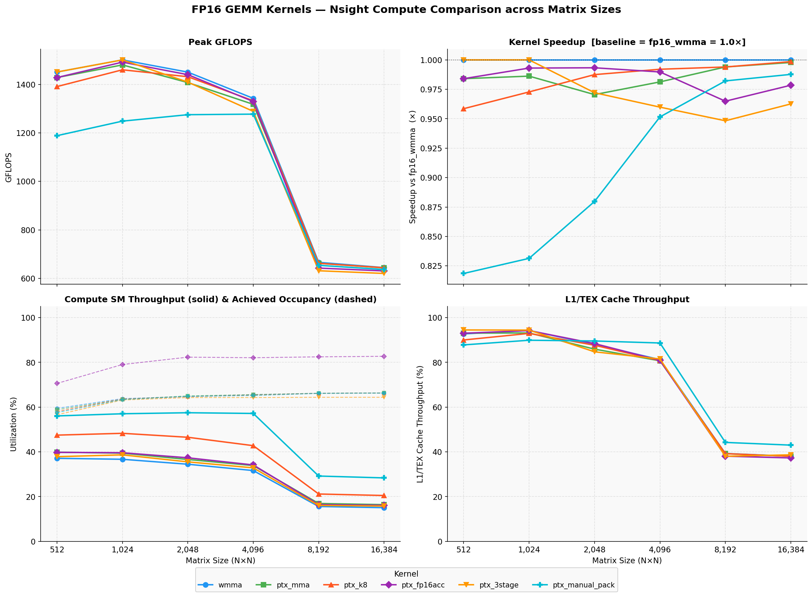
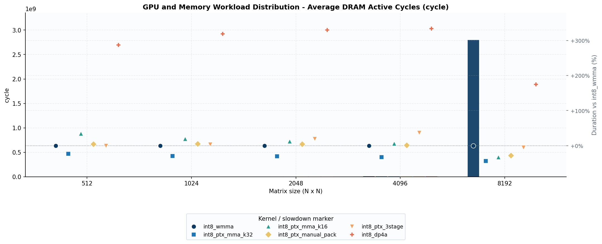
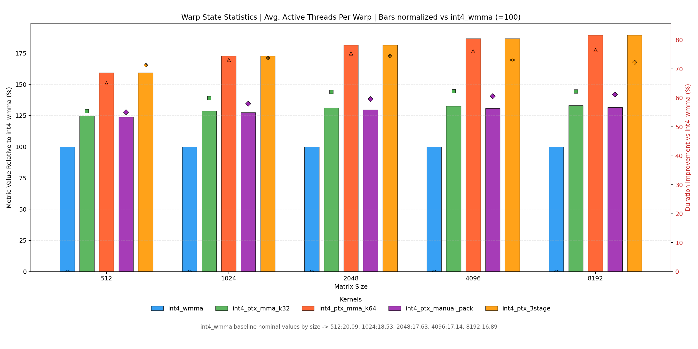
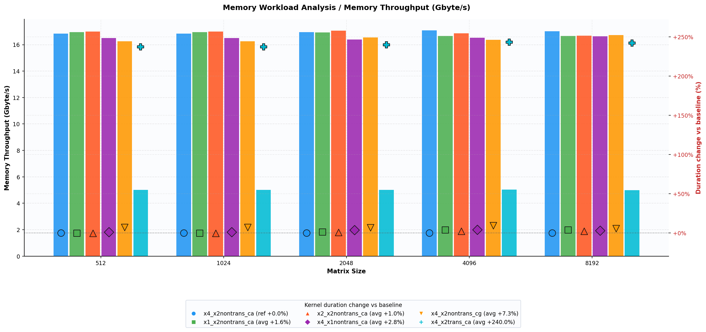

# TensorCorePTX — PTX-first Tensor Core GEMM Exploration

This repository collects findings, experiments, and design notes for implementing high-performance PTX GEMM kernels using `cp.async`, `ldmatrix` and `mma.sync` on Nvidia L4 (Ada/SM89). The focus is a PTX-first path across three precisions (`fp16`, `int8`, `int4`): for each precision we run a multi-variant deep dive over key PTX instruction choices and compare against a double-buffered WMMA-API kernel used as the baseline.

## Table of Contents
- [Summary](#summary)
- [Run 1 — fp16 - Profiling Results](#run-1--fp16---profiling-results)
- [Run 2 — int8 - Profiling Results](#run-2--int8---profiling-results)
- [Run 3 — int4 - Profiling Results for Base Kernels](#run-3--int4---profiling-results-for-base-kernels)
- [Run 4 — int4 - Profiling Results for the optimal k64 kernel family](#run-4--int4---profiling-results-for-the-optimal-k64-kernel-family)

## Summary

Most kernels in this project follow the same core pattern: overlap DRAM->SRAM prefetch (`cp.async`) with tile-level compute in registers (`ldmatrix` + `mma.sync`) to hide memory latency. Additional variants include manual SRAM->register packing paths (no `ldmatrix`) and an INT8 `dp4a` path; for each precision family, the baseline is always the WMMA-API kernel (`*_wmma`), and PTX variants are evaluated relative to that baseline. All kernels were profiled with Nsight Compute across square matrix sizes N = 512 → 8192. 

### At-a-Glance Results

<table width="100%">
	<colgroup>
		<col width="22%" />
		<col width="29%" />
		<col width="14%" />
		<col width="35%" />
	</colgroup>
	<thead>
		<tr>
			<th width="22%">Run</th>
			<th width="29%">Best kernel(s)</th>
			<th width="14%">Speedup vs dtype_wmma</th>
			<th width="35%">Key finding</th>
		</tr>
	</thead>
	<tbody>
		<tr>
			<td><code>Run 1 - fp16</code></td>
			<td><a href="kernels/fp16_wmma.cu"><code>fp16_wmma</code></a></td>
			<td><code>1.0x-1.0x</code></td>
			<td>PTX variants do not improve wall time: at <code>N &lt;= 4096</code> local gains are offset by extra instruction/packing overhead, and after the L2-capacity cliff (<code>N &gt;= 8192</code>) all kernels converge because DRAM becomes the dominant bottleneck.</td>
		</tr>
		<tr>
			<td><code>Run 2 - int8</code></td>
			<td><a href="kernels/int8_ptx_mma_k32.cu"><code>int8_ptx_mma_k32</code></a></td>
			<td><code>1.4x-1.8x</code></td>
			<td><code>k32</code> wins with fewer executed instructions and better global-load coalescing; at <code>N=8192</code>, Average DRAM Active Cycles tracks duration nearly 1:1, confirming memory-efficiency-driven ranking in the DRAM-bound regime.</td>
		</tr>
		<tr>
			<td><code>Run 3 - int4</code></td>
			<td><a href="kernels/int4_ptx_3stage.cu"><code>int4_ptx_3stage</code></a> (small <code>N</code>), <a href="kernels/int4_ptx_mma_k64_x4_x2nontrans_ca.cu"><code>int4_ptx_mma_k64</code></a> (large <code>N</code>)</td>
			<td><code>2.9x-4.3x</code></td>
			<td>Both kernels avoid WMMA INT4 software emulation overhead; the crossover comes from memory hierarchy behavior, where <code>3stage</code> loses L1 locality as <code>N</code> grows while <code>k64</code> retains higher L1 hit rate and scales better.</td>
		</tr>
		<tr>
			<td><code>Run 4 - int4 + k64</code></td>
			<td><a href="kernels/int4_ptx_mma_k64_x4_x2nontrans_ca.cu"><code>int4_ptx_mma_k64</code></a></td>
			<td><code>2.9x-4.3x</code></td>
			<td>Sweeping loader split (<code>x1/x2/x4</code>), cache policy (<code>ca/cg</code>), and B layout (<code>nontrans/trans</code>) does not beat baseline: non-trans <code>ca</code> variants remain in the same bottleneck class, <code>cg</code> adds L2-latency pressure, and <code>trans</code> breaks coalescing with a large throughput penalty.</td>
		</tr>
	</tbody>
</table>

### Raw durations (ms)

<table width="100%">
	<thead>
		<tr>
			<th>Kernel</th>
			<th>Per Dtype</th>
			<th>512</th>
			<th>1024</th>
			<th>2048</th>
			<th>4096</th>
			<th>8192</th>
		</tr>
	</thead>
	<tbody>
		<tr>
			<td><a href="kernels/fp16_wmma.cu"><code>fp16_wmma</code></a></td>
			<td><code>Base & Optimal</code></td>
			<td>0.184</td>
			<td>1.430</td>
			<td>11.850</td>
			<td>102.350</td>
			<td>16500.000</td>
		</tr>
		<tr>
			<td><a href="kernels/int8_wmma.cu"><code>int8_wmma</code></a></td>
			<td><code>Base</code></td>
			<td>0.152</td>
			<td>1.110</td>
			<td>8.550</td>
			<td>68.470</td>
			<td>858.300</td>
		</tr>
		<tr>
			<td><a href="kernels/int8_ptx_mma_k32.cu"><code>int8_ptx_mma_k32</code></a></td>
			<td><code>Optimal</code></td>
			<td>0.109</td>
			<td>0.726</td>
			<td>5.410</td>
			<td>42.000</td>
			<td>480.060</td>
		</tr>
		<tr>
			<td><a href="kernels/int4_wmma.cu"><code>int4_wmma</code></a></td>
			<td><code>Base</code></td>
			<td>0.195</td>
			<td>1.450</td>
			<td>11.400</td>
			<td>90.110</td>
			<td>712.960</td>
		</tr>
		<tr>
			<td><a href="kernels/int4_ptx_3stage.cu"><code>int4_ptx_3stage</code></a></td>
			<td><code>Optimal (small N)</code></td>
			<td>0.056</td>
			<td>0.382</td>
			<td>2.910</td>
			<td>24.260</td>
			<td>197.630</td>
		</tr>
		<tr>
			<td><a href="kernels/int4_ptx_mma_k64_x4_x2nontrans_ca.cu"><code>int4_ptx_mma_k64</code></a></td>
			<td><code>Optimal (large N)</code></td>
			<td>0.068</td>
			<td>0.395</td>
			<td>2.810</td>
			<td>21.520</td>
			<td>167.100</td>
		</tr>
	</tbody>
</table>

### Speed up vs fp16_wmma

<table width="100%">
	<thead>
		<tr>
			<th>Kernel</th>
			<th>Per Dtype</th>
			<th>512</th>
			<th>1024</th>
			<th>2048</th>
			<th>4096</th>
			<th>8192</th>
		</tr>
	</thead>
	<tbody>
		<tr>
			<td><a href="kernels/int8_wmma.cu"><code>int8_wmma</code></a></td>
			<td><code>Base</code></td>
			<td><code>1.2x</code></td>
			<td><code>1.3x</code></td>
			<td><code>1.4x</code></td>
			<td><code>1.5x</code></td>
			<td><code>19.2x</code></td>
		</tr>
		<tr>
			<td><a href="kernels/int8_ptx_mma_k32.cu"><code>int8_ptx_mma_k32</code></a></td>
			<td><code>Optimal</code></td>
			<td><code>1.7x</code></td>
			<td><code>2.0x</code></td>
			<td><code>2.2x</code></td>
			<td><code>2.4x</code></td>
			<td><code>34.4x</code></td>
		</tr>
		<tr>
			<td><a href="kernels/int4_wmma.cu"><code>int4_wmma</code></a></td>
			<td><code>Base</code></td>
			<td><code>0.9x</code></td>
			<td><code>1.0x</code></td>
			<td><code>1.0x</code></td>
			<td><code>1.1x</code></td>
			<td><code>23.1x</code></td>
		</tr>
		<tr>
			<td><a href="kernels/int4_ptx_3stage.cu"><code>int4_ptx_3stage</code></a></td>
			<td><code>Optimal (small N)</code></td>
			<td><code>3.3x</code></td>
			<td><code>3.7x</code></td>
			<td><code>4.1x</code></td>
			<td><code>4.2x</code></td>
			<td><code>83.5x</code></td>
		</tr>
		<tr>
			<td><a href="kernels/int4_ptx_mma_k64_x4_x2nontrans_ca.cu"><code>int4_ptx_mma_k64</code></a></td>
			<td><code>Optimal (large N)</code></td>
			<td><code>2.7x</code></td>
			<td><code>3.6x</code></td>
			<td><code>4.2x</code></td>
			<td><code>4.8x</code></td>
			<td><code>98.7x</code></td>
		</tr>
	</tbody>
</table>

---

## Details

### Run 1 — fp16 - Profiling Results

> Full Summary: [`prof/md/run1/ncu_summary.md`](prof/md/run1/ncu_summary.md)

Kernels profiled: [`fp16_wmma`](kernels/fp16_wmma.cu), [`fp16_ptx_mma`](kernels/fp16_ptx_mma.cu), [`fp16_ptx_k8`](kernels/fp16_ptx_k8.cu), [`fp16_ptx_fp16acc`](kernels/fp16_ptx_fp16acc.cu), [`fp16_ptx_3stage`](kernels/fp16_ptx_3stage.cu), [`fp16_ptx_manual_pack`](kernels/fp16_ptx_manual_pack.cu)

**Raw durations (ms):**

| Kernel | 512 | 1024 | 2048 | 4096 | 8192 |
|---|---:|---:|---:|---:|---:|
| `fp16_wmma` (baseline) | 680.155 | 684.000 | 813.093 | 1539.726 | 14098.618 |
| `fp16_ptx_mma` | 710.899 | 698.062 | 782.720 | 1553.984 | 14150.838 |
| `fp16_ptx_k8` | 685.578 | 724.600 | 801.493 | 1540.406 | 14135.938 |
| `fp16_ptx_fp16acc` | 664.341 | 700.616 | 789.057 | 1555.479 | 14553.427 |
| `fp16_ptx_3stage` | 689.617 | 683.957 | 794.762 | 1577.620 | 14828.855 |
| `fp16_ptx_manual_pack` | 673.823 | 699.585 | 789.764 | 1574.092 | 14312.770 |

**Slowdown / speedup vs `fp16_wmma` (%, + slower, - faster):**

| Kernel | 512 | 1024 | 2048 | 4096 | 8192 |
|---|---:|---:|---:|---:|---:|
| `fp16_ptx_mma` | +4.5% | +2.1% | -3.7% | +0.9% | +0.4% |
| `fp16_ptx_k8` | +0.8% | +5.9% | -1.4% | +0.0% | +0.3% |
| `fp16_ptx_fp16acc` | -2.3% | +2.4% | -3.0% | +1.0% | +3.2% |
| `fp16_ptx_3stage` | +1.4% | +0.0% | -2.3% | +2.5% | +5.2% |
| `fp16_ptx_manual_pack` | -0.9% | +2.3% | -2.9% | +2.2% | +1.5% |



Six FP16 GEMM kernels were profiled with Nsight Compute across matrix sizes N = 512 → 8192 (square, FP16 inputs, FP32 accumulation). The four tracked metrics — GFLOPS, Compute (SM) Throughput %, Achieved Occupancy %, and L1/TEX Cache Throughput % — reveal two distinct operating regimes separated by an L2 capacity cliff between N = 4096 and N = 8192.

**Compute-bound regime (N ≤ 4096):** All kernels sustain 1,280–1,500 GFLOPS. `fp16_ptx_manual_pack` has the highest Compute (SM) % (~57%) and `fp16_ptx_k8` is second (~47%), but both are still slower than `fp16_wmma` — the baseline WMMA intrinsic path. The penalty ranges from +1% (`ptx_mma`, `ptx_k8`) up to +22% (`ptx_manual_pack`) at N = 512 due to unrecovered packing overhead at small tile counts. No hand-written PTX variant outperforms the compiler-optimised WMMA path in this regime.

**Memory-bound regime (N ≥ 8192):** Once the matrices (~537 MB combined at N = 8192, FP16 A/B + FP32 C) exceed L2 capacity, every kernel stalls on DRAM. L1/TEX throughput collapses from ~90% to ~38%, GFLOPS halves to 620–666, and all slowdown differences shrink to < 1%. The instruction mix becomes irrelevant — bandwidth is the sole bottleneck.

**`fp16_ptx_fp16acc` occupancy anomaly:** Using FP16 accumulators halves the accumulator register count, lifting Achieved Occupancy to 70–82% vs 56–66% for all other kernels. Despite this, GFLOPS are not higher — confirming that occupancy alone does not drive throughput when the kernel is not latency-limited by a warp-count shortage.

**Next steps:** (1) verify tensor-core `mma` instructions are actually being issued via `inst_executed_pipe_tensor`; (2) profile DRAM bandwidth to quantify saturation at large sizes; (3) improve shared-memory tiling to recover L1/TEX utilisation in the compute-bound region; (4) extend triple-buffered `cp.async` pipeline (`ptx_3stage`) more aggressively to mask L2 latency at the cliff boundary.

| Kernel | SRAM→Regs | mma.sync shape | Acc type | Pipeline | Notes |
|---|---|---|---|---|---|
| `fp16_wmma` | `wmma::load_matrix_sync` | m16n16k16 (WMMA) | f32 | 2-stage cp.async | WMMA baseline; no explicit PTX |
| `fp16_ptx_mma` | `ldmatrix.x4` / `.x2.trans` | m16n8k16 × 2 | f32 | 2-stage cp.async | First pure-PTX kernel |
| `fp16_ptx_k8` | `ldmatrix.x2` / `.x1.trans` | m16n8k8 × 4 | f32 | 2-stage cp.async | Narrower K tile; 4 MMA calls per K-step |
| `fp16_ptx_fp16acc` | `ldmatrix.x4` / `.x2.trans` | m16n8k16 × 2 | f16 (packed) | 2-stage cp.async | Half the accumulator registers vs f32 |
| `fp16_ptx_3stage` | `ldmatrix.x4` / `.x2.trans` | m16n8k16 × 2 | f32 | **3-stage** cp.async | `wait_group 1`; one extra SRAM buffer to hide L2 latency |
| `fp16_ptx_manual_pack` | 4+2 scalar `ld.shared` + `mov.b32` | m16n8k16 × 2 | f32 | 2-stage cp.async | No `ldmatrix`; exposes its instruction-count cost |

---

### Run 2 — int8 - Profiling Results

> Full Analysis: [`prof/md/run2/ncu_details.md`](prof/md/run2/ncu_details.md)

Kernels profiled: [`int8_wmma`](kernels/int8_wmma.cu), [`int8_ptx_mma_k16`](kernels/int8_ptx_mma_k16.cu), [`int8_ptx_mma_k32`](kernels/int8_ptx_mma_k32.cu), [`int8_ptx_manual_pack`](kernels/int8_ptx_manual_pack.cu), [`int8_ptx_3stage`](kernels/int8_ptx_3stage.cu), [`int8_dp4a`](kernels/int8_dp4a.cu)

**Raw durations:**

| Kernel | 512 | 1024 | 2048 | 4096 | 8192 |
|---|---:|---:|---:|---:|---:|
| `int8_wmma` (baseline) | 152.00 us | 1.11 ms | 8.55 ms | 68.47 ms | 858.30 ms |
| `int8_ptx_mma_k32` | 108.67 us | 726.46 us | 5.41 ms | 42.00 ms | 480.06 ms |
| `int8_ptx_mma_k16` | 204.54 us | 1.33 ms | 9.61 ms | 72.93 ms | 582.00 ms |
| `int8_ptx_manual_pack` | 159.55 us | 1.17 ms | 8.93 ms | 69.54 ms | 617.68 ms |
| `int8_ptx_3stage` | 151.87 us | 1.15 ms | 10.22 ms | 93.88 ms | 820.32 ms |
| `int8_dp4a` | 588.80 us | 4.65 ms | 36.75 ms | 296.86 ms | 2360 ms |

**Slowdown / speedup vs `int8_wmma` (%, + slower, - faster):**

| Kernel | 512 | 1024 | 2048 | 4096 | 8192 |
|---|---:|---:|---:|---:|---:|
| `int8_ptx_mma_k32` | -28.5% | -34.6% | -36.7% | -38.7% | -44.1% |
| `int8_ptx_mma_k16` | +34.6% | +19.8% | +12.4% | +6.5% | -32.2% |
| `int8_ptx_manual_pack` | +5.0% | +5.4% | +4.4% | +1.6% | -28.0% |
| `int8_ptx_3stage` | -0.1% | +3.6% | +19.5% | +37.1% | -4.4% |
| `int8_dp4a` | +287.4% | +318.9% | +329.8% | +333.6% | +174.9% |

Six INT8 GEMM kernels were profiled with Nsight Compute across matrix sizes N = 512 → 8192 (square, INT8 A/B inputs, INT32 accumulation, no in-kernel dequant). Performance is measured relative to `int8_wmma` (the WMMA-API baseline).



**`int8_ptx_mma_k32` is the fastest kernel at every size**, ranging from 23% faster than `int8_wmma` at N=512 up to 43% faster at N=8192. Its advantage is rooted in instruction count: it executes 25–43% fewer instructions than wmma by decomposing each K=32 tile step into two tightly unrolled `m16n8k16` MMA calls, eliminating most of the overhead present in the other kernels. Its coalescing is also exceptional — only 0.4% wasted global sectors at N=8192, vs ~50% for every other kernel.

**`int8_ptx_mma_k16` is *slower* than `int8_wmma` at small–medium sizes** (+7% to +35% at N=512–4096) but overtakes it at N=8192 (−32%). Its uncoalesced global load pattern (1 of 32 bytes used per sector) generates enormous excess traffic; at large sizes a 76% L1 hit rate absorbs this and the kernel recovers. NCU estimates an 80–85% potential speedup from fixing the access pattern alone.

**`int8_ptx_3stage` degrades sharply at N=4096** (+37% vs wmma) due to MIO queue saturation — its triple-buffer prefetch schedule generates heavy shared-memory pressure that the scheduler cannot hide. It recovers at N=8192 (−4% vs wmma) but never leads the field.

**`int8_ptx_manual_pack`** (scalar `ld.shared` + `prmt.b32` packing, no `ldmatrix`) **is within 2–5% of `int8_wmma`** across all sizes and achieves the highest IPC of all kernels (1.93 at N=512, 1.72 at N=8192). Its dense ALU packing sequence keeps the scheduler fed consistently.

**`int8_dp4a` is never competitive** — even at N=8192 it is 175% slower than wmma (4.8×). Scalar DP4A instructions emit 3–5× more instructions per unit of arithmetic work than MMA, saturate the MIO queue, and cannot exploit tensor cores.

**Occupancy is not the performance predictor.** `int8_wmma` achieves the highest occupancy at every size yet is consistently outrun by `k32` (which is register-capped at 66.7% theoretical). The bottleneck is instruction efficiency and memory latency, not warp count.

**Average DRAM Active Cycles is the N=8192 performance fingerprint.** At N ≤ 4096 all kernels show essentially identical DRAM active cycle counts (within ~1% of each other), confirming the compute-bound regime. At N=8192 the spread becomes enormous: `k32` logs 1.57B DRAM-active cycles vs `wmma`'s 2.80B — a −43.9% reduction that tracks almost exactly with its −43% wall-clock speedup. The same correspondence holds for every kernel (k16: −34.8% DRAM / −32% wall-clock; manual_pack: −32.6% / −28%; 3stage: −6.4% / −4%). This is the clearest evidence that N=8192 is purely DRAM-latency-bound and that the performance ranking is entirely explained by coalescing quality: `k32` wastes only 0.4% of global sectors vs ~50% for the others.

| Kernel | SRAM→Regs | mma.sync shape | Acc type | Pipeline | Notes |
|---|---|---|---|---|---|
| `int8_wmma` | `wmma::load_matrix_sync` | m16n16k16 (WMMA) | int32 | 2-stage cp.async | WMMA baseline |
| `int8_ptx_mma_k16` | `ldmatrix.x2` / `.x1.trans` | m16n8k16 × 2 | int32 | 2-stage cp.async | Fastest at N=8192 behind k32; poor coalescing |
| `int8_ptx_mma_k32` | 2×`ldmatrix.x2` / 4×`.x1.trans` | m16n8k16 × 4 (k32 decomposed) | int32 | 2-stage cp.async | **Fastest overall**; fewest instructions; best coalescing |
| `int8_ptx_manual_pack` | 4+4 scalar `ld.shared` + `prmt.b32` | m16n8k16 × 2 | int32 | 2-stage cp.async | Highest IPC; no `ldmatrix`; within 5% of wmma |
| `int8_ptx_3stage` | `ldmatrix.x2` / `.x1.trans` | m16n8k16 × 2 | int32 | **3-stage** cp.async | MIO-saturated at mid sizes; recovers at N=8192 |
| `int8_dp4a` | scalar `ld.shared` | `dp4a.s32.s32` × K/4 | int32 | none | Scalar only; no tensor cores; 4.8× slower than wmma at N=8192 |

---

### Run 3 — int4 - Profiling Results for Base Kernels

> Full Analysis: [`prof/md/run3/ncu_details.md`](prof/md/run3/ncu_details.md)

Kernels profiled: [`int4_wmma`](kernels/int4_wmma.cu), [`int4_ptx_mma_k32`](kernels/int4_ptx_mma_k32.cu), [`int4_ptx_manual_pack`](kernels/int4_ptx_manual_pack.cu), [`int4_ptx_3stage`](kernels/int4_ptx_3stage.cu), [`int4_ptx_mma_k64`](kernels/int4_ptx_mma_k64_x4_x2nontrans_ca.cu)

**Raw durations:**

| Kernel | 512 | 1024 | 2048 | 4096 | 8192 |
|---|---:|---:|---:|---:|---:|
| `int4_wmma` (baseline) | 195.42 us | 1.450 ms | 11.40 ms | 90.11 ms | 712.96 ms |
| `int4_ptx_mma_k32` | 87.01 us | 0.579 ms | 4.32 ms | 33.99 ms | 269.35 ms |
| `int4_ptx_mma_k64` | 68.19 us | 0.395 ms | 2.81 ms | 21.52 ms | 167.10 ms |
| `int4_ptx_manual_pack` | 87.84 us | 0.611 ms | 4.61 ms | 35.55 ms | 277.13 ms |
| `int4_ptx_3stage` | 56.16 us | 0.382 ms | 2.91 ms | 24.26 ms | 197.63 ms |

**Slowdown / speedup vs `int4_wmma` (%, + slower, - faster):**

| Kernel | 512 | 1024 | 2048 | 4096 | 8192 |
|---|---:|---:|---:|---:|---:|
| `int4_ptx_mma_k32` | -55.5% | -60.1% | -62.1% | -62.3% | -62.2% |
| `int4_ptx_mma_k64` | -65.1% | -72.8% | -75.4% | -76.1% | -76.6% |
| `int4_ptx_manual_pack` | -55.1% | -57.9% | -59.6% | -60.5% | -61.1% |
| `int4_ptx_3stage` | -71.3% | -73.7% | -74.5% | -73.1% | -72.3% |

Five INT4 kernels were profiled across N = 512 -> 8192 with `int4_wmma` as baseline. The two top kernels are `int4_ptx_mma_k64` and `int4_ptx_3stage`: `3stage` is fastest at very small sizes (512/1024), while `k64` becomes fastest from 2048 onward and widens the lead at large N.



**Wall-time speedup vs `int4_wmma` (from run3 profile):**

| Size | `int4_ptx_3stage` | `int4_ptx_mma_k64` |
|---|---|---|
| 512 | **+248%** | +187% |
| 1024 | **+280%** | +267% |
| 2048 | +292% | **+306%** |
| 4096 | +271% | **+319%** |
| 8192 | +261% | **+327%** |

At N=8192, the top-2 separation from the middle pack is large in both wall time and instruction pressure: `int4_ptx_mma_k64` / `int4_ptx_3stage` run at 167.10 / 197.63 ms, while `int4_ptx_mma_k32` / `int4_ptx_manual_pack` are 269.35 / 277.13 ms. The same ordering appears in average executed instructions per scheduler (~45-46M for k64/3stage vs ~79-81M for k32/manual_pack), confirming that arithmetic-density and instruction footprint are dominant differentiators once WMMA emulation is removed.

The key crossover mechanism between the two winners is memory hierarchy behavior, not tensor-core utilization: `3stage` is best at small sizes due to deeper prefetch overlap, but as N grows it becomes strongly L2-driven. By N=8192, `3stage` reaches ~95.6% L2 throughput with L1 hit rate collapsed to ~14.5%, while `k64` retains ~61.6% L1 hit rate and therefore better large-size latency.

**Run 3 key metrics at N=8192:**

| Metric | int4_wmma | int4_ptx_mma_k64 | int4_ptx_3stage |
|---|---:|---:|---:|
| Duration (ms) | 712.96 | **167.10** | 197.63 |
| Avg active threads/warp | 16.89 | **32** | **32** |
| Avg divergent branches | 4,610,118 | **0** | **0** |
| Avg executed instr/scheduler | ~295M | **~45M** | **~46M** |
| L1/TEX hit rate (%) | 80.34 | **61.56** | 14.49 |
| L2 throughput (%) | lower | moderate | **95.6** |

**Condensed takeaways:**

- `int4_wmma` underperforms mainly because WMMA INT4 (`wmma::experimental::precision::s4`) is software-expanded, which inflates instruction count and introduces heavy lane-dependent divergence.
- The winning PTX kernels call native INT4 Tensor Core MMA directly (`mma.sync...m16n8k64.s4`) and avoid that expansion cost.
- Warp efficiency is the biggest separator: winners keep ~32 active threads/warp with zero divergent branches, while `int4_wmma` runs with partial warp activity and millions of divergent branches at large sizes.
- Instruction pressure tracks performance closely: winners execute roughly 6-7x fewer instructions per scheduler than `int4_wmma` at large N.
- `k64` sustains stronger large-size behavior than `3stage` because `3stage` becomes more L2-bound as N grows (L1 hit-rate collapse), while `k64` keeps much higher L1 locality at N=8192 (~62% vs ~14% for `3stage`).

---

### Run 4 — int4 - Profiling Results for the optimal k64 kernel family

> Full Analysis: [`prof/md/run4/ncu_details.md`](prof/md/run4/ncu_details.md)

Kernels profiled: [`int4_ptx_mma_k64_x1_x2nontrans_ca`](kernels/int4_ptx_mma_k64_x1_x2nontrans_ca.cu), [`int4_ptx_mma_k64_x2_x2nontrans_ca`](kernels/int4_ptx_mma_k64_x2_x2nontrans_ca.cu), [`int4_ptx_mma_k64_x4_x1nontrans_ca`](kernels/int4_ptx_mma_k64_x4_x1nontrans_ca.cu), [`int4_ptx_mma_k64_x4_x2nontrans_ca`](kernels/int4_ptx_mma_k64_x4_x2nontrans_ca.cu), [`int4_ptx_mma_k64_x4_x2nontrans_cg`](kernels/int4_ptx_mma_k64_x4_x2nontrans_cg.cu), [`int4_ptx_mma_k64_x4_x2trans_ca`](kernels/int4_ptx_mma_k64_x4_x2trans_ca.cu)

**Raw durations (ms):**

| Kernel | 512 | 1024 | 2048 | 4096 | 8192 |
|---|---:|---:|---:|---:|---:|
| `x4_x2nontrans_ca` (baseline) | 1210.219 | 1309.438 | 1902.636 | 5775.392 | 35043.367 |
| `x1_x2nontrans_ca` | 1249.271 | 1351.661 | 2002.608 | 6155.718 | 37926.035 |
| `x2_x2nontrans_ca` | 1266.319 | 1345.487 | 1978.199 | 6050.660 | 37072.375 |
| `x4_x1nontrans_ca` | 1283.560 | 1373.870 | 2031.992 | 6142.130 | 37640.043 |
| `x4_x2nontrans_cg` | 1282.004 | 1386.205 | 2066.496 | 6451.012 | 39894.840 |
| `x4_x2trans_ca` | 1295.441 | 1554.672 | 3155.077 | 14994.947 | 108172.047 |

**Slowdown / speedup vs `x4_x2nontrans_ca` (%, + slower, - faster):**

| Kernel | 512 | 1024 | 2048 | 4096 | 8192 |
|---|---:|---:|---:|---:|---:|
| `x1_x2nontrans_ca` | +3.2% | +3.2% | +5.3% | +6.6% | +8.2% |
| `x2_x2nontrans_ca` | +4.6% | +2.8% | +4.0% | +4.8% | +5.8% |
| `x4_x1nontrans_ca` | +6.1% | +4.9% | +6.8% | +6.4% | +7.4% |
| `x4_x2nontrans_cg` | +5.9% | +5.9% | +8.6% | +11.7% | +13.8% |
| `x4_x2trans_ca` | +7.0% | +18.7% | +65.8% | +159.6% | +208.7% |

This run isolates the `int4_ptx_mma_k64*` family to test loader split (`x1/x2/x4`), cache policy (`ca` vs `cg`), and B layout (`nontrans` vs `trans`) while keeping the core MMA strategy fixed.



Run4 shows that the chosen k64 baseline sits inside a tight local optimum basin: non-trans `ca` variants (`x1/x2/x4`) move only a few percent because they do not change the bottleneck class. Their occupancy, scheduler eligibility class, and memory-throughput range remain similar, so tuning these knobs mostly redistributes pressure between L1/L2 and instruction issue rather than changing end-to-end throughput.

By contrast, the `cg` and `trans` variants reveal two distinct failure modes. `cg` causes a mild latency regression by shifting too much traffic to L2 (lower L1 hit, higher L2 pressure), while `trans` causes a structural collapse from poor coalescing: very low useful bytes per sector, large excessive-sector counts, reduced eligible warps, and much higher warp cycles per instruction. This is why `trans` is not just "slower" but qualitatively off the optimal path.

**Run4 diagnostic snapshot (baseline vs key variants):**

| Metric | x4_x2nontrans_ca (baseline) | x4_x2nontrans_cg | x4_x2trans_ca |
|---|---:|---:|---:|
| Duration delta vs baseline | 0% | ~+6% to +14% | ~+7% to +209% |
| L1/TEX hit rate (%) | ~64 | ~20 | very low utility |
| L2 throughput (%) | ~26 | ~50 | high-pressure, low-efficiency |
| Eligible warps/scheduler | ~0.57 | ~0.50 | ~0.20 |
| Warp cycles/executed instruction | ~12.5 | ~13.8 | ~27.8 |
| Useful global-load payload | healthy | moderate | ~2.2 / 32 bytes per sector |
| Memory throughput (Gbyte/s) | ~16-17 | slightly lower | ~5 |
| Excessive global sectors (N=2048) | 32,768 / 327,680 (10%) | higher than baseline | 1,998,848 / 2,293,760 (87%) |

**Condensed takeaways:**

- Non-trans `ca` variants are effectively tied: changing `x1/x2/x4` shifts only second-order metrics (L1/L2 mix, eligible warps, few-percent latency), not the dominant bottleneck.
- `x4_x2nontrans_cg` is consistently slightly worse because it pushes traffic from L1 to L2 (L1 hit/throughput down, L2 throughput up), increasing latency without compute-side benefit.
- `x4_x2trans_ca` is structurally worse (up to ~3.1x slower at large sizes): severe uncoalesced global loads and shared bank conflicts drive scheduler starvation.
- As a direct result, `x4_x2trans_ca` shows a collapse in effective memory throughput (Gbyte/s) versus the non-trans baseline.
- Trans evidence is direct in NCU: only ~2.2/32 bytes per global-load sector utilized, eligible warps/scheduler ~0.20 vs ~0.57 baseline, and warp cycles/instruction ~27.8 vs ~12.5 baseline.
- Baseline remains optimal because none of the tested knobs changed the bottleneck class; they only redistributed pressure inside the same bound.

---

## PyTorch Bindings

Each kernel can be installed as a standalone Python extension via `setup.py`. One extension = one kernel; the module name matches the kernel name.

```bash
# Install an INT8 kernel (B must be passed pre-transposed as [N,K])
INT8_KERNEL=int8_ptx_mma_k16 pip install -e .

# Install an FP16 kernel
KERNEL=fp16_ptx_3stage pip install -e .

# Rebuild after editing a kernel (editable install re-compiles automatically)
INT8_KERNEL=int8_ptx_mma_k16 pip install -e . --no-build-isolation
```

```python
import torch
import int8_ptx_mma_k16

M, K, N = 4096, 4096, 4096
A  = torch.randint(-127, 127, (M, K), dtype=torch.int8,  device="cuda")
B  = torch.randint(-127, 127, (K, N), dtype=torch.int8,  device="cuda")
BT = B.t().contiguous()                           # kernel expects B transposed: [N, K]

C  = int8_ptx_mma_k16.gemm_int8(A, BT)           # → [M, N] int32, no dequant inside kernel
C_fp32 = C.float() * scale_A * scale_B            # dequantize on host if needed
```

```python
import torch
import fp16_ptx_3stage

A = torch.randn(4096, 4096, dtype=torch.float16, device="cuda")
B = torch.randn(4096, 4096, dtype=torch.float16, device="cuda")
C = fp16_ptx_3stage.gemm_fp16(A, B)              # → [M, N] float32
```

The `CUDA_ARCH` env var (default `89`) selects the SM target. For an A100 use `CUDA_ARCH=80`.
Bindings live in `bindings/bindings_fp16.cpp` and `bindings/bindings_int8.cpp`; `setup.py` wires them to the correct kernel sources.

---

## Compile & Run
```
rm -rf build && cmake -B build -DKERNEL=fp16_ptx_fp16acc -DCUDA_ARCH=89 && cmake --build build -j$(nproc)
./build/profile_fp16_ptx_fp16acc > fp16_ptx_fp16acc.txt

# Run NVIDIA Nsight Compute (`ncu`) across a set of 2^N sizes.
# This invokes the same executable repeatedly while setting `PROFILE_SIZE`.
for S in 512 1024 2048 4096 8192; do
	echo "Profiling size=$S"
	SKIP_VERIFY=1 PROFILE_SIZE=$S ncu --set full --target-processes all ./build/profile_fp16_ptx_fp16acc \
		> fp16_ptx_fp16acc_ncu_${S}.txt 2>&1
done


# Full NCU report

ncu --import-source yes --set full --export prof/int4_wmma ./build/profile_int4_wmma
```