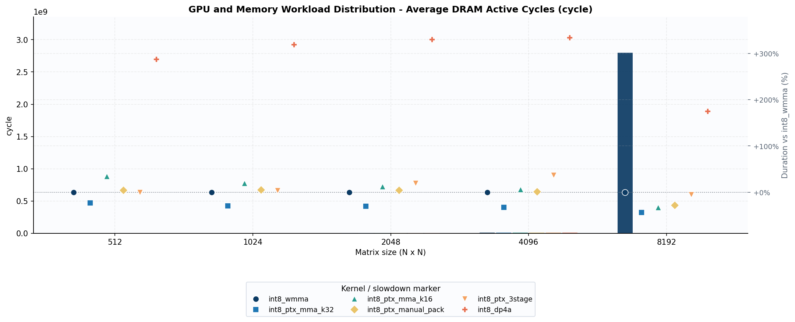
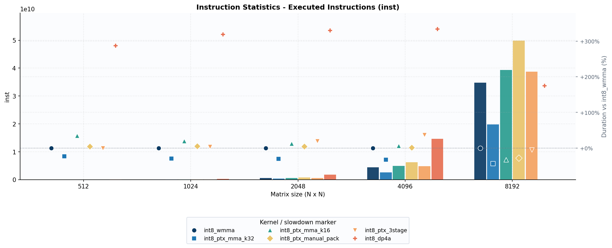
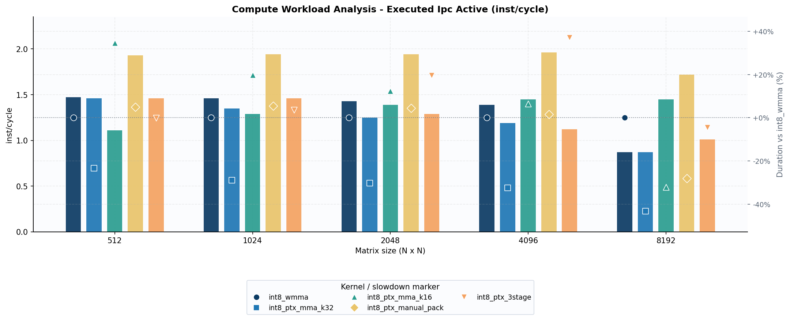
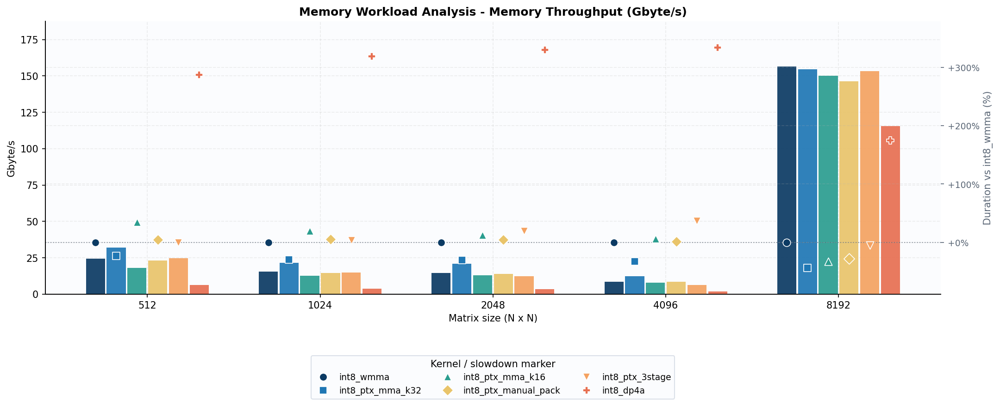
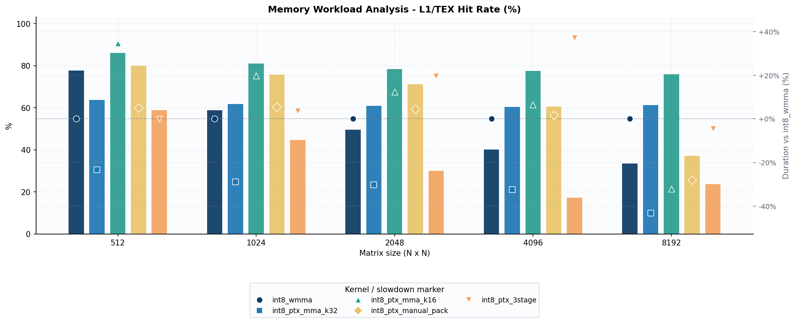
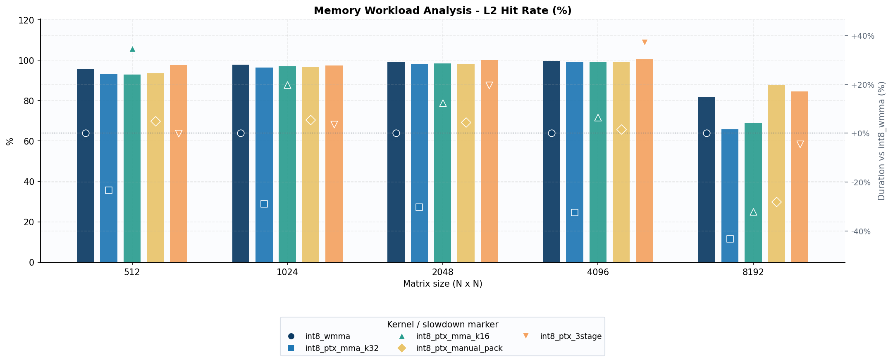
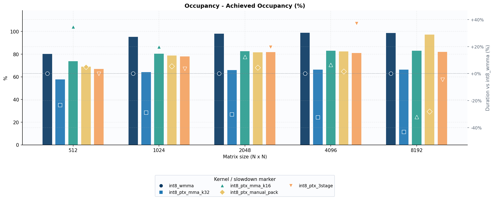
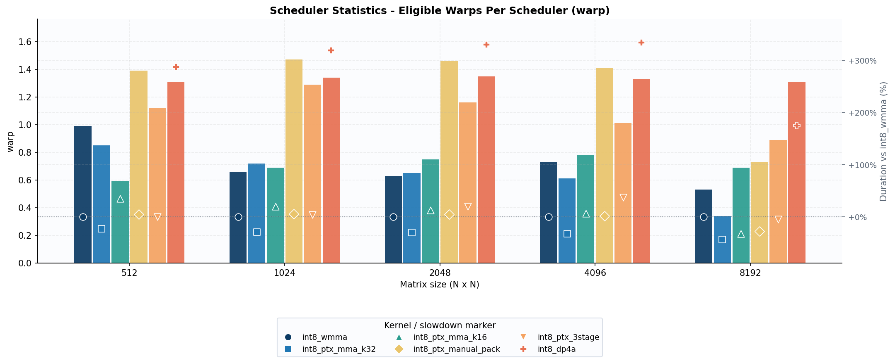
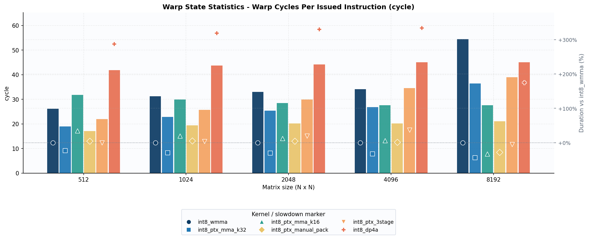
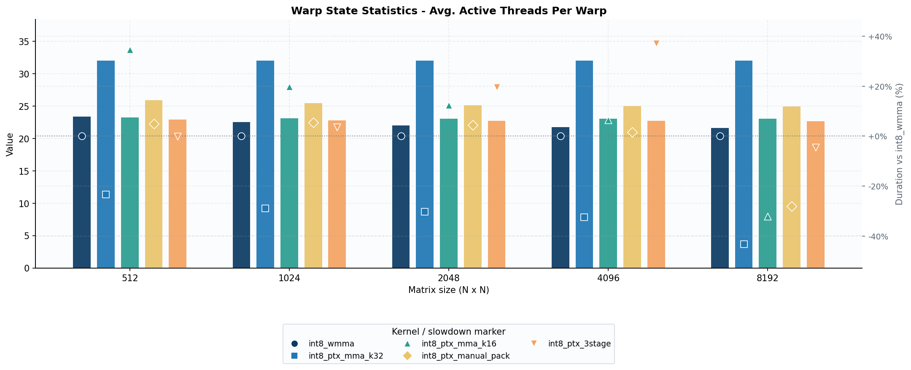

# Run 2 — INT8 GEMM NCU Profiling: Detailed Analysis

**Kernels (in performance order at large sizes):**
`int8_ptx_mma_k32` > `int8_ptx_mma_k16` ≈ `int8_ptx_manual_pack` > `int8_ptx_3stage` ≈ `int8_wmma` >> `int8_dp4a`

**Sizes profiled:** 512, 1024, 2048, 4096, 8192 (square matrix dimension)

**Reference file:** [`ncu_txt_profiles_comparison.md`](../../txt/run2/ncu_txt_profiles_comparison.md)

---

## 1. Execution Duration

### Raw durations

| Size | int8_wmma | int8_ptx_mma_k32 | int8_ptx_mma_k16 | int8_ptx_manual_pack | int8_ptx_3stage | int8_dp4a |
|---|---|---|---|---|---|---|
| 512 | 152.00 µs | 108.67 µs | 204.54 µs | 159.55 µs | 151.87 µs | 588.80 µs |
| 1024 | 1.11 ms | 726.46 µs | 1.33 ms | 1.17 ms | 1.15 ms | 4.65 ms |
| 2048 | 8.55 ms | 5.41 ms | 9.61 ms | 8.93 ms | 10.22 ms | 36.75 ms |
| 4096 | 68.47 ms | 42.00 ms | 72.93 ms | 69.54 ms | 93.88 ms | 296.86 ms |
| 8192 | 858.30 ms | 480.06 ms | 582.00 ms | 617.68 ms | 820.32 ms | 2360 ms |

### Speedup / slowdown vs `int8_wmma` (negative = faster)

| Size | k32 | k16 | manual_pack | 3stage | dp4a |
|---|---|---|---|---|---|
| 512 | **−28%** | +35% | +5% | ~0% | +287% |
| 1024 | **−35%** | +20% | +5% | +4% | +319% |
| 2048 | **−37%** | +12% | +4% | +20% | +330% |
| 4096 | **−39%** | +7% | +2% | +37% | +333% |
| 8192 | **−44%** | −32% | −28% | −4% | +175% |

### Observations

- **`int8_ptx_mma_k32` is consistently the fastest kernel at every matrix size** — its advantage grows monotonically from 28% faster at 512 to 44% faster at 8192.
- **Small-size regime (512–1024):** `int8_wmma`, `int8_ptx_3stage`, and `int8_ptx_manual_pack` are tightly bunched within 0–5% of each other. Only `k32` stands apart.
- **`int8_ptx_mma_k16` is surprisingly *slower* than `wmma` at sizes 512–4096** (+7–35% slower), but catches up at 8192 (−32%). Its regime transition is the sharpest of all kernels.
- **`int8_ptx_3stage` degrades dramatically at 4096** (+37% vs wmma) before recovering at 8192 (−4%). The MIO stall dominates at mid sizes.
- **`int8_dp4a` is never competitive.** Even at 8192 it is 175% slower than wmma (4.8× slower). Its non-tensor-core scalar DP4A path simply cannot match tensor-core throughput for large GEMMs.
- **The regime crossover for k16/manual_pack/3stage happens between 4096 and 8192** when the working set can no longer fit in L1/L2 and the kernels that better exploit the memory hierarchy gain the advantage.

---

## 2. Instruction Counts

### Executed Instructions

| Size | int8_wmma | int8_ptx_mma_k32 | int8_ptx_mma_k16 | int8_ptx_manual_pack | int8_ptx_3stage | int8_dp4a |
|---|---|---|---|---|---|---|
| 512 | 9,895,936 | **7,544,832** | 10,211,328 | 13,717,504 | 9,879,552 | 29,917,184 |
| 8192 | 34,745,614,336 | **20,050,870,272** | 39,356,203,008 | 49,816,797,184 | 38,767,951,872 | — |

### Observations

- **`k32` executes the fewest instructions at both 512 and 8192** — 25% fewer than wmma at 512, 43% fewer at 8192. This is the single strongest predictor of its elapsed-time lead.
- **`manual_pack` has the highest instruction count at 512** (13.7M vs wmma 9.9M), yet is only ~5% slower on the wall clock. Its higher IPC (1.93 vs wmma 1.47 at 512) partially compensates.
- **`dp4a` executes 3× more instructions than wmma at 512** (29.9M vs 9.9M) because it uses scalar DP4A instead of tensor-core MMA instructions, which emit far fewer instructions for the same work.
- **`k16` and `3stage` have similar instruction counts to `wmma`** at small sizes (within 3%), but their execution efficiency differs significantly (see §4 IPC).
- **Instruction count growth from 512→8192 scales as ~N³** (matrix volume), as expected for GEMM.

---

## 3. Compute Throughput and IPC

### Executed IPC Active (instructions per active cycle)

| Size | int8_wmma | int8_ptx_mma_k32 | int8_ptx_mma_k16 | int8_ptx_manual_pack | int8_ptx_3stage | int8_dp4a |
|---|---|---|---|---|---|---|
| 512 | 1.47 | 1.51 | 1.11 | **1.93** | 1.46 | 1.11 |
| 8192 | 0.87 | 0.86 | 1.45 | **1.72** | 1.01 | 1.07 |

### Compute (SM) Throughput %

| Size | int8_wmma | int8_ptx_mma_k32 | int8_ptx_mma_k16 | int8_ptx_manual_pack | int8_ptx_3stage | int8_dp4a |
|---|---|---|---|---|---|---|
| 512 | ~44% | ~41% | ~37% | ~52% | ~47% | ~94% |
| 8192 | 29.85% | 28.19% | 47.70% | 48.50% | 33.62% | 94.40% |

### Observations

- **`manual_pack` has the highest IPC at both sizes** (1.93 @ 512, 1.72 @ 8192). Its code path packs data manually before calling MMA, resulting in dense ALU instruction sequences. NCU notes ALU as the highest-utilized pipeline at 45.4% at 512 and 42.1% at 8192.
- **`k16` IPC flips dramatically across sizes:** 1.11 at 512 → 1.45 at 8192. At small sizes its L1TEX-stall-heavy code path wastes cycles; at large sizes it issues efficiently because the L1 hit rate improves relative to the working set.
- **All kernels have much lower IPC at 8192 than at 512** — the compute-to-memory ratio shifts as the problem becomes bandwidth-bound. `manual_pack` retains 1.72 because its tight ALU work hides latency better.
- **`dp4a` has the highest SM Busy at 8192 (94.4%)** because it dispatches tiny scalar DP4A operations at high frequency — but those operations accomplish far less arithmetic work per issued instruction than tensor-core MMA.
- **At 8192, `wmma` and `k32` both drop to IPC ≈ 0.87** — neither is compute-limited; both are waiting on L1TEX loads. Their SM throughput (29–36%) is the lowest among PTX kernels and confirms heavy memory latency exposure.

---

## 4. Memory Hierarchy

### Memory Throughput (Gbyte/s)

| Size | int8_wmma | int8_ptx_mma_k32 | int8_ptx_mma_k16 | int8_ptx_manual_pack | int8_ptx_3stage | int8_dp4a |
|---|---|---|---|---|---|---|
| 512 | 24.40 | **34.21** | 18.09 | 23.26 | 24.54 | 6.27 |
| 8192 | 156.34 | 157.29 | 150.24 | 146.39 | 153.14 | 115.48 |

### L1/TEX Hit Rate %

| Size | int8_wmma | int8_ptx_mma_k32 | int8_ptx_mma_k16 | int8_ptx_manual_pack | int8_ptx_3stage | int8_dp4a |
|---|---|---|---|---|---|---|
| 512 | 77.60 | 64.16 | **85.98** | 79.98 | 58.74 | 52.28 |
| 8192 | 33.56 | **61.46** | 75.90 | 37.22 | 23.68 | 49.89 |

### L2 Hit Rate %

| Size | int8_wmma | int8_ptx_mma_k32 | int8_ptx_mma_k16 | int8_ptx_manual_pack | int8_ptx_3stage | int8_dp4a |
|---|---|---|---|---|---|---|
| 512 | 95.53 | 92.90 | 92.89 | 93.58 | **97.60** | 96.09 |
| 8192 | 81.86 | 65.60 | 68.75 | **87.87** | 84.46 | 50.12 |

### Mem Busy % (L1 pipeline utilization)

| Size | int8_wmma | int8_ptx_mma_k32 | int8_ptx_mma_k16 | int8_ptx_manual_pack | int8_ptx_3stage | int8_dp4a |
|---|---|---|---|---|---|---|
| 512 | 83.54 | 78.07 | 83.03 | 80.28 | **86.70** | 57.21 |
| 8192 | 69.38 | 64.77 | **87.84** | **92.80** | 80.89 | 58.13 |

### Max Bandwidth % (DRAM bandwidth utilization)

| Size | int8_wmma | int8_ptx_mma_k32 | int8_ptx_mma_k16 | int8_ptx_manual_pack | int8_ptx_3stage | int8_dp4a |
|---|---|---|---|---|---|---|
| 512 | 45.07 | 40.56 | 35.90 | **49.71** | 45.52 | **92.63** |
| 8192 | 60.73 | 52.47 | 50.12 | 79.10 | 79.17 | **94.40** |

### Observations

- **`k32` achieves the highest memory throughput at 512 (31.88 GB/s)** despite a lower L1 hit rate than wmma. This is because it executes 23% fewer instructions, so each instruction produces proportionally more useful memory traffic.
- **At 8192 all tensor-core kernels converge to 146–156 GB/s** — the GEMM is now memory-bandwidth-limited and all kernels are doing similar amounts of useful data movement. The differences in wall-clock time arise from how efficiently they cover the latency.
- **`dp4a` lags significantly at 8192 (115 GB/s vs 146–156 for PTX kernels)** because its uncoalesced access pattern wastes approximately 50% of fetched sectors (see §7), reducing effective bandwidth.
- **L1 hit rate inverts between 512 and 8192:**
  - At 512: `k16` leads (86%), `3stage` and `dp4a` lowest (53–59%)
  - At 8192: `k16` still leads (76%), `wmma` and `3stage` drop to 34% and 24%
  - **`k32` maintains 61% L1 hit at 8192** — its 16.38 KB shared memory per block (double that of wmma/k16) stages larger tiles and retains data in L1 longer
- **L2 hit rate at 8192:** `manual_pack` tops at 87.9%, `k32` drops to 65.8% — `k32` pushes data to DRAM more but compensates with fewer total loads
- **`dp4a` has the highest Max Bandwidth % at both sizes (93–94%)** — it saturates DRAM because its scalar memory-heavy code hammers the memory subsystem without the compute hiding that MMA provides

### Average DRAM Active Cycles — the N=8192 performance fingerprint

| Size | int8_wmma | int8_ptx_mma_k32 | int8_ptx_mma_k16 | int8_ptx_manual_pack | int8_ptx_3stage |
|---|---|---|---|---|---|
| 512 | 77,269 | 77,461 | 77,072 | 77,317 | 77,643 |
| 1024 | 354,984 | 354,272 | 355,075 | 353,856 | 354,179 |
| 2048 | 2,611,349 | 2,581,587 | 2,591,048 | 2,615,099 | 2,619,691 |
| 4096 | 12,074,896 | 12,001,069 | 12,004,963 | 12,092,413 | 12,107,291 |
| 8192 | **2,795,572,312** | **1,573,085,848** | **1,821,660,829** | **1,883,737,747** | **2,617,198,477** |

**vs wmma at N=8192 (DRAM cycles / wall-clock):**

| Kernel | DRAM cycles vs wmma | Wall-clock vs wmma |
|---|---|---|
| `int8_ptx_mma_k32` | −43.7% | −44% |
| `int8_ptx_mma_k16` | −34.8% | −32% |
| `int8_ptx_manual_pack` | −32.6% | −28% |
| `int8_ptx_3stage` | −6.4% | −4% |

At N ≤ 4096 all kernels show almost identical DRAM active cycle counts (within ~1%), confirming the compute-bound regime: DRAM is not the bottleneck and instruction efficiency determines performance. At N=8192 the spread becomes enormous — **Average DRAM Active Cycles tracks wall-clock elapsed time almost exactly** (within 1–4 percentage points across all kernels). This is the clearest single piece of evidence that N=8192 is purely DRAM-latency-bound: the kernel that spends the fewest cycles waiting on DRAM wins, and that ranking matches the coalescing quality ranking (`k32` wastes 0.4% of global sectors vs ~50% for the others). Fixing the coalescing defect in any of the slower kernels would be expected to close most of the gap with `k32`.

---

## 5. Occupancy

### Theoretical vs Achieved Occupancy %

| Size | Kernel | Theoretical | Achieved | Limiter |
|---|---|---|---|---|
| 512 | int8_wmma | 100% | 80.22% | Warp scheduling imbalance |
| 512 | int8_ptx_mma_k32 | **66.67%** | 57.99% | **Register pressure** (54 regs/thread) |
| 512 | int8_ptx_mma_k16 | 83.33% | 73.77% | Warp scheduling imbalance |
| 512 | int8_ptx_manual_pack | 83.33% | 68.91% | Warp scheduling imbalance |
| 512 | int8_ptx_3stage | 83.33% | 66.94% | Warp scheduling imbalance |
| 512 | int8_dp4a | 100% | 96.43% | None significant |
| 8192 | int8_wmma | 100% | 98.66% | None |
| 8192 | int8_ptx_mma_k32 | **66.67%** | 66.55% | **Register pressure** |
| 8192 | int8_ptx_mma_k16 | 83.33% | 82.92% | None |
| 8192 | int8_ptx_manual_pack | 83.33% | 97.28% | *(exceeds theoretical — wave effects)* |
| 8192 | int8_ptx_3stage | 83.33% | 82.07% | None |
| 8192 | int8_dp4a | 100% | 99.95% | None |

### Block Limits (at 512 — same hardware, same across sizes)

| Metric | wmma | k32 | k16 | manual_pack | 3stage | dp4a |
|---|---|---|---|---|---|---|
| Block Limit Registers | 6 | **4** | 5 | 5 | 5 | 6 |
| Block Limit Shared Mem | 7 | **5** | 7 | 7 | 7 | 19 |
| Theoretical Active Warps/SM | 48 | **32** | 40 | 40 | 40 | 48 |

### Observations

- **`k32` is register-limited:** 54 registers/thread forces Block Limit Registers = 4, capping theoretical occupancy at 66.67%. This is the only kernel limited by registers; all others cap at 100% or 83.33% (limited by shared memory config or warps).
- **Occupancy is NOT the performance predictor here.** `wmma` achieves the highest or joint-highest occupancy at every size, yet it is consistently slower than `k32` which has 57–66% occupancy. More warps resident does not help if those warps are stalled waiting for the same bottleneck.
- **At 8192, vmma and manual_pack both achieve ~97–99% occupancy** yet manual_pack is 28% faster. The difference is in instruction efficiency and memory access patterns, not in warp count.
- **`k32` theoretical occupancy gap narrows to zero at 8192** (66.67% theoretical, 66.40% achieved) — at large sizes register allocation tightly controls the warp count per SM and actual scheduling cannot under-fill.
- **`dp4a` has near-perfect occupancy at all sizes** (96–100%) — its light register pressure and tiny shared memory usage happily fill the SM, but the excessive instruction count and uncoalesced accesses mean those warps spend most of their time stalled.
- **At 512, the achieved occupancy is well below theoretical for wmma (80% vs 100%) and manual_pack (69% vs 83%)** due to warp scheduling overhead from partial waves (only 1 full wave at N=512); NCU reports a 50% partial-wave impact for wmma, k16, manual_pack, 3stage.

---

## 6. Scheduler Statistics

### Active Warps Per Scheduler

| Size | int8_wmma | int8_ptx_mma_k32 | int8_ptx_mma_k16 | int8_ptx_manual_pack | int8_ptx_3stage | int8_dp4a |
|---|---|---|---|---|---|---|
| 512 | 9.68 | 6.96 | 8.86 | 8.29 | 8.06 | **11.57** |
| 8192 | 11.82 | 7.99 | 9.98 | 7.26 | 9.70 | **11.99** |

### Eligible Warps Per Scheduler (ready to issue)

| Size | int8_wmma | int8_ptx_mma_k32 | int8_ptx_mma_k16 | int8_ptx_manual_pack | int8_ptx_3stage | int8_dp4a |
|---|---|---|---|---|---|---|
| 512 | 0.99 | 0.83 | 0.59 | **1.39** | 1.12 | 1.31 |
| 8192 | 0.53 | 0.32 | 0.69 | 0.73 | 0.89 | 1.31 |

### Issue Rate (cycles per issued instruction)

| Size | int8_wmma | int8_ptx_mma_k32 | int8_ptx_mma_k16 | int8_ptx_manual_pack | int8_ptx_3stage | int8_dp4a |
|---|---|---|---|---|---|---|
| 512 | 1/2.7 | 1/2.7 | 1/3.6 | **1/2.1** | 1/2.7 | 1/3.6 |
| 8192 | 1/4.6 | 1/4.6 | 1/2.8 | **1/2.9** | 1/4.0 | 1/3.8 |

### Observations

- **`dp4a` has the most active warps per scheduler at both sizes** (11.57 at 512, 11.99 at 8192) — its large grid (8× more blocks) packs more warps into each SM. Yet this does not help because the stall bottleneck is MIO queue saturation, not warp shortage.
- **`k32` has the fewest active warps per scheduler** (6.93 at 512, 7.99 at 8192) due to its lower occupancy (register pressure). Yet it issues the same frequency as wmma at 512 (both 1/2.7 cycles) and is substantially faster — fewer but more effective instructions.
- **`manual_pack` has the highest eligible warps per scheduler at 512 (1.39)**, meaning it keeps warps ready to issue more consistently. Combined with the fastest issue rate (1/2.1 cycles), this drives the highest IPC at 512.
- **At 8192, eligible warps per scheduler collapse for wmma and k32 (0.53 and 0.34)** — most warps are stalled on L1TEX scoreboard. k32 with 0.34 eligible/scheduler has the worst warp readiness; its 8192 advantage comes purely from fewer total instructions.
- **`k16` eligible warp count improves from 0.59 (512) → 0.69 (8192)** and issue rate improves from 1/3.6 → 1/2.8. At 8192 k16's higher L1 hit rate (76%) frees warps faster than the other PTX kernels.
- **All schedulers are far below the theoretical optimum of 1 instruction per cycle.** The kernel that wastes the fewest cycles waiting ultimately wins.

---

## 7. Warp State Statistics

### Warp Cycles Per Issued Instruction

| Size | int8_wmma | int8_ptx_mma_k32 | int8_ptx_mma_k16 | int8_ptx_manual_pack | int8_ptx_3stage | int8_dp4a |
|---|---|---|---|---|---|---|
| 512 | 26.11 | **18.49** | 31.75 | **17.12** | 21.97 | 41.80 |
| 8192 | 54.40 | 37.22 | 27.55 | **21.13** | 39.00 | 45.04 |

### Average Active Threads Per Warp

| Size | int8_wmma | int8_ptx_mma_k32 | int8_ptx_mma_k16 | int8_ptx_manual_pack | int8_ptx_3stage | int8_dp4a |
|---|---|---|---|---|---|---|
| 512 | 23.38 | **32.00** | 23.26 | 25.93 | 22.93 | **32.00** |
| 8192 | 21.64 | **32.00** | 23.03 | 24.94 | 22.68 | **32.00** |

### Dominant Stall Reasons

| Kernel | Size 512 primary stall | Size 8192 primary stall |
|---|---|---|
| int8_wmma | L1TEX scoreboard 8.8c (33.8%) + MIO 8.6c (33.0%) | L1TEX 27.5c (50.6%) + MIO 19.2c (35.3%) |
| int8_ptx_mma_k32 | L1TEX 6.5c (35.2%) | L1TEX 20.0c (53.8%) |
| int8_ptx_mma_k16 | L1TEX 9.8c (31.0%) | L1TEX 13.0c (47.3%) |
| int8_ptx_manual_pack | MIO 6.4c (37.5%) | L1TEX 17.7c (83.9%) |
| int8_ptx_3stage | MIO 13.7c (62.4%) | MIO 28.9c (74.0%) |
| int8_dp4a | MIO 20.8c (49.8%) | MIO 23.0c (51.2%) |

### Observations

- **`manual_pack` has the lowest warp-cycles-per-instruction at 512 (17.12)** — its packing logic predicts and issues instructions so efficiently that warps stall briefly. At 8192 it remains the best (21.13).
- **`k32` warp cycles per instruction is best among MMA kernels at 512 (18.95)** and second-best at 8192 (36.44). The stall is mostly L1TEX scoreboard at 8192 (18.7 cycles, 51.4%).
- **`dp4a` has catastrophic warp cycles at 512 (41.80)** — MIO queue fills up with the constant stream of DP4A shared-memory instructions (20.8 cycles MIO stall = 49.8% of all idle cycles). This is the direct cause of its 287% slowdown vs wmma at 512.
- **3stage MIO stall grows from 62.4% of cycles (512) to 74.0% (8192)** — its double-buffered prefetch scheme generates even more shared-memory pressure at large sizes. This explains the dramatic degradation at 4096 and the recovery at 8192 where it eventually delivers enough bandwidth.
- **`wmma` stall evolves: at 512 it is balanced (33% L1TEX + 33% MIO); at 8192 L1TEX dominates (50.6%)** — as the working set no longer fits in L1, the scoreboard wait on global-to-shared loads grows very long (27.5 cycles).
- **`k32` and `dp4a` are the only kernels with all 32 threads active per warp** — `k32` because its PTX MMA naturally uses full warp width, and `dp4a` because its scalar DP4A operates uniformly across all threads. All other kernels see ~22–26 active threads, indicating predication overhead from boundary checks.
- **Predication reduces active threads to "not-predicated-off" threads:** wmma drops to 21.1 threads (from 23.4), k16 to 21.4, 3stage to 21.0. This ~10–15% wasted instruction slot cost is consistent with the 12–16% divergence-related speedup NCU estimates.
- **`k32` branch efficiency = 100% with 0 divergent branches** — its tightly unrolled PTX code avoids all conditionals. All other MMA kernels show ~87–88% branch efficiency with ~547–565 divergent branches per SM (from N-boundary handling), while dp4a also achieves 100% with zero divergent branches.

---

## 8. Launch Configuration

### Key Parameters (constant across all sizes)

| Parameter | int8_wmma | int8_ptx_mma_k32 | int8_ptx_mma_k16 | int8_ptx_manual_pack | int8_ptx_3stage | int8_dp4a |
|---|---|---|---|---|---|---|
| Block Size | 256 | 256 | 256 | 256 | 256 | 256 |
| Registers Per Thread | 39 | **54** | 48 | 48 | 48 | 40 |
| Static Shared Mem / Block | 8.19 KB | **16.38 KB** | 8.19 KB | 8.19 KB | 12.29 KB | 640 B |
| Shared Mem Config | 65.54 KB | **102.40 KB** | 65.54 KB | 65.54 KB | **102.40 KB** | 32.77 KB |

### Grid Sizes

| Matrix Size | wmma / k32 / k16 / mp / 3s | dp4a |
|---|---|---|
| 512 | 512 blocks | 4,096 blocks |
| 8192 | 131,072 blocks | 1,048,576 blocks |

### Waves Per SM

| Size | int8_wmma | int8_ptx_mma_k32 | int8_ptx_mma_k16 | int8_ptx_manual_pack | int8_ptx_3stage | int8_dp4a |
|---|---|---|---|---|---|---|
| 512 | 1.47 | **2.21** | 1.77 | 1.77 | 1.77 | 11.77 |
| 8192 | 376.64 | **564.97** | 451.97 | 451.97 | 451.97 | 3013.15 |

### Observations

- **`k32` uses 54 registers per thread** — the highest of all kernels. This register spill into occupancy: Block Limit Registers = 4, vs 5–6 for others. Yet register pressure enables complex loop unrolling that eliminates instructions.
- **`k32` allocates 16.38 KB shared memory per block** — double that of wmma/k16/manual_pack. Together with its 102.4 KB L1 config (vs 65.5 KB for others), this allows `k32` to stage two concurrent tiles in shared memory (double-buffering), maintaining a 61% L1 hit rate at 8192.
- **`3stage` also uses 12.29 KB shared / 102.4 KB L1 config** — its name refers to the 3-stage software pipeline (prefetch + compute + store). However, the triple DP4A shared-memory stage generates substantial MIO pressure.
- **`dp4a` allocates 640 bytes of static shared memory per block** (tiny — just for scratch), with 32.77 KB L1 config. Its 8× more blocks compensate but at the cost of 8× more global accesses.
- **At 512, `k32` completes 2.21 waves per SM while wmma completes only 1.47**. NCU flags all tensor-core kernels except k32 for having a 50% partial-wave tail (1 full wave + partial). k32 finishes 2 full waves + a tiny partial wave (48 blocks), so the tail penalty is only 33%.
- **`dp4a` runs 11.77 waves at 512 and 3013 waves at 8192** — with 8× more blocks, it fills the GPU repeatedly and has no partial-wave problem. Despite this, it remains by far the slowest.

---

## 9. Memory Access Coalescing

### Uncoalesced Global Accesses (sectors wasted per run)

| Size | int8_wmma | int8_ptx_mma_k32 | int8_ptx_mma_k16 | int8_ptx_manual_pack | int8_ptx_3stage | int8_dp4a |
|---|---|---|---|---|---|---|
| 512 | 2,097,152 (48%) | **131,072 (6%)** | 4,128,768 (64%) | 2,228,224 (50%) | 2,228,224 (50%) | 2,097,152 (48%) |
| 8192 | 8,589,934,592 (50%) | **33,554,432 (0.4%)** | 9,110,028,288 (51%) | 8,623,489,024 (50%) | 8,623,489,024 (50%) | 8,589,934,592 (50%) |

### Uncoalesced Shared Memory Accesses (excessive wavefronts)

| Size | int8_wmma | int8_ptx_mma_k32 | int8_ptx_mma_k16 | int8_ptx_manual_pack | int8_ptx_3stage | int8_dp4a |
|---|---|---|---|---|---|---|
| 512 | 3,555,328 (76%) | **1,998,848 (64%)** | 3,555,328 (77%) | 3,555,328 (76%) | 3,670,016 (78%) | — |
| 8192 | 15,003,025,408 (78%) | **8,564,768,768 (66%)** | 15,003,025,408 (78%) | 15,003,025,408 (78%) | 15,032,385,536 (78%) | — |

### `k16` global load inefficiency

- At 512: only **1.0 of 32 bytes** per sector are utilized by each thread — a 32× overfetch for global loads (Est. Speedup 80.44% from fixing this).
- At 8192: same pattern, 1.0/32 bytes utilized (Est. Speedup 85.1%).
- This is an extreme access stride: the k16 kernel's PTX global load pattern touches one byte per 32-byte cache line due to its matrix layout assumptions.
- Despite this, `k16` outperforms `wmma` at 8192 because the huge L1 hit rate (76%) absorbs most of the excess traffic.

### Observations

- **`k32` stands apart on coalescing.** Only 6% excessive global sectors at 512 (vs 48–64% for all others) and near-zero at 8192 (0.4%). Its carefully crafted PTX load layout aligns sectors perfectly to thread groups. This is likely a key reason for its low instruction count and high L1 hit rate.
- **`k16` global loads are spectacularly uncoalesced** (1 of 32 bytes used per sector) — every thread in a warp fetches a byte from a different 32-byte line. NCU estimates an 80–85% potential speedup from fixing this one access pattern alone.
- **Shared memory bank conflicts are pervasive across all kernels.** wmma, k16, manual_pack, and 3stage all show 76–78% excessive shared wavefronts. k32 is best at 64–66% but still significant. This suggests the shared memory tile layout (row-major byte tiles vs 4-byte wide bank addresses) induces systematic bank conflicts for int8 data.
- **`k32` shared memory bank conflict:** at 8192, k32 is explicitly flagged for a 5.3-way average bank conflict across 805 million shared load requests, producing about 2.15 billion conflicts. Fixing this is estimated to give ~32% additional speedup — suggesting k32 still has room for improvement.
- **`k32`'s low uncoalesced global access rate means its L2 traffic is substantially lower**, which explains why its L2 hit rate drops to 65.8% at 8192 while wmma hits 81.9%, despite wmma being slower — wmma fetches more redundant data, finds more of it in L2.

---

## 10. NCU Speed-of-Light Bottleneck Classification

### Primary bottleneck by size (from SOL section)

| Size | int8_wmma | int8_ptx_mma_k32 | int8_ptx_mma_k16 | int8_ptx_manual_pack | int8_ptx_3stage | int8_dp4a |
|---|---|---|---|---|---|---|
| 512 | L1 (INF) | Memory/L1 (OPT) | L1 (INF) | L1 (INF) | L1 (INF) | Compute (INF) |
| 8192 | Memory-then-compute (OPT) | Memory/L1 (OPT) | L1 (INF) | L2 (INF) | L2 (INF) | Compute (INF) |

### Observations

- **At 512, all MMA kernels are classified as L1-bound** — the memory pipeline ≥80% utilized and L1 is the bottleneck. `k32` is noted separately with memory more heavily utilized than compute, specifically with an L1 bottleneck.
- **At 8192, the bottleneck migrates:** wmma and k32 shift to "memory-then-compute" (OPT), k16 stays L1-bound, manual_pack and 3stage shift to L2-bound.
- **`dp4a` is consistently compute-limited** — its tiny arithmetic intensity per thread (scalar DP4A) saturates compute pipelines but at low FLOP/s efficiency, while the SM Throughput at 94% is misleadingly high (it's issue slots used, not useful arithmetic per cycle).
- **`manual_pack` shifts to L2-bound at 8192** because its manual packing strategy generates many L2 lookups — reflected in 87.9% L2 hit rate and 79.1% Max Bandwidth. It is the only PTX kernel explicitly memory-L2 bound at 8192.

---

## 11. Per-Kernel Summary

### `int8_ptx_mma_k32` — Best overall
- Uses 54 registers/thread and 16.38 KB shared memory to stage large double-buffered tiles
- Register pressure limits occupancy to 66.7%, but this does not hurt performance
- Lowest instruction count at every size (25–43% fewer than wmma)
- Near-perfect global load coalescing (6% excessive at 512, 0.4% at 8192)
- Primary stall at 8192: L1TEX scoreboard (18.7 cycles, 51.4%)
- Full warp utilization (32/32 threads active) and zero divergent branches
- NCU classifies as memory-bound (L1). Estimated 24–33% further speedup possible from reducing its 64–66% uncoalesced shared memory bank conflicts
- Performance advantage grows with N: 28% faster than wmma at 512, 44% faster at 8192

### `int8_ptx_mma_k16` — Competitive at large sizes only
- Mediocre at 512–4096 (7–35% slower than wmma), excellent at 8192 (32% faster)
- Global load pattern is severely uncoalesced (1 byte used per 32-byte sector, 64% excessive sectors)
- Compensated at large sizes by high L1 hit rate (76% at 8192) and moderate IPC (1.45)
- Primary stall: L1TEX scoreboard at all sizes (9.8–13.0 cycles)
- ~23/32 active threads per warp — boundary check predication hurts small sizes
- NCU estimates 80–85% speedup from fixing the global load coalescing issue alone
- K=16 tile width creates more overlap between L1 cache reuse and MMA computation at large sizes

### `int8_ptx_manual_pack` — Best IPC, middle-of-pack elapsed time
- Highest IPC at both 512 (1.93) and 8192 (1.72) — explicit packing creates dense ALU sequences
- Highest instruction count at 512 (13.7M — 39% more than wmma) but executes quickly due to IPC
- At large sizes instruction count diverges most severely (49.8B at 8192 vs wmma 34.7B)
- Balanced L1/L2 profile: 37.2% L1 hit, 87.9% L2 hit at 8192 — heavily L2-dependent
- Lowest warp cycles per instruction at 8192 (21.13) — best stall characteristic among MMA kernels
- Primary stall at 512: MIO queue (6.4 cycles, 37.5%); at 8192: L1TEX (17.7 cycles, 83.9%)
- 50% uncoalesced global sectors — same as wmma, so no coalescing advantage
- NCU estimates 17–20% speedup from occupancy/warp scheduling improvement at small sizes

### `int8_ptx_3stage` — Well-matched to wmma at 512, degrades at 4096
- At 512, virtually identical to wmma (152 µs vs 151.87 µs)
- Severely MIO-stall-limited: 62.4% of idle cycles are MIO queue at 512, growing to 74.0% at 8192
- The 3-stage pipeline design generates the highest shared memory wavefront count (78% excessive)
- At 4096, the MIO pressure causes 37% slowdown vs wmma
- At 8192, the increased working set size makes the prefetch pipeline effective, closing the gap to −4%
- Identical instruction count and IPC to wmma at small sizes; diverges at large N
- Block Limit Shared Mem = 7 (same as wmma, k16, manual_pack) — 12.29 KB/block
- NCU estimates 50% speedup at 512 from partial-wave tail elimination

### `int8_wmma` — Solid baseline, memory-bound at all sizes
- Uses CUDA `wmma` API wrapper — one abstraction layer above raw PTX MMA
- Split stall: L1TEX (33.8%) and MIO (33.0%) at 512; dominated by L1TEX at 8192 (50.6%)
- 39 registers/thread — lightest register footprint among MMA kernels
- 8.19 KB shared memory — smallest among MMA kernels, explaining the lower L1 hit rate at 8192 (34%)
- At 8192 warp cycles per instruction (54.40) is the worst of all kernels — warps wait longest
- 100% theoretical occupancy but only 80% achieved at 512 (partial-wave imbalance), 99% at 8192
- 50% uncoalesced global sectors and 76–78% uncoalesced shared wavefronts — same as the other wmma-derived kernels

### `int8_dp4a` — Non-competitive at all sizes
- Scalar DP4A instruction (no tensor core use) — intrinsically lower throughput per clock
- 8× more thread blocks: grid=4096 at 512, grid=1,048,576 at 8192 (vs 512/131072 for others)
- 640 B static shared memory (tiny), 40 regs/thread — almost no resource pressure on SM
- Achieved occupancy 96–100% at all sizes
- Instruction count 3× wmma at 512; grows to 3.4× at 8192 in execution overhead
- Dominated by MIO stalls at all sizes: 49–52% of warp cycles
- 50% uncoalesced global accesses (same as wmma/3stage) + no shared bank conflict (no shared mem)
- 100% branch efficiency, zero divergent branches — good control flow, poor arithmetic efficiency
- `dp4a` is 175–333% slower than wmma depending on size

---

## 12. Key Takeaways

- **Fewer instructions beats more occupancy:** `k32` has the least occupancy (66.7%) but the fewest instructions and wins every size. `dp4a` has the most occupancy (100%) and the most instructions and loses every size.
- **Global load coalescing is critical.** `k32`'s near-perfect coalescing (only 6% excessive sectors at 512) is the single largest differentiator. It is the only kernel that does not waste half its DRAM bandwidth.
- **Shared memory bank conflicts are a universal problem.** All kernels suffer 64–78% excessive shared memory wavefronts — a consequence of int8 data layout (1-byte elements) clashing with 4-byte bank addresses. `k32` manages 64%, leaving significant headroom.
- **MIO stalls dominate shared-memory-heavy code paths.** `3stage` and `dp4a` dedicate 62–74% of warp idle time to MIO queue stalls. Reducing shared memory instruction frequency (wider loads, fewer instructions) directly translates to faster instruction issue.
- **The L1→L2→DRAM bottleneck transition shifts with problem size.** At 512 all kernels are L1-bound. At 8192, kernels with better reuse (k32, k16) remain L1/L2-bound while others (wmma, manual_pack, 3stage) hit L2 or DRAM bandwidth limits.
- **Register pressure is a performance-positive trade-off for `k32`.** Accepting lower occupancy (66.7%) in exchange for the instructions savings from complex loop unrolling is a net win across all tested sizes.
- **`k16` has a fundamental access pattern bug** (1 byte used per 32-byte global sector). Fixing this could yield an estimated 80–85% speedup for `k16`, potentially making it competitive with `k32`.
- **No kernel reaches FP32 or FP64 roofline peaks.** All kernels remain well below peak arithmetic throughput because the INT8 MMA instruction is rooflined by memory traffic, not compute capacity. The arithmetic intensity of this GEMM is not sufficient to reach compute-bound territory on the tested GPU.
