# Run3 NCU Analysis Outline

## Base INT4 Kernel Comparison

### Profiled Kernels

- [int4_wmma](../../../kernels/int4_wmma.cu)
- [int4_ptx_mma_k32](../../../kernels/int4_ptx_mma_k32.cu)
- [int4_ptx_mma_k64](../../../kernels/int4_ptx_mma_k64_x4_x2nontrans_ca.cu)
- [int4_ptx_manual_pack](../../../kernels/int4_ptx_manual_pack.cu)
- [int4_ptx_3stage](../../../kernels/int4_ptx_3stage.cu)

### Kernel Duration Summary (ms)

[int4_wmma](../../../kernels/int4_wmma.cu) is the baseline for the comparison below.

| Kernel | 512 | 1024 | 2048 | 4096 | 8192 |
|--------|-----|------|------|------|------|
| int4_wmma | 0.1954 | 1.4500 | 11.40 | 90.11 | 712.96 |
| int4_ptx_manual_pack | 0.0878 (+123%) | 0.6110 (+137%) | 4.61 (+147%) | 35.55 (+154%) | 277.13 (+157%) |
| int4_ptx_mma_k32 | 0.0870 (+125%) | 0.5794 (+150%) | 4.32 (+164%) | 33.99 (+165%) | 269.35 (+165%) |
| int4_ptx_3stage | **0.0562** (+248%) | **0.3816** (+280%) | 2.91 (+292%) | 24.26 (+271%) | 197.63 (+261%) |
| int4_ptx_mma_k64 | 0.0682 (+187%) | 0.3947 (+267%) | **2.81 (+306%)** | **21.52 (+319%)** | **167.10 (+327%)** |

---

## Performance Analysis — Why k64 and 3stage Win

### TLDR

**`int4_ptx_mma_k64`** and **`int4_ptx_3stage`** are the fastest kernels across all profiled sizes. At **512 and 1024**, `3stage` holds a narrow lead (56 µs vs 68 µs at N=512); from **2048 onward**, `k64` takes over decisively and extends its margin with problem size (167 ms vs 198 ms at N=8192 — a 15% gap that represents 30 ms of wall time).

The three root causes of `int4_wmma`'s 3.3–4.3× underperformance are:

| Root Cause | wmma | k64 / 3stage |
|---|---|---|
| Active threads/warp (N=8192) | **16.89** (53% fill) | **32** (100% fill) |
| Divergent branches (N=8192) | **4,610,118** | **0** |
| Avg. instructions/scheduler (N=8192) | **~295M** | **~45–46M** |

k64 and 3stage win because:
1. Every warp runs with all 32 threads active — no SIMT lane is ever idle.
2. Zero conditional branches → zero divergence → no serialized execution paths.
3. 6–7× fewer executed instructions compress the critical path across all units.
4. 54 registers/thread (vs 40 for wmma) enable larger tiled computation with less memory round-tripping.

The **crossover from 3stage-wins to k64-wins at N≈2048** is driven by the memory hierarchy: 3stage's explicit prefetching pipeline exhausts L1 capacity at large sizes (L1 hit rate collapses to 14% at N=8192), forcing all traffic to L2. k64's balanced cache reuse keeps ~62% of L1 requests hitting locally, which becomes the deciding factor at scale.

---

### Detailed Analysis

#### 1. Kernel Duration

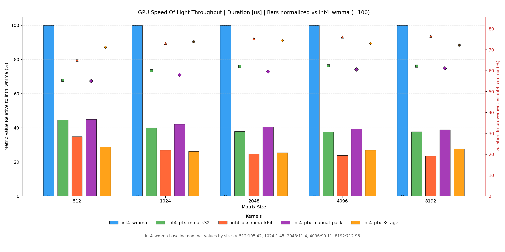

| Kernel | 512 (µs) | 1024 (ms) | 2048 (ms) | 4096 (ms) | 8192 (ms) |
|--------|----------|-----------|-----------|-----------|-----------|
| int4_wmma | 195.42 | 1.450 | 11.40 | 90.11 | 712.96 |
| int4_ptx_mma_k32 | 87.01 | 0.579 | 4.32 | 33.99 | 269.35 |
| int4_ptx_mma_k64 | 68.19 | 0.395 | **2.81** | **21.52** | **167.10** |
| int4_ptx_manual_pack | 87.84 | 0.611 | 4.61 | 35.55 | 277.13 |
| int4_ptx_3stage | **56.16** | **0.382** | 2.91 | 24.26 | 197.63 |

The performance gap between the top two kernels and the rest widens with problem size: at N=512, k64 is 2.9× faster than wmma; at N=8192 it is 4.3× faster — the relative speedup keeps growing.

---

#### 2. Warp Utilization — Active Threads Per Warp

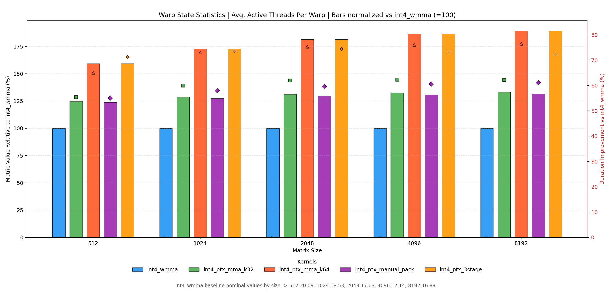

The CUDA execution model groups 32 threads into a warp. If fewer than 32 are active, functional units sit idle. `int4_wmma` activates only **16–20 threads/warp** across all sizes — meaning 38–47% of compute capacity is wasted every single cycle.

| Kernel | N=512 | N=8192 |
|--------|-------|--------|
| int4_wmma | 20.09 | 16.89 |
| int4_ptx_mma_k32 | 32 | 32 |
| int4_ptx_mma_k64 | **32** | **32** |
| int4_ptx_manual_pack | 32 | 32 |
| int4_ptx_3stage | **32** | **32** |

k64 and 3stage maintain full warp occupancy regardless of problem size. wmma's active thread count actually *decreases* as N grows — suggesting its divergence-inducing control flow becomes a larger fraction of execution at scale.

---

#### 3. Warp Divergence

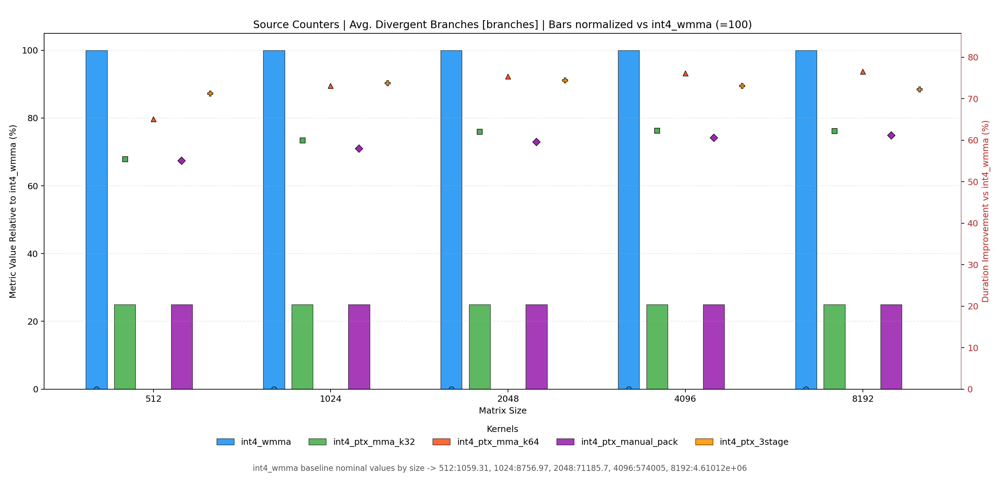
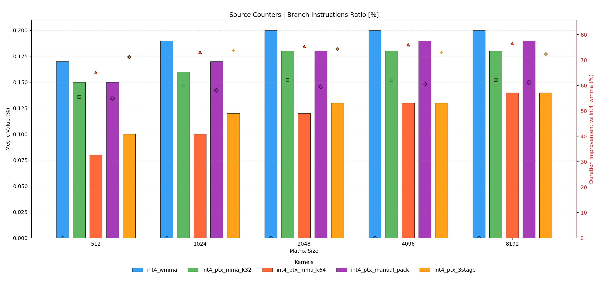

Divergent branches force the warp scheduler to serialize two or more execution paths — active thread count drops, and compute throughput collapses to a fraction of peak. At N=8192:

| Kernel | Avg. Divergent Branches |
|--------|------------------------|
| int4_wmma | 4,610,118 |
| int4_ptx_mma_k32 | 1,152,529 |
| int4_ptx_mma_k64 | **0** |
| int4_ptx_manual_pack | 1,152,529 |
| int4_ptx_3stage | **0** |

k64 and 3stage contain **zero divergent branches at every problem size**. Their inner loops are written as unconditional PTX MMA sequences with no predicated sub-warps. This is the single most impactful structural difference between the winning and losing kernels.

---

#### 4. Instruction Count

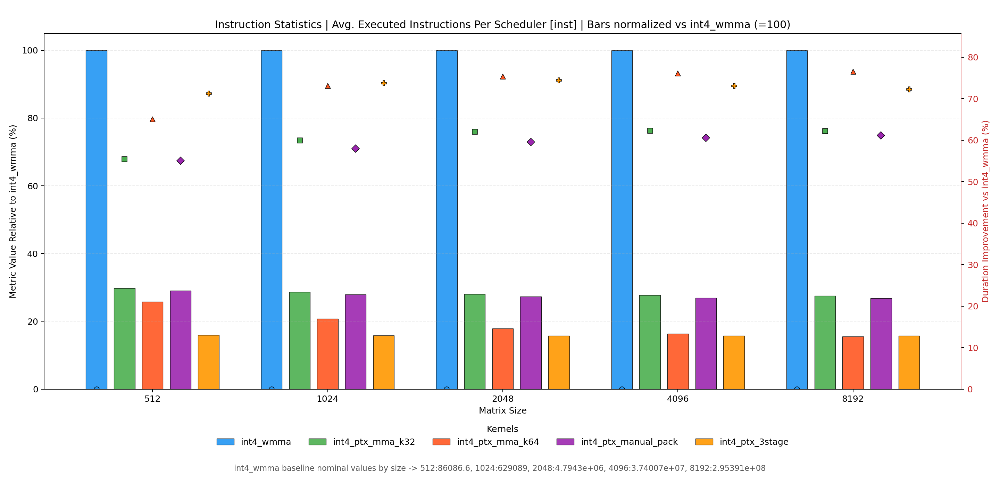

Fewer instructions reduce pressure on every downstream unit: the scheduler, the dispatch logic, the register file, and the memory subsystem. At N=8192 (average executed instructions per scheduler slot):

| Kernel | ~Avg Instrs/Scheduler |
|--------|-----------------------|
| int4_wmma | ~295M |
| int4_ptx_mma_k32 | ~81M |
| int4_ptx_mma_k64 | **~45M** |
| int4_ptx_manual_pack | ~79M |
| int4_ptx_3stage | **~46M** |

k64 and 3stage execute roughly **6.5× fewer instructions than wmma**. The instruction overhead in wmma comes from its warp-level divergence handling, predicated execution overhead, and less efficient loop unrolling relative to the explicit PTX MMA approach.

---

#### 5. Warp Cycles Per Executed Instruction

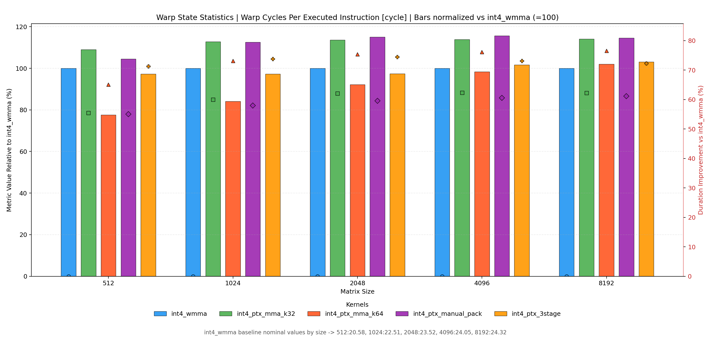

This metric counts how many cycles a warp stalls between consecutive issued instructions — a direct measure of pipeline stall depth. k64 is consistently the best or co-best across all sizes. 3stage is similarly low. wmma's cycle-per-instruction ratio improves at scale (because its long-latency stalls are increasingly hidden by its larger warp count) but never overcomes the damage done by its 6.5× higher instruction count.

---

#### 6. Register Allocation and Launch Geometry

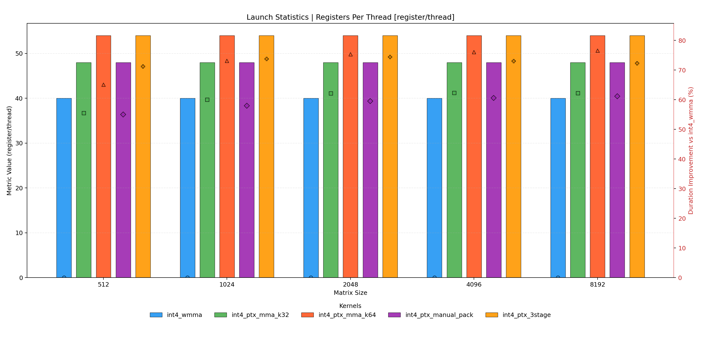
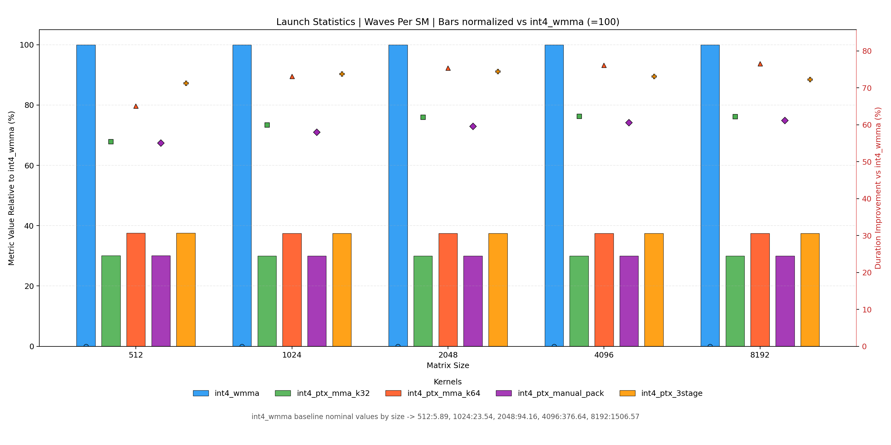

k64 and 3stage allocate **54 registers/thread**, versus 40 for wmma and 48 for k32/manual_pack. More registers allow the compiler to keep all MMA accumulator tiles and prefetch buffers live in the register file, eliminating shared-memory round-trips for intermediate results and enabling larger outer-product tiles per block.

The occupancy tradeoff is visible in **Waves Per SM** — more registers per thread means fewer concurrent blocks per SM, which increases the total wave count needed to drain the grid:

| Kernel | Waves/SM at N=8192 |
|--------|-------------------|
| int4_wmma | 1506.57 |
| int4_ptx_mma_k32 | ~530 |
| int4_ptx_mma_k64 | **564.97** |
| int4_ptx_manual_pack | ~530 |
| int4_ptx_3stage | **564.97** |

wmma's grid is launched with much smaller thread blocks — each computing a smaller tile — resulting in a 2.7× higher wave count. Each new wave pays cold-start costs (L1 miss on shared memory load, scheduler warm-up), compounding the overhead across 1500+ waves.

---

#### 7. Scheduler Efficiency

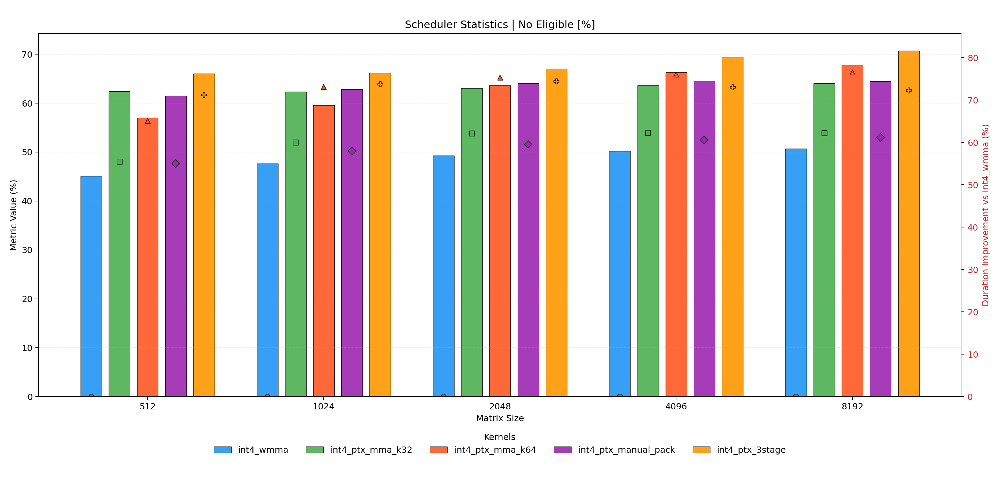
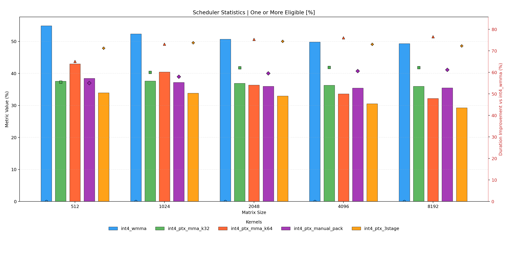
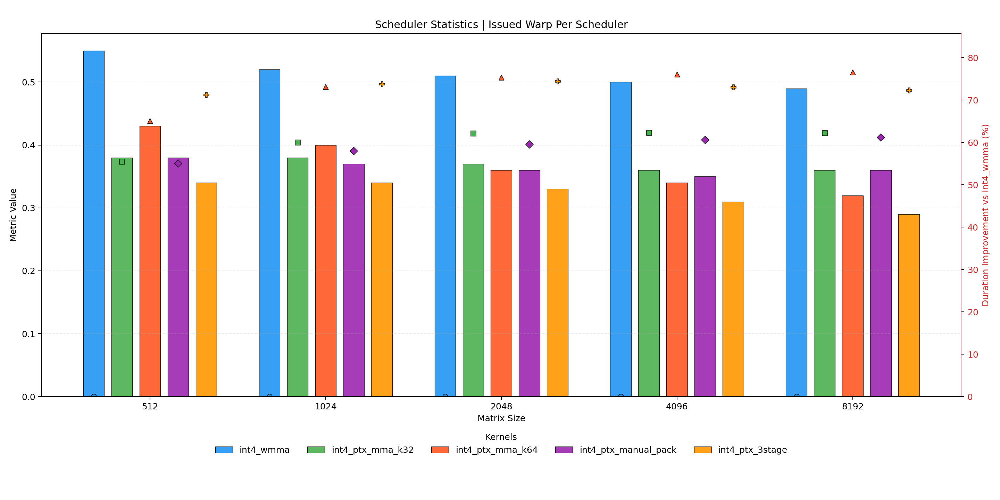

The warp scheduler issues one instruction per eligible warp per cycle. If no warp is eligible — because all warps are stalled waiting for an operand — the cycle is wasted. wmma's high divergence and partial-warp execution translate directly into a higher fraction of **No-Eligible** cycles, stalling the pipeline. k64 and 3stage's full-warp, divergence-free execution maintains a near-peak eligible-warp supply to the scheduler at all times.

---

#### 8. Memory Hierarchy

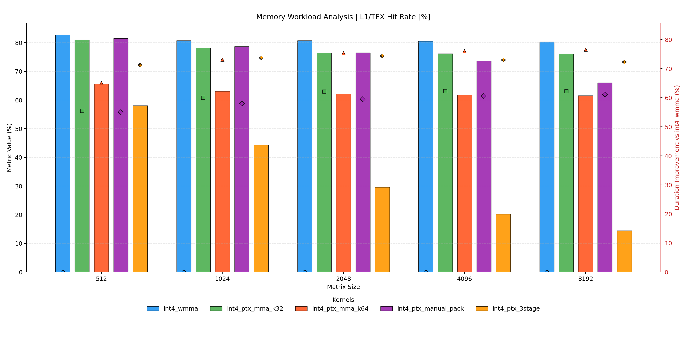
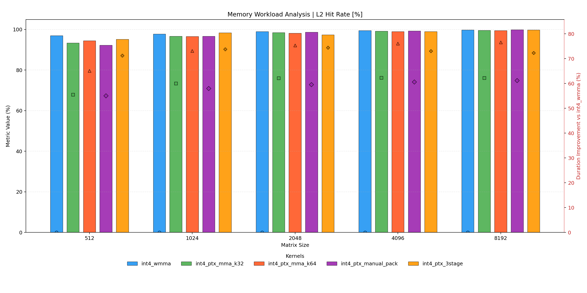
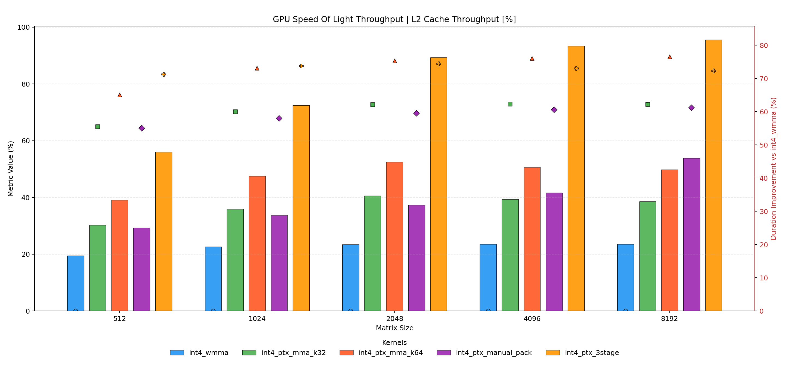
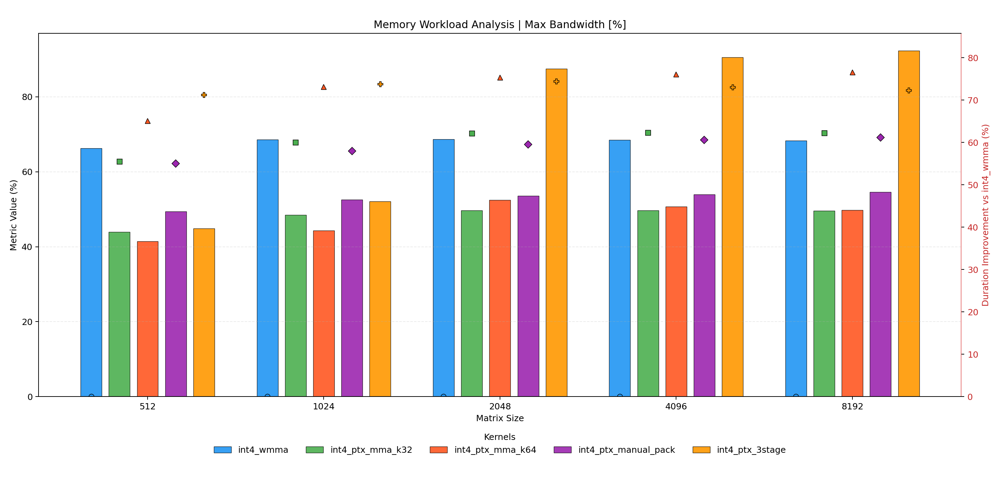

The memory behavior of k64 and 3stage diverges at large sizes, explaining the crossover in their relative performance.

**L1 Hit Rate at N=8192:**

| Kernel | L1 Hit Rate |
|--------|-------------|
| int4_wmma | 80.34% |
| int4_ptx_mma_k32 | 76.15% |
| int4_ptx_mma_k64 | 61.56% |
| int4_ptx_manual_pack | 66.06% |
| int4_ptx_3stage | **14.49%** |

3stage's explicit three-stage prefetch pipeline — while highly effective at small N — writes so many in-flight tiles into L1 at large N that the cache is saturated and hit rates collapse. The kernel compensates by saturating L2: its **L2 throughput grows from 19.5% utilization at N=512 to 95.6% at N=8192**, making 3stage an L2-bound kernel at scale.

k64 avoids this by maintaining better spatial locality in its access pattern: L1 hit rate stays at ~62% at N=8192, reducing L2 traffic and keeping more data close to the compute units. This L1/L2 balance is the decisive factor that pushes k64 ahead of 3stage at large problem sizes.

wmma maintains the highest L1 hit rate (~80%) because its small tile footprint fits comfortably in L1 — but this is a symptom of its *less ambitious* tiling strategy, not a strength. The tile is small *because* there are fewer registers available (40 vs 54), forcing more frequent global memory reloads that wmma partially hides behind its high warp count.

---

#### 9. Compute Throughput

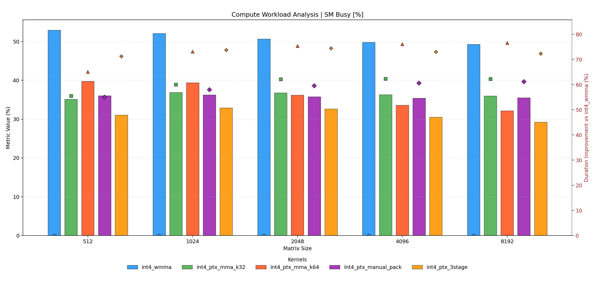
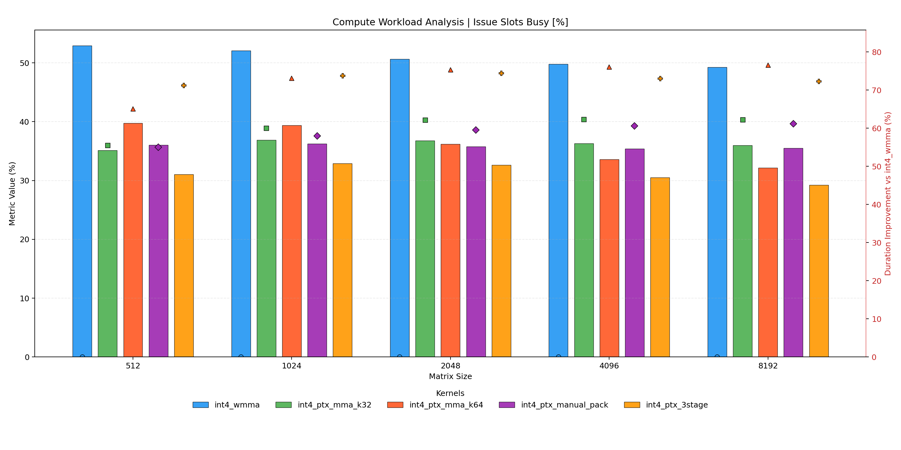
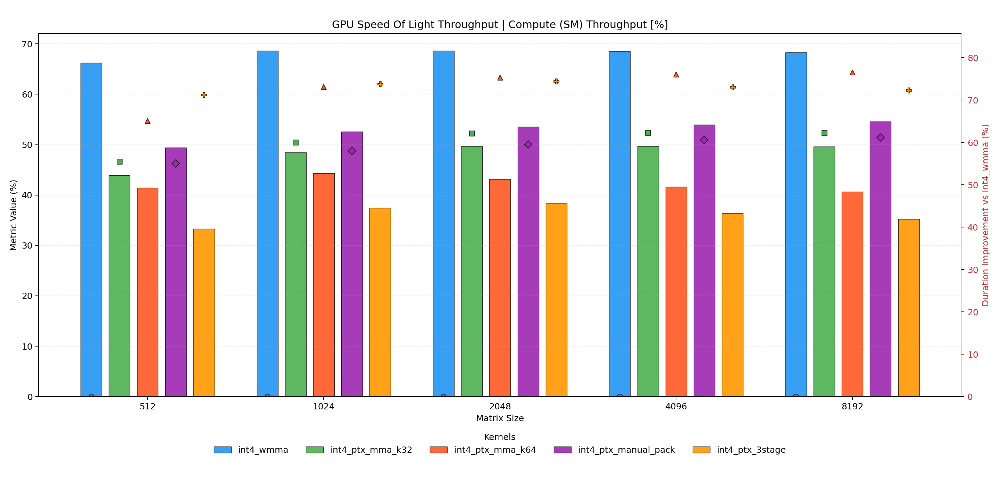

k64 and 3stage achieve higher effective SM utilization via the compounding effect of all the factors above: full warp occupancy, zero divergence, low instruction overhead, and efficient register usage mean that issue slots are productive rather than wasted serializing divergent paths or waiting on stalled warps.

---

#### 10. Occupancy

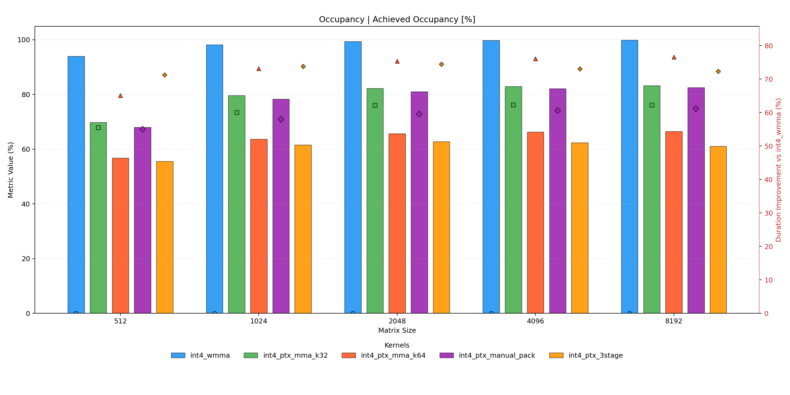
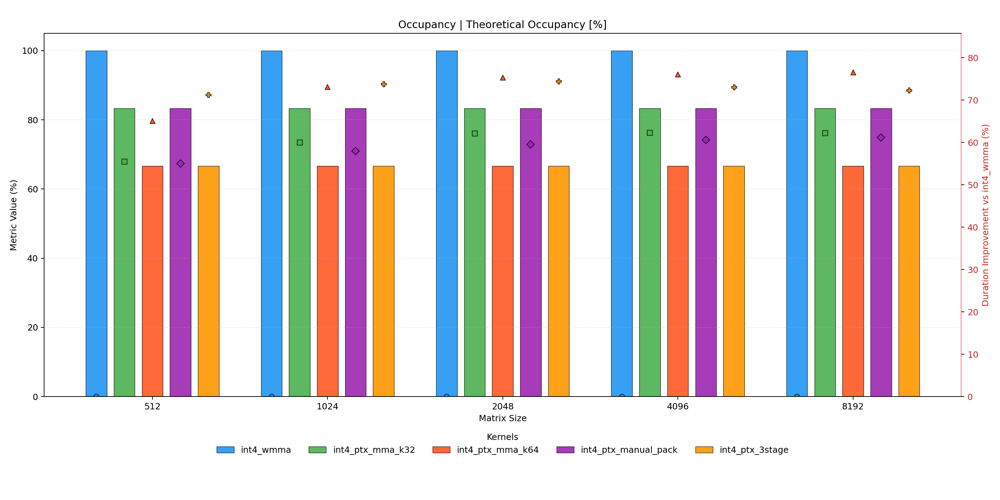

The 54-register allocation of k64 and 3stage reduces theoretical occupancy compared to wmma's 40-register count. This is a **deliberate architectural tradeoff**: despite running fewer concurrent warps per SM, the combination of full-warp execution, zero divergence, and optimized tiling delivers 3–4× higher throughput. This result is a textbook illustration of the fact that **maximizing occupancy is not the optimization target — maximizing throughput is**. Occupancy is only a proxy for throughput when warps are otherwise identical; here they are not.

---

### Summary of Key Takeaways

| # | Finding |
|---|---------|
| 1 | **Warp efficiency beats raw occupancy.** wmma has higher occupancy but consistently loses because its warps run at 50–63% thread fill with heavy divergence. |
| 2 | **Zero divergence is a prerequisite for peak MMA throughput.** Every divergent branch destroys the SIMT execution model that INT4 tensor cores depend on. |
| 3 | **Register investment pays off.** The extra 14 registers in k64/3stage (54 vs 40) enable larger tiles and register-blocked computation, reducing memory traffic at the cost of a tolerable occupancy reduction. |
| 4 | **3stage wins at small sizes; k64's cache balance wins at large sizes.** The crossover is L1 capacity exhaustion: 3stage's aggressive prefetching exceeds the L1 footprint beyond N≈1024, driving all traffic to L2 and erasing its advantage over k64. |
| 5 | **Launch geometry amplifies the gap.** k64/3stage's 2.7× smaller wave count reduces amortized block launch and cold-start costs, benefiting every size. |
| 6 | **Instruction count dominates wall time.** k32 and manual_pack improve on wmma in warp utilization and divergence, yet still execute 1.7–1.8× more instructions than k64/3stage — confirming that raw arithmetic density, not memory or scheduler effects, is the primary differentiator at the top. |
