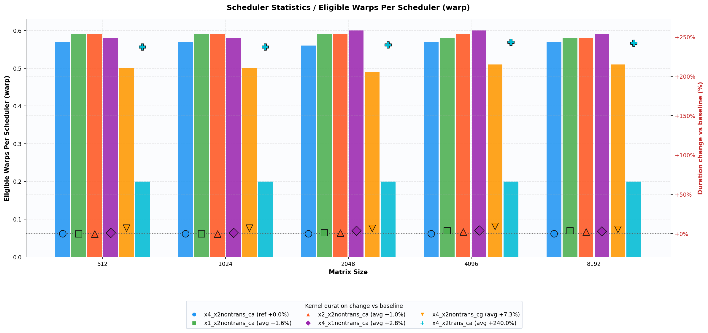
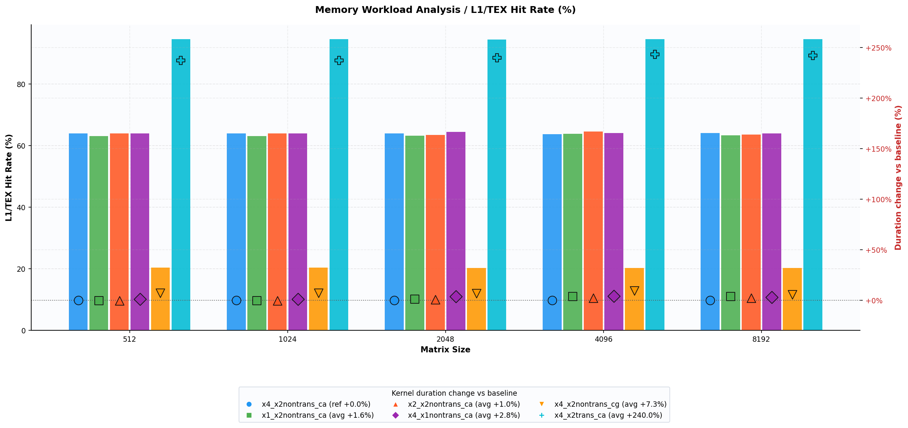
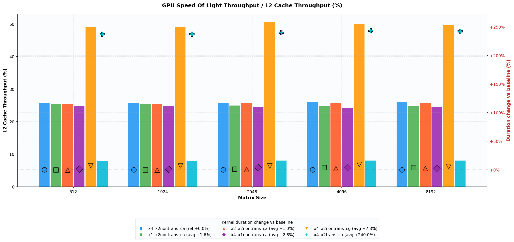
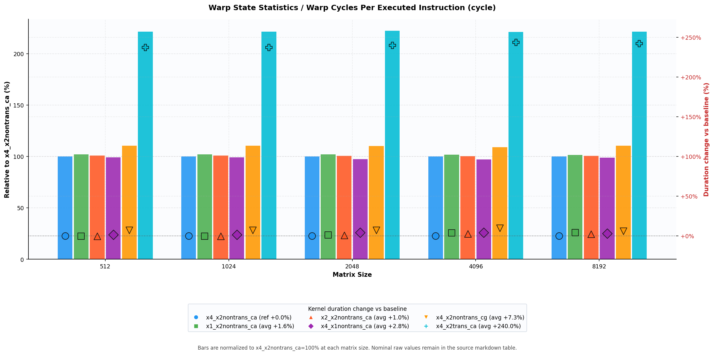
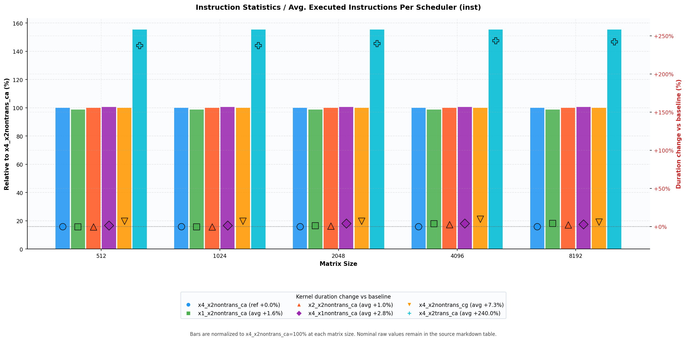

## Run 4 - Int4 k64 Family Deep Dive

### Scope

This run isolates only the `int4_ptx_mma_k64*` family:

- [`x4_x2nontrans_ca`](../../../kernels/int4_ptx_mma_k64_x4_x2nontrans_ca.cu) (baseline; same kernel as run3 `int4_ptx_mma_k64`)
- [`x1_x2nontrans_ca`](../../../kernels/int4_ptx_mma_k64_x1_x2nontrans_ca.cu)
- [`x2_x2nontrans_ca`](../../../kernels/int4_ptx_mma_k64_x2_x2nontrans_ca.cu)
- [`x4_x1nontrans_ca`](../../../kernels/int4_ptx_mma_k64_x4_x1nontrans_ca.cu)
- [`x4_x2nontrans_cg`](../../../kernels/int4_ptx_mma_k64_x4_x2nontrans_cg.cu)
- [`x4_x2trans_ca`](../../../kernels/int4_ptx_mma_k64_x4_x2trans_ca.cu)

The question is why baseline stays best, why non-cg/non-trans variants are nearly tied, why `cg` is slightly worse, and why `trans` is dramatically worse.

---

## Duration Summary

Compared to baseline (`x4_x2nontrans_ca`), kernel duration deltas are:

| Size | x1_x2nontrans_ca | x2_x2nontrans_ca | x4_x1nontrans_ca | x4_x2nontrans_cg | x4_x2trans_ca |
|---|---:|---:|---:|---:|---:|
| 512 | -0.3% | -0.3% | +1.4% | +7.1% | +237.3% |
| 1024 | -0.3% | -0.3% | +1.4% | +7.1% | +237.3% |
| 2048 | +1.1% | +0.8% | +4.0% | +7.0% | +239.8% |
| 4096 | +3.7% | +2.5% | +4.2% | +9.6% | +243.5% |
| 8192 | +3.9% | +2.3% | +3.1% | +5.9% | +242.2% |

Interpretation:

- `x1/x2/x4` non-trans `ca` variants are effectively tied (small single-digit deltas).
- `cg` is consistently a small regression (+6% to +10% around larger sizes).
- `trans` is a structural failure mode (~3.4x slower).

---

## Details

### 1. Why baseline and other non-trans `ca` variants are so close

They execute almost the same kernel behavior and hit the same limiter:

- Same occupancy class (theoretical 66.67%, achieved ~34-35%).
- Same instruction footprint class (`~5.5k` avg executed instructions/scheduler).
- Same memory throughput class (`~16.4-17.1 GB/s`).
- Same scheduler eligibility class (`~0.56-0.60` eligible warps/scheduler).

So changing `x1/x2/x4` loader split does not move the dominant bottleneck enough to produce meaningful wins.
It mainly shifts second-order behavior (L1/L2 traffic mix, eligible-warps rate, and a few-percent latency), not the primary limit.

### 2. Why `cg` is slightly worse

`cg` shifts traffic away from L1 toward L2:

- L1/TEX hit rate drops from ~64% to ~20%.
- L2 cache throughput doubles (~26% -> ~50%).
- Eligible warps/scheduler drops (~0.57 -> ~0.50).
- Warp cycles/instruction rises (~12.5 -> ~13.8).

This is exactly a small latency penalty from relying more on L2 pathing; no compensating compute gain appears, so duration increases modestly.

Note: `cg` does not mean "L1 globally equals zero"; it changes caching policy for relevant global-load paths, while other accesses can still show L1 activity.

### 3. Why `trans` is much worse

`trans` is dominated by memory-access inefficiency and resulting scheduler starvation:

- Duration jumps to ~92 us vs ~27 us (about 3.4x).
- Useful memory throughput collapses to ~5 GB/s vs ~16-17 GB/s.
- DRAM throughput % is very low (~1.68%) despite high memory busy (~60%).
- Eligible warps/scheduler collapses to ~0.20 (from ~0.57).
- One-or-more-eligible drops to ~15.8% (from ~33%).
- Warp cycles per executed instruction rises to ~27.8 (from ~12.5).
- Instruction count rises sharply (`8611` vs `~5539` avg executed instr/scheduler).
- Registers/thread increase to 64 (vs 54-55), reducing scheduling flexibility.

NCU diagnostics for `trans` show concrete uncoalescing and bank-conflict penalties:

- Global-load sector utilization is only **2.2/32 bytes** per sector (~6.9% useful payload) for `trans`.
- In the same run, non-trans `ca` kernels do not trigger this severe global-load warning and are far better coalesced overall (their total global excessive sectors are much lower).
- Source Counters at N=2048: `trans` has **1,998,848 excessive global sectors out of 2,293,760 (87%)**.
- Baseline `x4_x2nontrans_ca` at N=2048: **32,768 excessive sectors out of 327,680 (10%)**.
- Relative gap: `trans` has about **8.7x higher excessive-sector rate** (87% vs 10%) and about **61x more excessive sectors** in absolute count.
- Shared-load bank conflicts exist too (about **5.3-way**), but similar conflict signatures also appear in non-trans variants, so the primary separator is global-load coalescing, not shared-load conflict alone.

This relative data explains the paradox: `trans` keeps memory hardware busy with low-efficiency global transactions, so useful GB/s and scheduler eligibility collapse.

---

## Why Baseline Is the Optimum in Run 4

- It preserves the better L1/L2 balance of non-trans `ca` kernels (no L2 overpressure like `cg`, no access-path pathology like `trans`).
- It avoids the severe scheduler starvation seen in `trans`.
- Its tiny lead over other non-trans `ca` variants is real but small; those variants are fundamentally in the same performance basin.
- None of the tested knobs changed the dominant bottleneck class, so no variant produced a meaningful improvement over baseline.

---

## Practical Takeaways

1. Keep `x4_x2nontrans_ca` as production baseline for this kernel family.
2. Drop `trans` from performance candidates; it is structurally memory-inefficient on this setup.
3. Use `cg` only if there is a separate reason (e.g., cache interference control), not for raw latency.
4. Further gains likely require changes beyond `x{i}_x{j}` and cache-policy toggles (e.g., data layout/coalescing strategy or deeper pipeline/tiling changes), because current variants are bottleneck-equivalent.
