# NCU Charts

Source: `ncu_txt_profiles_comparison.md`

Chart layout: each chart is one metric, with grouped columns by matrix size (512, 1024, 2048, 4096, 8192); each group contains six kernel columns.

Kernel order: int8_dp4a, int8_ptx_3stage, int8_ptx_manual_pack, int8_ptx_mma_k16, int8_ptx_mma_k32, int8_wmma.

## GPU Speed Of Light Throughput

### DRAM Frequency (Ghz)

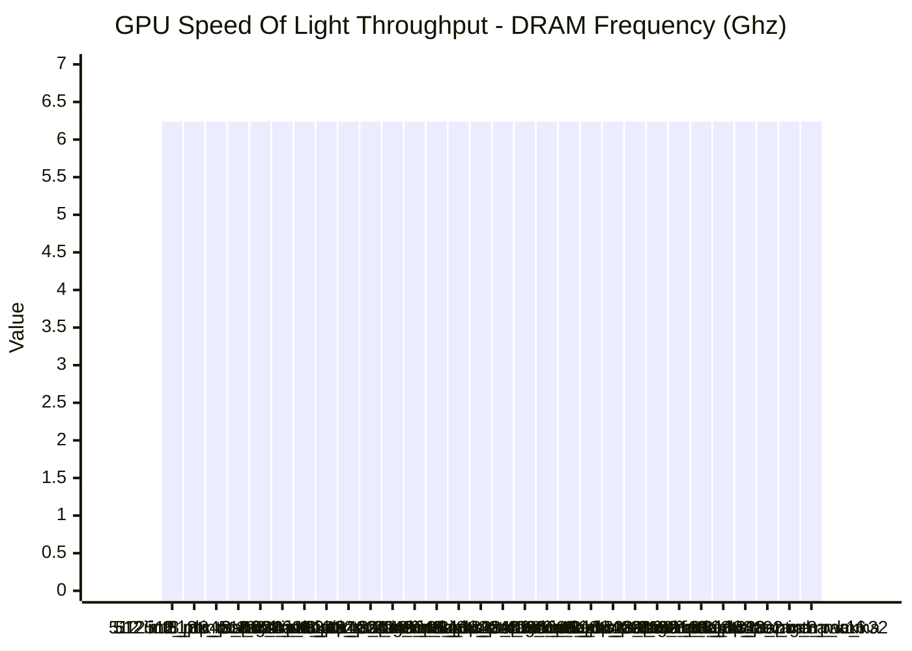
```mermaid
xychart-beta
    title "GPU Speed Of Light Throughput - DRAM Frequency (Ghz)"
    x-axis ["512 int8_dp4a", "512 int8_ptx_3stage", "512 int8_ptx_manual_pack", "512 int8_ptx_mma_k16", "512 int8_ptx_mma_k32", "512 int8_wmma", "1024 int8_dp4a", "1024 int8_ptx_3stage", "1024 int8_ptx_manual_pack", "1024 int8_ptx_mma_k16", "1024 int8_ptx_mma_k32", "1024 int8_wmma", "2048 int8_dp4a", "2048 int8_ptx_3stage", "2048 int8_ptx_manual_pack", "2048 int8_ptx_mma_k16", "2048 int8_ptx_mma_k32", "2048 int8_wmma", "4096 int8_dp4a", "4096 int8_ptx_3stage", "4096 int8_ptx_manual_pack", "4096 int8_ptx_mma_k16", "4096 int8_ptx_mma_k32", "4096 int8_wmma", "8192 int8_dp4a", "8192 int8_ptx_3stage", "8192 int8_ptx_manual_pack", "8192 int8_ptx_mma_k16", "8192 int8_ptx_mma_k32", "8192 int8_wmma"]
    y-axis "Value" 0 --> 7
    bar [6.24, 6.24, 6.24, 6.24, 6.24, 6.24, 6.24, 6.24, 6.24, 6.24, 6.24, 6.24, 6.24, 6.24, 6.24, 6.24, 6.24, 6.24, 6.24, 6.24, 6.24, 6.24, 6.24, 6.24, 6.24, 6.24, 6.24, 6.24, 6.24, 6.24]
```

### SM Frequency (Mhz)

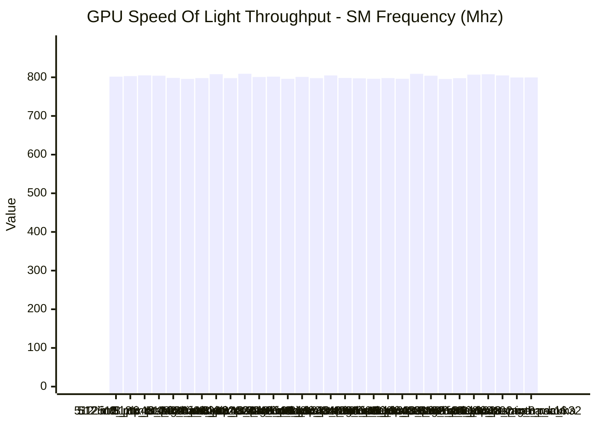
```mermaid
xychart-beta
    title "GPU Speed Of Light Throughput - SM Frequency (Mhz)"
    x-axis ["512 int8_dp4a", "512 int8_ptx_3stage", "512 int8_ptx_manual_pack", "512 int8_ptx_mma_k16", "512 int8_ptx_mma_k32", "512 int8_wmma", "1024 int8_dp4a", "1024 int8_ptx_3stage", "1024 int8_ptx_manual_pack", "1024 int8_ptx_mma_k16", "1024 int8_ptx_mma_k32", "1024 int8_wmma", "2048 int8_dp4a", "2048 int8_ptx_3stage", "2048 int8_ptx_manual_pack", "2048 int8_ptx_mma_k16", "2048 int8_ptx_mma_k32", "2048 int8_wmma", "4096 int8_dp4a", "4096 int8_ptx_3stage", "4096 int8_ptx_manual_pack", "4096 int8_ptx_mma_k16", "4096 int8_ptx_mma_k32", "4096 int8_wmma", "8192 int8_dp4a", "8192 int8_ptx_3stage", "8192 int8_ptx_manual_pack", "8192 int8_ptx_mma_k16", "8192 int8_ptx_mma_k32", "8192 int8_wmma"]
    y-axis "Value" 0 --> 891
    bar [801.76, 803.02, 805.05, 804.14, 798.45, 795.87, 797.86, 808.03, 797.81, 809.15, 800.78, 801.79, 796.07, 800.94, 797.75, 804.82, 798.37, 797.36, 796.21, 797.92, 796.20, 808.89, 804.17, 795.53, 797.70, 806.80, 807.82, 804.79, 799.59, 799.76]
```

### Elapsed Cycles (cycle)

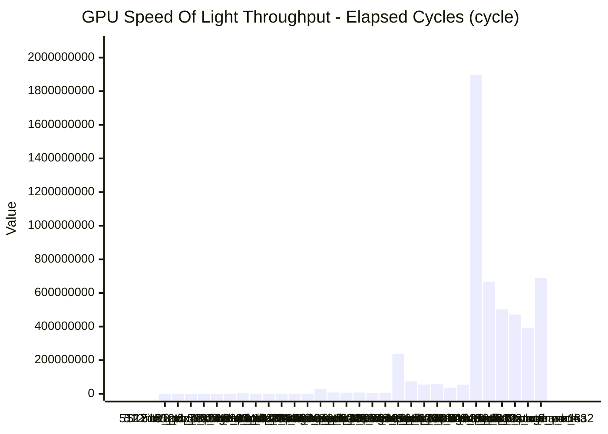
```mermaid
xychart-beta
    title "GPU Speed Of Light Throughput - Elapsed Cycles (cycle)"
    x-axis ["512 int8_dp4a", "512 int8_ptx_3stage", "512 int8_ptx_manual_pack", "512 int8_ptx_mma_k16", "512 int8_ptx_mma_k32", "512 int8_wmma", "1024 int8_dp4a", "1024 int8_ptx_3stage", "1024 int8_ptx_manual_pack", "1024 int8_ptx_mma_k16", "1024 int8_ptx_mma_k32", "1024 int8_wmma", "2048 int8_dp4a", "2048 int8_ptx_3stage", "2048 int8_ptx_manual_pack", "2048 int8_ptx_mma_k16", "2048 int8_ptx_mma_k32", "2048 int8_wmma", "4096 int8_dp4a", "4096 int8_ptx_3stage", "4096 int8_ptx_manual_pack", "4096 int8_ptx_mma_k16", "4096 int8_ptx_mma_k32", "4096 int8_wmma", "8192 int8_dp4a", "8192 int8_ptx_3stage", "8192 int8_ptx_manual_pack", "8192 int8_ptx_mma_k16", "8192 int8_ptx_mma_k32", "8192 int8_wmma"]
    y-axis "Value" 0 --> 2087288479
    bar [474808, 122639, 129159, 165614, 93542, 121418, 3715954, 934381, 938693, 1087000, 635020, 889297, 29322720, 8220400, 7139230, 7786894, 4768959, 6831783, 237319405, 75213504, 55428773, 59474411, 37385672, 54493221, 1897534980, 667548493, 502956946, 471921869, 390675202, 689414888]
```

### Memory Throughput (%)

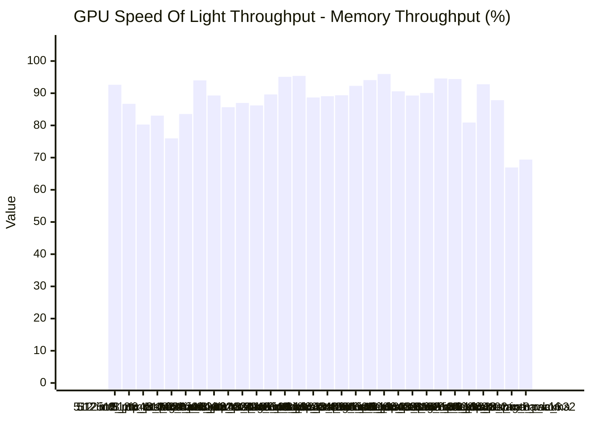
```mermaid
xychart-beta
    title "GPU Speed Of Light Throughput - Memory Throughput (%)"
    x-axis ["512 int8_dp4a", "512 int8_ptx_3stage", "512 int8_ptx_manual_pack", "512 int8_ptx_mma_k16", "512 int8_ptx_mma_k32", "512 int8_wmma", "1024 int8_dp4a", "1024 int8_ptx_3stage", "1024 int8_ptx_manual_pack", "1024 int8_ptx_mma_k16", "1024 int8_ptx_mma_k32", "1024 int8_wmma", "2048 int8_dp4a", "2048 int8_ptx_3stage", "2048 int8_ptx_manual_pack", "2048 int8_ptx_mma_k16", "2048 int8_ptx_mma_k32", "2048 int8_wmma", "4096 int8_dp4a", "4096 int8_ptx_3stage", "4096 int8_ptx_manual_pack", "4096 int8_ptx_mma_k16", "4096 int8_ptx_mma_k32", "4096 int8_wmma", "8192 int8_dp4a", "8192 int8_ptx_3stage", "8192 int8_ptx_manual_pack", "8192 int8_ptx_mma_k16", "8192 int8_ptx_mma_k32", "8192 int8_wmma"]
    y-axis "Value" 0 --> 106
    bar [92.63, 86.70, 80.28, 83.03, 75.98, 83.54, 94.00, 89.30, 85.65, 86.97, 86.21, 89.64, 95.10, 95.39, 88.68, 89.07, 89.38, 92.29, 94.08, 95.96, 90.59, 89.28, 90.08, 94.58, 94.40, 80.89, 92.80, 87.84, 66.95, 69.38]
```

### DRAM Throughput (%)

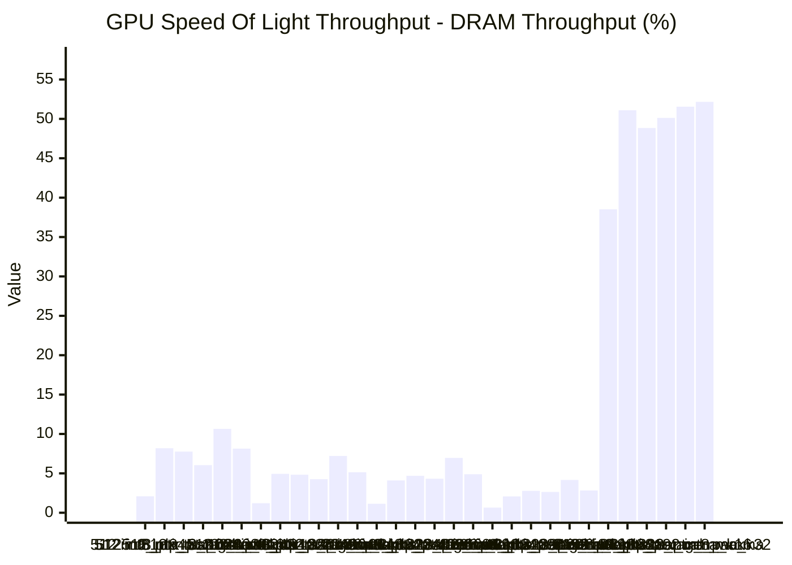
```mermaid
xychart-beta
    title "GPU Speed Of Light Throughput - DRAM Throughput (%)"
    x-axis ["512 int8_dp4a", "512 int8_ptx_3stage", "512 int8_ptx_manual_pack", "512 int8_ptx_mma_k16", "512 int8_ptx_mma_k32", "512 int8_wmma", "1024 int8_dp4a", "1024 int8_ptx_3stage", "1024 int8_ptx_manual_pack", "1024 int8_ptx_mma_k16", "1024 int8_ptx_mma_k32", "1024 int8_wmma", "2048 int8_dp4a", "2048 int8_ptx_3stage", "2048 int8_ptx_manual_pack", "2048 int8_ptx_mma_k16", "2048 int8_ptx_mma_k32", "2048 int8_wmma", "4096 int8_dp4a", "4096 int8_ptx_3stage", "4096 int8_ptx_manual_pack", "4096 int8_ptx_mma_k16", "4096 int8_ptx_mma_k32", "4096 int8_wmma", "8192 int8_dp4a", "8192 int8_ptx_3stage", "8192 int8_ptx_manual_pack", "8192 int8_ptx_mma_k16", "8192 int8_ptx_mma_k32", "8192 int8_wmma"]
    y-axis "Value" 0 --> 58
    bar [2.09, 8.19, 7.76, 6.04, 10.65, 8.14, 1.21, 4.94, 4.83, 4.26, 7.21, 5.14, 1.14, 4.10, 4.69, 4.32, 6.96, 4.89, 0.65, 2.07, 2.78, 2.64, 4.16, 2.82, 38.52, 51.09, 48.84, 50.12, 51.55, 52.16]
```

### Duration (us)

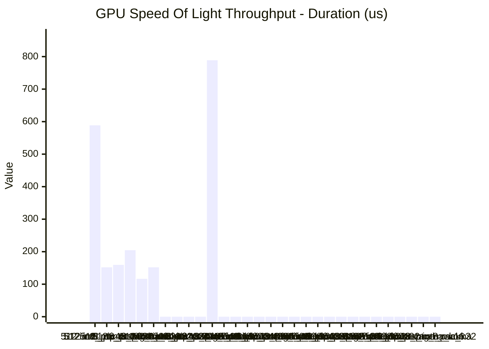
```mermaid
xychart-beta
    title "GPU Speed Of Light Throughput - Duration (us)"
    x-axis ["512 int8_dp4a", "512 int8_ptx_3stage", "512 int8_ptx_manual_pack", "512 int8_ptx_mma_k16", "512 int8_ptx_mma_k32", "512 int8_wmma", "1024 int8_dp4a", "1024 int8_ptx_3stage", "1024 int8_ptx_manual_pack", "1024 int8_ptx_mma_k16", "1024 int8_ptx_mma_k32", "1024 int8_wmma", "2048 int8_dp4a", "2048 int8_ptx_3stage", "2048 int8_ptx_manual_pack", "2048 int8_ptx_mma_k16", "2048 int8_ptx_mma_k32", "2048 int8_wmma", "4096 int8_dp4a", "4096 int8_ptx_3stage", "4096 int8_ptx_manual_pack", "4096 int8_ptx_mma_k16", "4096 int8_ptx_mma_k32", "4096 int8_wmma", "8192 int8_dp4a", "8192 int8_ptx_3stage", "8192 int8_ptx_manual_pack", "8192 int8_ptx_mma_k16", "8192 int8_ptx_mma_k32", "8192 int8_wmma"]
    y-axis "Value" 0 --> 868
    bar [588.80, 151.87, 159.55, 204.54, 116.58, 152, 0, 0, 0, 0, 788.83, 0, 0, 0, 0, 0, 0, 0, 0, 0, 0, 0, 0, 0, 0, 0, 0, 0, 0, 0]
```

### L1/TEX Cache Throughput (%)

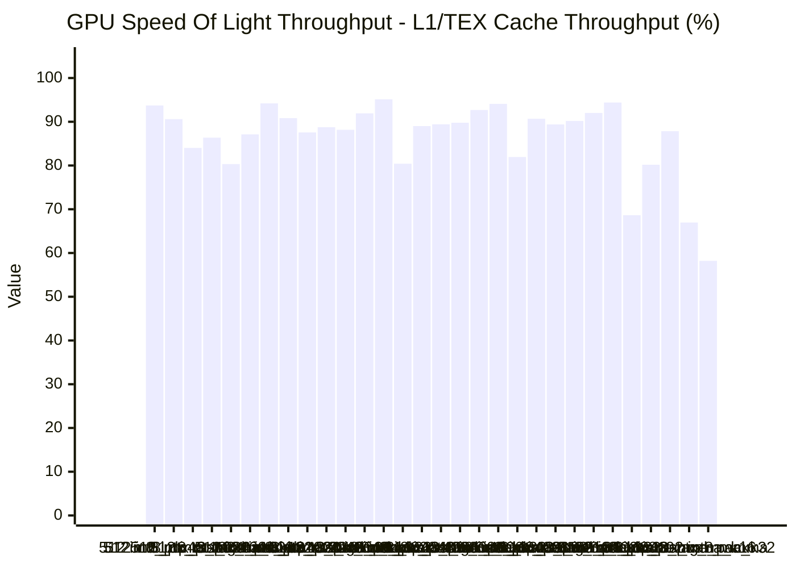
```mermaid
xychart-beta
    title "GPU Speed Of Light Throughput - L1/TEX Cache Throughput (%)"
    x-axis ["512 int8_dp4a", "512 int8_ptx_3stage", "512 int8_ptx_manual_pack", "512 int8_ptx_mma_k16", "512 int8_ptx_mma_k32", "512 int8_wmma", "1024 int8_dp4a", "1024 int8_ptx_3stage", "1024 int8_ptx_manual_pack", "1024 int8_ptx_mma_k16", "1024 int8_ptx_mma_k32", "1024 int8_wmma", "2048 int8_dp4a", "2048 int8_ptx_3stage", "2048 int8_ptx_manual_pack", "2048 int8_ptx_mma_k16", "2048 int8_ptx_mma_k32", "2048 int8_wmma", "4096 int8_dp4a", "4096 int8_ptx_3stage", "4096 int8_ptx_manual_pack", "4096 int8_ptx_mma_k16", "4096 int8_ptx_mma_k32", "4096 int8_wmma", "8192 int8_dp4a", "8192 int8_ptx_3stage", "8192 int8_ptx_manual_pack", "8192 int8_ptx_mma_k16", "8192 int8_ptx_mma_k32", "8192 int8_wmma"]
    y-axis "Value" 0 --> 105
    bar [93.73, 90.60, 84.02, 86.37, 80.33, 87.13, 94.21, 90.84, 87.56, 88.76, 88.16, 91.93, 95.14, 80.41, 89.01, 89.42, 89.78, 92.69, 94.09, 81.95, 90.69, 89.38, 90.19, 92.02, 94.40, 68.64, 80.18, 87.86, 66.97, 58.20]
```

### L2 Cache Throughput (%)

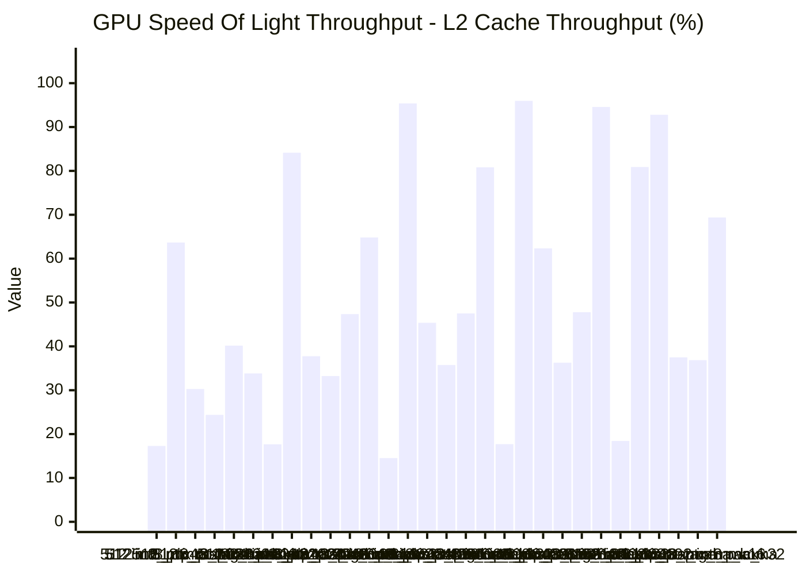
```mermaid
xychart-beta
    title "GPU Speed Of Light Throughput - L2 Cache Throughput (%)"
    x-axis ["512 int8_dp4a", "512 int8_ptx_3stage", "512 int8_ptx_manual_pack", "512 int8_ptx_mma_k16", "512 int8_ptx_mma_k32", "512 int8_wmma", "1024 int8_dp4a", "1024 int8_ptx_3stage", "1024 int8_ptx_manual_pack", "1024 int8_ptx_mma_k16", "1024 int8_ptx_mma_k32", "1024 int8_wmma", "2048 int8_dp4a", "2048 int8_ptx_3stage", "2048 int8_ptx_manual_pack", "2048 int8_ptx_mma_k16", "2048 int8_ptx_mma_k32", "2048 int8_wmma", "4096 int8_dp4a", "4096 int8_ptx_3stage", "4096 int8_ptx_manual_pack", "4096 int8_ptx_mma_k16", "4096 int8_ptx_mma_k32", "4096 int8_wmma", "8192 int8_dp4a", "8192 int8_ptx_3stage", "8192 int8_ptx_manual_pack", "8192 int8_ptx_mma_k16", "8192 int8_ptx_mma_k32", "8192 int8_wmma"]
    y-axis "Value" 0 --> 106
    bar [17.30, 63.67, 30.28, 24.38, 40.17, 33.83, 17.68, 84.14, 37.75, 33.24, 47.35, 64.83, 14.53, 95.39, 45.37, 35.75, 47.50, 80.81, 17.70, 95.96, 62.33, 36.28, 47.78, 94.58, 18.43, 80.89, 92.80, 37.49, 36.85, 69.38]
```

### SM Active Cycles (cycle)

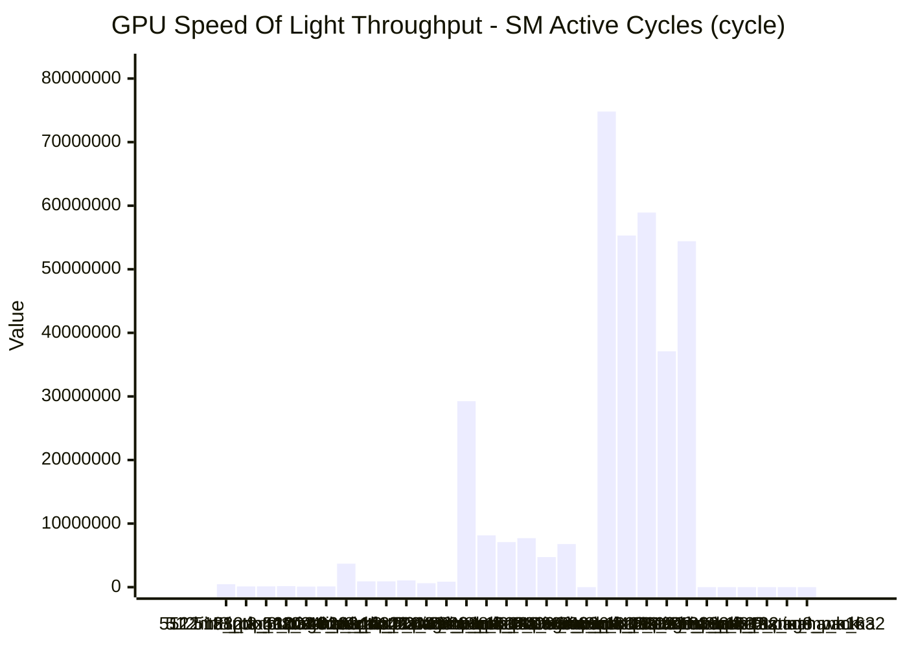
```mermaid
xychart-beta
    title "GPU Speed Of Light Throughput - SM Active Cycles (cycle)"
    x-axis ["512 int8_dp4a", "512 int8_ptx_3stage", "512 int8_ptx_manual_pack", "512 int8_ptx_mma_k16", "512 int8_ptx_mma_k32", "512 int8_wmma", "1024 int8_dp4a", "1024 int8_ptx_3stage", "1024 int8_ptx_manual_pack", "1024 int8_ptx_mma_k16", "1024 int8_ptx_mma_k32", "1024 int8_wmma", "2048 int8_dp4a", "2048 int8_ptx_3stage", "2048 int8_ptx_manual_pack", "2048 int8_ptx_mma_k16", "2048 int8_ptx_mma_k32", "2048 int8_wmma", "4096 int8_dp4a", "4096 int8_ptx_3stage", "4096 int8_ptx_manual_pack", "4096 int8_ptx_mma_k16", "4096 int8_ptx_mma_k32", "4096 int8_wmma", "8192 int8_dp4a", "8192 int8_ptx_3stage", "8192 int8_ptx_manual_pack", "8192 int8_ptx_mma_k16", "8192 int8_ptx_mma_k32", "8192 int8_wmma"]
    y-axis "Value" 0 --> 82292602
    bar [466540.59, 116686.60, 122713.38, 158121.90, 88041.86, 115989.07, 3698740.91, 912240.24, 915557.84, 1057492.14, 617689.88, 863883.81, 29243869.10, 8144326.64, 7097133.90, 7706847.91, 4732894.76, 6786233.60, 0, 74811455.50, 55312771.33, 58918146.47, 37099824.48, 54415000.97, 0, 0, 0, 0, 0, 0]
```

### Compute (SM) Throughput (%)

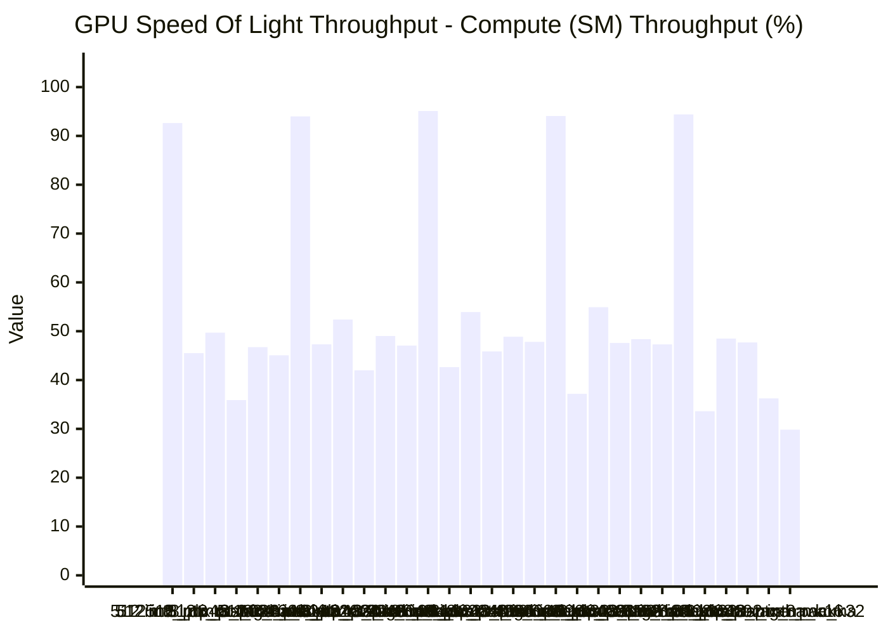
```mermaid
xychart-beta
    title "GPU Speed Of Light Throughput - Compute (SM) Throughput (%)"
    x-axis ["512 int8_dp4a", "512 int8_ptx_3stage", "512 int8_ptx_manual_pack", "512 int8_ptx_mma_k16", "512 int8_ptx_mma_k32", "512 int8_wmma", "1024 int8_dp4a", "1024 int8_ptx_3stage", "1024 int8_ptx_manual_pack", "1024 int8_ptx_mma_k16", "1024 int8_ptx_mma_k32", "1024 int8_wmma", "2048 int8_dp4a", "2048 int8_ptx_3stage", "2048 int8_ptx_manual_pack", "2048 int8_ptx_mma_k16", "2048 int8_ptx_mma_k32", "2048 int8_wmma", "4096 int8_dp4a", "4096 int8_ptx_3stage", "4096 int8_ptx_manual_pack", "4096 int8_ptx_mma_k16", "4096 int8_ptx_mma_k32", "4096 int8_wmma", "8192 int8_dp4a", "8192 int8_ptx_3stage", "8192 int8_ptx_manual_pack", "8192 int8_ptx_mma_k16", "8192 int8_ptx_mma_k32", "8192 int8_wmma"]
    y-axis "Value" 0 --> 105
    bar [92.63, 45.52, 49.71, 35.90, 46.74, 45.07, 94.00, 47.31, 52.40, 41.99, 49.02, 47.06, 95.10, 42.64, 53.93, 45.86, 48.87, 47.81, 94.08, 37.18, 54.92, 47.60, 48.38, 47.30, 94.40, 33.62, 48.50, 47.70, 36.25, 29.85]
```

### Duration (ms)

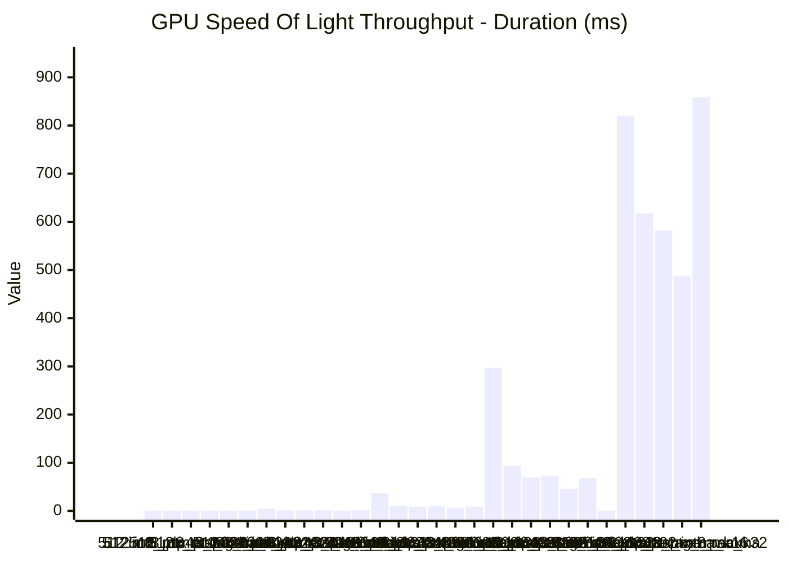
```mermaid
xychart-beta
    title "GPU Speed Of Light Throughput - Duration (ms)"
    x-axis ["512 int8_dp4a", "512 int8_ptx_3stage", "512 int8_ptx_manual_pack", "512 int8_ptx_mma_k16", "512 int8_ptx_mma_k32", "512 int8_wmma", "1024 int8_dp4a", "1024 int8_ptx_3stage", "1024 int8_ptx_manual_pack", "1024 int8_ptx_mma_k16", "1024 int8_ptx_mma_k32", "1024 int8_wmma", "2048 int8_dp4a", "2048 int8_ptx_3stage", "2048 int8_ptx_manual_pack", "2048 int8_ptx_mma_k16", "2048 int8_ptx_mma_k32", "2048 int8_wmma", "4096 int8_dp4a", "4096 int8_ptx_3stage", "4096 int8_ptx_manual_pack", "4096 int8_ptx_mma_k16", "4096 int8_ptx_mma_k32", "4096 int8_wmma", "8192 int8_dp4a", "8192 int8_ptx_3stage", "8192 int8_ptx_manual_pack", "8192 int8_ptx_mma_k16", "8192 int8_ptx_mma_k32", "8192 int8_wmma"]
    y-axis "Value" 0 --> 945
    bar [0, 0, 0, 0, 0, 0, 4.65, 1.15, 1.17, 1.33, 0, 1.11, 36.75, 10.22, 8.93, 9.61, 5.96, 8.55, 296.86, 93.88, 69.54, 72.93, 46.19, 68.47, 0, 820.32, 617.68, 582.00, 487.57, 858.30]
```

### Duration (s)

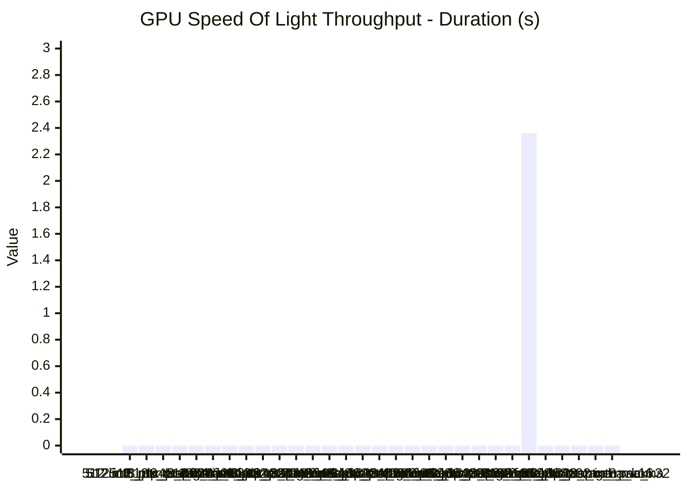
```mermaid
xychart-beta
    title "GPU Speed Of Light Throughput - Duration (s)"
    x-axis ["512 int8_dp4a", "512 int8_ptx_3stage", "512 int8_ptx_manual_pack", "512 int8_ptx_mma_k16", "512 int8_ptx_mma_k32", "512 int8_wmma", "1024 int8_dp4a", "1024 int8_ptx_3stage", "1024 int8_ptx_manual_pack", "1024 int8_ptx_mma_k16", "1024 int8_ptx_mma_k32", "1024 int8_wmma", "2048 int8_dp4a", "2048 int8_ptx_3stage", "2048 int8_ptx_manual_pack", "2048 int8_ptx_mma_k16", "2048 int8_ptx_mma_k32", "2048 int8_wmma", "4096 int8_dp4a", "4096 int8_ptx_3stage", "4096 int8_ptx_manual_pack", "4096 int8_ptx_mma_k16", "4096 int8_ptx_mma_k32", "4096 int8_wmma", "8192 int8_dp4a", "8192 int8_ptx_3stage", "8192 int8_ptx_manual_pack", "8192 int8_ptx_mma_k16", "8192 int8_ptx_mma_k32", "8192 int8_wmma"]
    y-axis "Value" 0 --> 3
    bar [0, 0, 0, 0, 0, 0, 0, 0, 0, 0, 0, 0, 0, 0, 0, 0, 0, 0, 0, 0, 0, 0, 0, 0, 2.36, 0, 0, 0, 0, 0]
```

## PM Sampling

### Maximum Buffer Size (Mbyte)

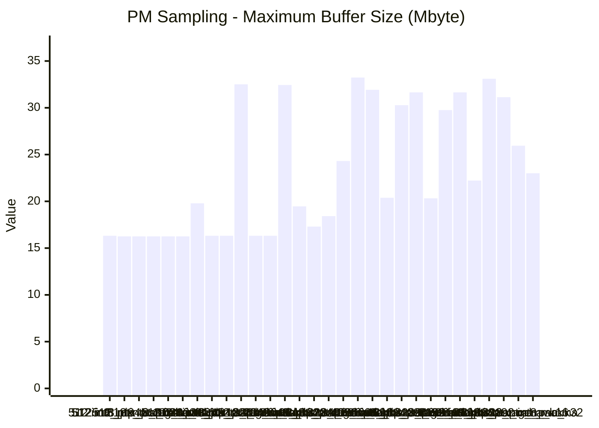
```mermaid
xychart-beta
    title "PM Sampling - Maximum Buffer Size (Mbyte)"
    x-axis ["512 int8_dp4a", "512 int8_ptx_3stage", "512 int8_ptx_manual_pack", "512 int8_ptx_mma_k16", "512 int8_ptx_mma_k32", "512 int8_wmma", "1024 int8_dp4a", "1024 int8_ptx_3stage", "1024 int8_ptx_manual_pack", "1024 int8_ptx_mma_k16", "1024 int8_ptx_mma_k32", "1024 int8_wmma", "2048 int8_dp4a", "2048 int8_ptx_3stage", "2048 int8_ptx_manual_pack", "2048 int8_ptx_mma_k16", "2048 int8_ptx_mma_k32", "2048 int8_wmma", "4096 int8_dp4a", "4096 int8_ptx_3stage", "4096 int8_ptx_manual_pack", "4096 int8_ptx_mma_k16", "4096 int8_ptx_mma_k32", "4096 int8_wmma", "8192 int8_dp4a", "8192 int8_ptx_3stage", "8192 int8_ptx_manual_pack", "8192 int8_ptx_mma_k16", "8192 int8_ptx_mma_k32", "8192 int8_wmma"]
    y-axis "Value" 0 --> 37
    bar [16.32, 16.25, 16.25, 16.25, 16.25, 16.25, 19.79, 16.32, 16.32, 32.51, 16.32, 16.32, 32.44, 19.46, 17.30, 18.42, 24.31, 33.23, 31.92, 20.38, 30.28, 31.65, 20.32, 29.75, 31.65, 22.22, 33.10, 31.13, 25.95, 23.00]
```

### Maximum Sampling Interval (us)

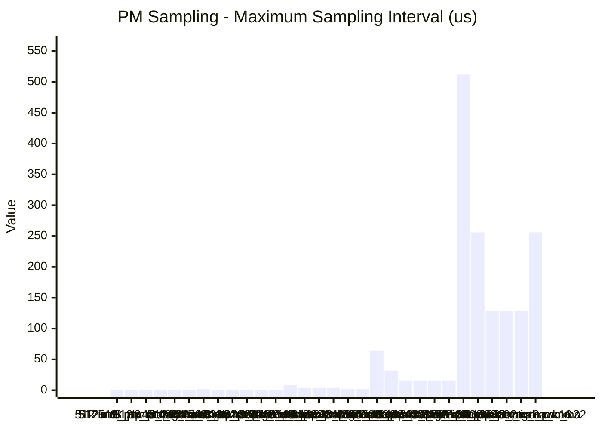
```mermaid
xychart-beta
    title "PM Sampling - Maximum Sampling Interval (us)"
    x-axis ["512 int8_dp4a", "512 int8_ptx_3stage", "512 int8_ptx_manual_pack", "512 int8_ptx_mma_k16", "512 int8_ptx_mma_k32", "512 int8_wmma", "1024 int8_dp4a", "1024 int8_ptx_3stage", "1024 int8_ptx_manual_pack", "1024 int8_ptx_mma_k16", "1024 int8_ptx_mma_k32", "1024 int8_wmma", "2048 int8_dp4a", "2048 int8_ptx_3stage", "2048 int8_ptx_manual_pack", "2048 int8_ptx_mma_k16", "2048 int8_ptx_mma_k32", "2048 int8_wmma", "4096 int8_dp4a", "4096 int8_ptx_3stage", "4096 int8_ptx_manual_pack", "4096 int8_ptx_mma_k16", "4096 int8_ptx_mma_k32", "4096 int8_wmma", "8192 int8_dp4a", "8192 int8_ptx_3stage", "8192 int8_ptx_manual_pack", "8192 int8_ptx_mma_k16", "8192 int8_ptx_mma_k32", "8192 int8_wmma"]
    y-axis "Value" 0 --> 564
    bar [1, 1, 1, 1, 1, 1, 2, 1, 1, 1, 1, 1, 8, 4, 4, 4, 2, 2, 64, 32, 16, 16, 16, 16, 512, 256, 128, 128, 128, 256]
```

### # Pass Groups

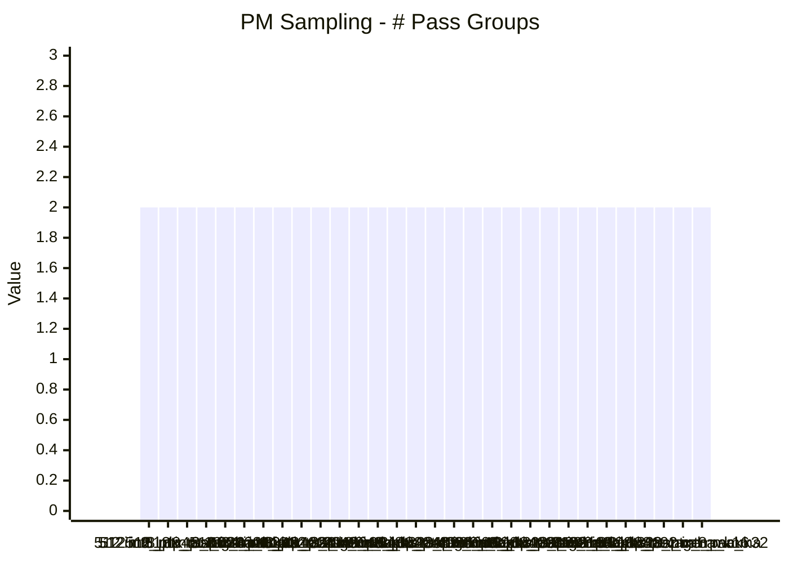
```mermaid
xychart-beta
    title "PM Sampling - # Pass Groups"
    x-axis ["512 int8_dp4a", "512 int8_ptx_3stage", "512 int8_ptx_manual_pack", "512 int8_ptx_mma_k16", "512 int8_ptx_mma_k32", "512 int8_wmma", "1024 int8_dp4a", "1024 int8_ptx_3stage", "1024 int8_ptx_manual_pack", "1024 int8_ptx_mma_k16", "1024 int8_ptx_mma_k32", "1024 int8_wmma", "2048 int8_dp4a", "2048 int8_ptx_3stage", "2048 int8_ptx_manual_pack", "2048 int8_ptx_mma_k16", "2048 int8_ptx_mma_k32", "2048 int8_wmma", "4096 int8_dp4a", "4096 int8_ptx_3stage", "4096 int8_ptx_manual_pack", "4096 int8_ptx_mma_k16", "4096 int8_ptx_mma_k32", "4096 int8_wmma", "8192 int8_dp4a", "8192 int8_ptx_3stage", "8192 int8_ptx_manual_pack", "8192 int8_ptx_mma_k16", "8192 int8_ptx_mma_k32", "8192 int8_wmma"]
    y-axis "Value" 0 --> 3
    bar [2, 2, 2, 2, 2, 2, 2, 2, 2, 2, 2, 2, 2, 2, 2, 2, 2, 2, 2, 2, 2, 2, 2, 2, 2, 2, 2, 2, 2, 2]
```

## Compute Workload Analysis

### Executed Ipc Active (inst/cycle)

```mermaid
xychart-beta
    title "Compute Workload Analysis - Executed Ipc Active (inst/cycle)"
    x-axis ["512 int8_dp4a", "512 int8_ptx_3stage", "512 int8_ptx_manual_pack", "512 int8_ptx_mma_k16", "512 int8_ptx_mma_k32", "512 int8_wmma", "1024 int8_dp4a", "1024 int8_ptx_3stage", "1024 int8_ptx_manual_pack", "1024 int8_ptx_mma_k16", "1024 int8_ptx_mma_k32", "1024 int8_wmma", "2048 int8_dp4a", "2048 int8_ptx_3stage", "2048 int8_ptx_manual_pack", "2048 int8_ptx_mma_k16", "2048 int8_ptx_mma_k32", "2048 int8_wmma", "4096 int8_dp4a", "4096 int8_ptx_3stage", "4096 int8_ptx_manual_pack", "4096 int8_ptx_mma_k16", "4096 int8_ptx_mma_k32", "4096 int8_wmma", "8192 int8_dp4a", "8192 int8_ptx_3stage", "8192 int8_ptx_manual_pack", "8192 int8_ptx_mma_k16", "8192 int8_ptx_mma_k32", "8192 int8_wmma"]
    y-axis "Value" 0 --> 3
    bar [1.11, 1.46, 1.93, 1.11, 1.46, 1.47, 1.09, 1.46, 1.94, 1.29, 1.35, 1.46, 1.08, 1.29, 1.94, 1.39, 1.25, 1.43, 1.06, 1.12, 1.96, 1.45, 1.19, 1.39, 1.07, 1.01, 1.72, 1.45, 0.87, 0.87]
```

### Executed Ipc Elapsed (inst/cycle)

```mermaid
xychart-beta
    title "Compute Workload Analysis - Executed Ipc Elapsed (inst/cycle)"
    x-axis ["512 int8_dp4a", "512 int8_ptx_3stage", "512 int8_ptx_manual_pack", "512 int8_ptx_mma_k16", "512 int8_ptx_mma_k32", "512 int8_wmma", "1024 int8_dp4a", "1024 int8_ptx_3stage", "1024 int8_ptx_manual_pack", "1024 int8_ptx_mma_k16", "1024 int8_ptx_mma_k32", "1024 int8_wmma", "2048 int8_dp4a", "2048 int8_ptx_3stage", "2048 int8_ptx_manual_pack", "2048 int8_ptx_mma_k16", "2048 int8_ptx_mma_k32", "2048 int8_wmma", "4096 int8_dp4a", "4096 int8_ptx_3stage", "4096 int8_ptx_manual_pack", "4096 int8_ptx_mma_k16", "4096 int8_ptx_mma_k32", "4096 int8_wmma", "8192 int8_dp4a", "8192 int8_ptx_3stage", "8192 int8_ptx_manual_pack", "8192 int8_ptx_mma_k16", "8192 int8_ptx_mma_k32", "8192 int8_wmma"]
    y-axis "Value" 0 --> 3
    bar [1.09, 1.40, 1.84, 1.07, 1.38, 1.41, 1.08, 1.44, 1.90, 1.26, 1.32, 1.42, 1.08, 1.29, 1.93, 1.39, 1.24, 1.42, 1.06, 1.12, 1.96, 1.44, 1.19, 1.39, 1.07, 1.01, 1.72, 1.45, 0.87, 0.87]
```

### Issue Slots Busy (%)

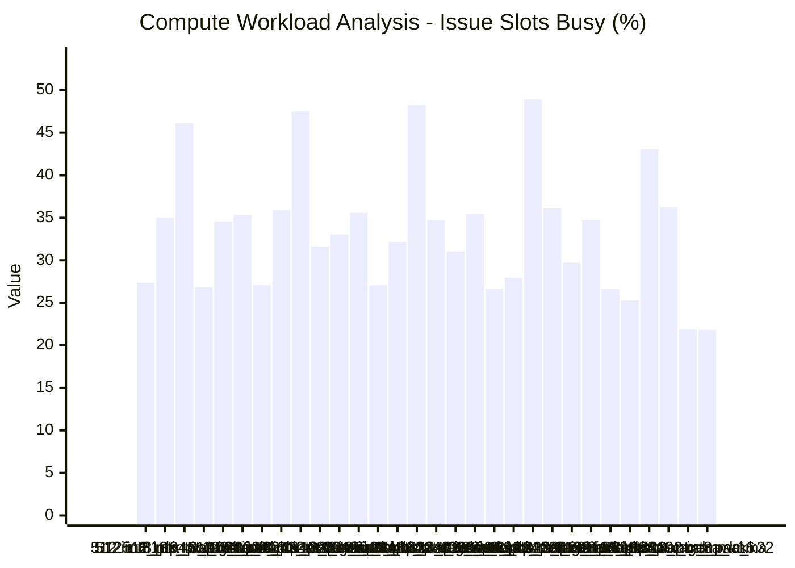
```mermaid
xychart-beta
    title "Compute Workload Analysis - Issue Slots Busy (%)"
    x-axis ["512 int8_dp4a", "512 int8_ptx_3stage", "512 int8_ptx_manual_pack", "512 int8_ptx_mma_k16", "512 int8_ptx_mma_k32", "512 int8_wmma", "1024 int8_dp4a", "1024 int8_ptx_3stage", "1024 int8_ptx_manual_pack", "1024 int8_ptx_mma_k16", "1024 int8_ptx_mma_k32", "1024 int8_wmma", "2048 int8_dp4a", "2048 int8_ptx_3stage", "2048 int8_ptx_manual_pack", "2048 int8_ptx_mma_k16", "2048 int8_ptx_mma_k32", "2048 int8_wmma", "4096 int8_dp4a", "4096 int8_ptx_3stage", "4096 int8_ptx_manual_pack", "4096 int8_ptx_mma_k16", "4096 int8_ptx_mma_k32", "4096 int8_wmma", "8192 int8_dp4a", "8192 int8_ptx_3stage", "8192 int8_ptx_manual_pack", "8192 int8_ptx_mma_k16", "8192 int8_ptx_mma_k32", "8192 int8_wmma"]
    y-axis "Value" 0 --> 54
    bar [27.35, 34.99, 46.10, 26.81, 34.57, 35.34, 27.08, 35.90, 47.49, 31.61, 33.04, 35.59, 27.07, 32.16, 48.30, 34.69, 31.05, 35.48, 26.62, 27.97, 48.89, 36.10, 29.72, 34.75, 26.63, 25.25, 43.04, 36.22, 21.86, 21.82]
```

### Issued Ipc Active (inst/cycle)

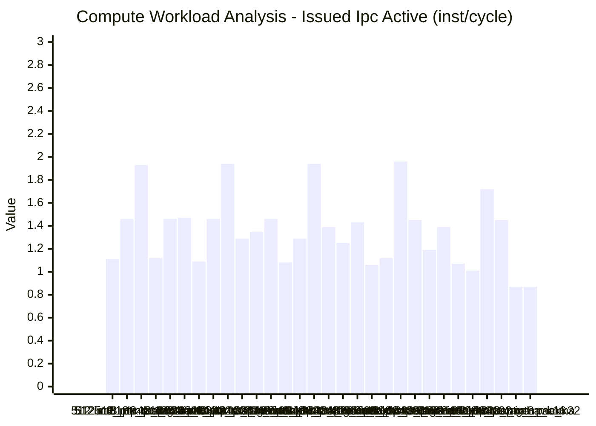
```mermaid
xychart-beta
    title "Compute Workload Analysis - Issued Ipc Active (inst/cycle)"
    x-axis ["512 int8_dp4a", "512 int8_ptx_3stage", "512 int8_ptx_manual_pack", "512 int8_ptx_mma_k16", "512 int8_ptx_mma_k32", "512 int8_wmma", "1024 int8_dp4a", "1024 int8_ptx_3stage", "1024 int8_ptx_manual_pack", "1024 int8_ptx_mma_k16", "1024 int8_ptx_mma_k32", "1024 int8_wmma", "2048 int8_dp4a", "2048 int8_ptx_3stage", "2048 int8_ptx_manual_pack", "2048 int8_ptx_mma_k16", "2048 int8_ptx_mma_k32", "2048 int8_wmma", "4096 int8_dp4a", "4096 int8_ptx_3stage", "4096 int8_ptx_manual_pack", "4096 int8_ptx_mma_k16", "4096 int8_ptx_mma_k32", "4096 int8_wmma", "8192 int8_dp4a", "8192 int8_ptx_3stage", "8192 int8_ptx_manual_pack", "8192 int8_ptx_mma_k16", "8192 int8_ptx_mma_k32", "8192 int8_wmma"]
    y-axis "Value" 0 --> 3
    bar [1.11, 1.46, 1.93, 1.12, 1.46, 1.47, 1.09, 1.46, 1.94, 1.29, 1.35, 1.46, 1.08, 1.29, 1.94, 1.39, 1.25, 1.43, 1.06, 1.12, 1.96, 1.45, 1.19, 1.39, 1.07, 1.01, 1.72, 1.45, 0.87, 0.87]
```

### SM Busy (%)

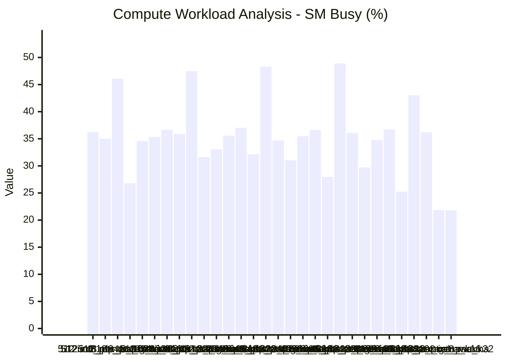
```mermaid
xychart-beta
    title "Compute Workload Analysis - SM Busy (%)"
    x-axis ["512 int8_dp4a", "512 int8_ptx_3stage", "512 int8_ptx_manual_pack", "512 int8_ptx_mma_k16", "512 int8_ptx_mma_k32", "512 int8_wmma", "1024 int8_dp4a", "1024 int8_ptx_3stage", "1024 int8_ptx_manual_pack", "1024 int8_ptx_mma_k16", "1024 int8_ptx_mma_k32", "1024 int8_wmma", "2048 int8_dp4a", "2048 int8_ptx_3stage", "2048 int8_ptx_manual_pack", "2048 int8_ptx_mma_k16", "2048 int8_ptx_mma_k32", "2048 int8_wmma", "4096 int8_dp4a", "4096 int8_ptx_3stage", "4096 int8_ptx_manual_pack", "4096 int8_ptx_mma_k16", "4096 int8_ptx_mma_k32", "4096 int8_wmma", "8192 int8_dp4a", "8192 int8_ptx_3stage", "8192 int8_ptx_manual_pack", "8192 int8_ptx_mma_k16", "8192 int8_ptx_mma_k32", "8192 int8_wmma"]
    y-axis "Value" 0 --> 54
    bar [36.22, 34.99, 46.10, 26.81, 34.57, 35.34, 36.66, 35.90, 47.49, 31.61, 33.04, 35.59, 37.03, 32.16, 48.30, 34.69, 31.05, 35.48, 36.61, 27.97, 48.89, 36.10, 29.72, 34.75, 36.72, 25.25, 43.04, 36.22, 21.86, 21.82]
```

## Memory Workload Analysis

### Local Memory Spilling Requests

```mermaid
xychart-beta
    title "Memory Workload Analysis - Local Memory Spilling Requests"
    x-axis ["512 int8_dp4a", "512 int8_ptx_3stage", "512 int8_ptx_manual_pack", "512 int8_ptx_mma_k16", "512 int8_ptx_mma_k32", "512 int8_wmma", "1024 int8_dp4a", "1024 int8_ptx_3stage", "1024 int8_ptx_manual_pack", "1024 int8_ptx_mma_k16", "1024 int8_ptx_mma_k32", "1024 int8_wmma", "2048 int8_dp4a", "2048 int8_ptx_3stage", "2048 int8_ptx_manual_pack", "2048 int8_ptx_mma_k16", "2048 int8_ptx_mma_k32", "2048 int8_wmma", "4096 int8_dp4a", "4096 int8_ptx_3stage", "4096 int8_ptx_manual_pack", "4096 int8_ptx_mma_k16", "4096 int8_ptx_mma_k32", "4096 int8_wmma", "8192 int8_dp4a", "8192 int8_ptx_3stage", "8192 int8_ptx_manual_pack", "8192 int8_ptx_mma_k16", "8192 int8_ptx_mma_k32", "8192 int8_wmma"]
    y-axis "Value" 0 --> 1
    bar [0, 0, 0, 0, 0, 0, 0, 0, 0, 0, 0, 0, 0, 0, 0, 0, 0, 0, 0, 0, 0, 0, 0, 0, 0, 0, 0, 0, 0, 0]
```

### Local Memory Spilling Request Overhead (%)

```mermaid
xychart-beta
    title "Memory Workload Analysis - Local Memory Spilling Request Overhead (%)"
    x-axis ["512 int8_dp4a", "512 int8_ptx_3stage", "512 int8_ptx_manual_pack", "512 int8_ptx_mma_k16", "512 int8_ptx_mma_k32", "512 int8_wmma", "1024 int8_dp4a", "1024 int8_ptx_3stage", "1024 int8_ptx_manual_pack", "1024 int8_ptx_mma_k16", "1024 int8_ptx_mma_k32", "1024 int8_wmma", "2048 int8_dp4a", "2048 int8_ptx_3stage", "2048 int8_ptx_manual_pack", "2048 int8_ptx_mma_k16", "2048 int8_ptx_mma_k32", "2048 int8_wmma", "4096 int8_dp4a", "4096 int8_ptx_3stage", "4096 int8_ptx_manual_pack", "4096 int8_ptx_mma_k16", "4096 int8_ptx_mma_k32", "4096 int8_wmma", "8192 int8_dp4a", "8192 int8_ptx_3stage", "8192 int8_ptx_manual_pack", "8192 int8_ptx_mma_k16", "8192 int8_ptx_mma_k32", "8192 int8_wmma"]
    y-axis "Value" 0 --> 1
    bar [0, 0, 0, 0, 0, 0, 0, 0, 0, 0, 0, 0, 0, 0, 0, 0, 0, 0, 0, 0, 0, 0, 0, 0, 0, 0, 0, 0, 0, 0]
```

### Memory Throughput (Gbyte/s)

```mermaid
xychart-beta
    title "Memory Workload Analysis - Memory Throughput (Gbyte/s)"
    x-axis ["512 int8_dp4a", "512 int8_ptx_3stage", "512 int8_ptx_manual_pack", "512 int8_ptx_mma_k16", "512 int8_ptx_mma_k32", "512 int8_wmma", "1024 int8_dp4a", "1024 int8_ptx_3stage", "1024 int8_ptx_manual_pack", "1024 int8_ptx_mma_k16", "1024 int8_ptx_mma_k32", "1024 int8_wmma", "2048 int8_dp4a", "2048 int8_ptx_3stage", "2048 int8_ptx_manual_pack", "2048 int8_ptx_mma_k16", "2048 int8_ptx_mma_k32", "2048 int8_wmma", "4096 int8_dp4a", "4096 int8_ptx_3stage", "4096 int8_ptx_manual_pack", "4096 int8_ptx_mma_k16", "4096 int8_ptx_mma_k32", "4096 int8_wmma", "8192 int8_dp4a", "8192 int8_ptx_3stage", "8192 int8_ptx_manual_pack", "8192 int8_ptx_mma_k16", "8192 int8_ptx_mma_k32", "8192 int8_wmma"]
    y-axis "Value" 0 --> 172
    bar [6.27, 24.54, 23.26, 18.09, 31.88, 24.40, 3.64, 14.80, 14.48, 12.78, 21.62, 15.42, 3.42, 12.30, 14.06, 12.94, 20.87, 14.66, 1.95, 6.19, 8.35, 7.90, 12.46, 8.46, 115.48, 153.14, 146.39, 150.24, 154.51, 156.34]
```

### Mem Busy (%)

```mermaid
xychart-beta
    title "Memory Workload Analysis - Mem Busy (%)"
    x-axis ["512 int8_dp4a", "512 int8_ptx_3stage", "512 int8_ptx_manual_pack", "512 int8_ptx_mma_k16", "512 int8_ptx_mma_k32", "512 int8_wmma", "1024 int8_dp4a", "1024 int8_ptx_3stage", "1024 int8_ptx_manual_pack", "1024 int8_ptx_mma_k16", "1024 int8_ptx_mma_k32", "1024 int8_wmma", "2048 int8_dp4a", "2048 int8_ptx_3stage", "2048 int8_ptx_manual_pack", "2048 int8_ptx_mma_k16", "2048 int8_ptx_mma_k32", "2048 int8_wmma", "4096 int8_dp4a", "4096 int8_ptx_3stage", "4096 int8_ptx_manual_pack", "4096 int8_ptx_mma_k16", "4096 int8_ptx_mma_k32", "4096 int8_wmma", "8192 int8_dp4a", "8192 int8_ptx_3stage", "8192 int8_ptx_manual_pack", "8192 int8_ptx_mma_k16", "8192 int8_ptx_mma_k32", "8192 int8_wmma"]
    y-axis "Value" 0 --> 106
    bar [57.21, 86.70, 80.28, 83.03, 75.98, 83.54, 57.96, 89.30, 85.65, 86.97, 86.21, 89.64, 58.57, 95.39, 88.68, 89.07, 89.38, 92.29, 57.94, 95.96, 90.59, 89.28, 90.08, 94.58, 58.13, 80.89, 92.80, 87.84, 66.95, 69.38]
```

### Max Bandwidth (%)

```mermaid
xychart-beta
    title "Memory Workload Analysis - Max Bandwidth (%)"
    x-axis ["512 int8_dp4a", "512 int8_ptx_3stage", "512 int8_ptx_manual_pack", "512 int8_ptx_mma_k16", "512 int8_ptx_mma_k32", "512 int8_wmma", "1024 int8_dp4a", "1024 int8_ptx_3stage", "1024 int8_ptx_manual_pack", "1024 int8_ptx_mma_k16", "1024 int8_ptx_mma_k32", "1024 int8_wmma", "2048 int8_dp4a", "2048 int8_ptx_3stage", "2048 int8_ptx_manual_pack", "2048 int8_ptx_mma_k16", "2048 int8_ptx_mma_k32", "2048 int8_wmma", "4096 int8_dp4a", "4096 int8_ptx_3stage", "4096 int8_ptx_manual_pack", "4096 int8_ptx_mma_k16", "4096 int8_ptx_mma_k32", "4096 int8_wmma", "8192 int8_dp4a", "8192 int8_ptx_3stage", "8192 int8_ptx_manual_pack", "8192 int8_ptx_mma_k16", "8192 int8_ptx_mma_k32", "8192 int8_wmma"]
    y-axis "Value" 0 --> 105
    bar [92.63, 45.52, 49.71, 35.90, 46.74, 45.07, 94.00, 82.82, 52.40, 41.99, 49.02, 63.93, 95.10, 91.02, 53.93, 45.86, 48.87, 77.86, 94.08, 92.76, 61.52, 47.60, 48.38, 86.60, 94.40, 79.17, 79.10, 50.12, 51.55, 60.73]
```

### L1/TEX Hit Rate (%)

```mermaid
xychart-beta
    title "Memory Workload Analysis - L1/TEX Hit Rate (%)"
    x-axis ["512 int8_dp4a", "512 int8_ptx_3stage", "512 int8_ptx_manual_pack", "512 int8_ptx_mma_k16", "512 int8_ptx_mma_k32", "512 int8_wmma", "1024 int8_dp4a", "1024 int8_ptx_3stage", "1024 int8_ptx_manual_pack", "1024 int8_ptx_mma_k16", "1024 int8_ptx_mma_k32", "1024 int8_wmma", "2048 int8_dp4a", "2048 int8_ptx_3stage", "2048 int8_ptx_manual_pack", "2048 int8_ptx_mma_k16", "2048 int8_ptx_mma_k32", "2048 int8_wmma", "4096 int8_dp4a", "4096 int8_ptx_3stage", "4096 int8_ptx_manual_pack", "4096 int8_ptx_mma_k16", "4096 int8_ptx_mma_k32", "4096 int8_wmma", "8192 int8_dp4a", "8192 int8_ptx_3stage", "8192 int8_ptx_manual_pack", "8192 int8_ptx_mma_k16", "8192 int8_ptx_mma_k32", "8192 int8_wmma"]
    y-axis "Value" 0 --> 95
    bar [52.28, 58.74, 79.98, 85.98, 63.64, 77.60, 52.20, 44.59, 75.76, 81.05, 61.82, 58.72, 60.86, 29.99, 71.24, 78.44, 60.85, 49.58, 51.70, 17.26, 60.59, 77.42, 60.33, 40.19, 49.89, 23.68, 37.22, 75.90, 61.17, 33.56]
```

### L2 Persisting Size (Mbyte)

```mermaid
xychart-beta
    title "Memory Workload Analysis - L2 Persisting Size (Mbyte)"
    x-axis ["512 int8_dp4a", "512 int8_ptx_3stage", "512 int8_ptx_manual_pack", "512 int8_ptx_mma_k16", "512 int8_ptx_mma_k32", "512 int8_wmma", "1024 int8_dp4a", "1024 int8_ptx_3stage", "1024 int8_ptx_manual_pack", "1024 int8_ptx_mma_k16", "1024 int8_ptx_mma_k32", "1024 int8_wmma", "2048 int8_dp4a", "2048 int8_ptx_3stage", "2048 int8_ptx_manual_pack", "2048 int8_ptx_mma_k16", "2048 int8_ptx_mma_k32", "2048 int8_wmma", "4096 int8_dp4a", "4096 int8_ptx_3stage", "4096 int8_ptx_manual_pack", "4096 int8_ptx_mma_k16", "4096 int8_ptx_mma_k32", "4096 int8_wmma", "8192 int8_dp4a", "8192 int8_ptx_3stage", "8192 int8_ptx_manual_pack", "8192 int8_ptx_mma_k16", "8192 int8_ptx_mma_k32", "8192 int8_wmma"]
    y-axis "Value" 0 --> 11
    bar [9.44, 9.44, 9.44, 9.44, 9.44, 9.44, 9.44, 9.44, 9.44, 9.44, 9.44, 9.44, 9.44, 9.44, 9.44, 9.44, 9.44, 9.44, 9.44, 9.44, 9.44, 9.44, 9.44, 9.44, 9.44, 9.44, 9.44, 9.44, 9.44, 9.44]
```

### L2 Compression Success Rate (%)

```mermaid
xychart-beta
    title "Memory Workload Analysis - L2 Compression Success Rate (%)"
    x-axis ["512 int8_dp4a", "512 int8_ptx_3stage", "512 int8_ptx_manual_pack", "512 int8_ptx_mma_k16", "512 int8_ptx_mma_k32", "512 int8_wmma", "1024 int8_dp4a", "1024 int8_ptx_3stage", "1024 int8_ptx_manual_pack", "1024 int8_ptx_mma_k16", "1024 int8_ptx_mma_k32", "1024 int8_wmma", "2048 int8_dp4a", "2048 int8_ptx_3stage", "2048 int8_ptx_manual_pack", "2048 int8_ptx_mma_k16", "2048 int8_ptx_mma_k32", "2048 int8_wmma", "4096 int8_dp4a", "4096 int8_ptx_3stage", "4096 int8_ptx_manual_pack", "4096 int8_ptx_mma_k16", "4096 int8_ptx_mma_k32", "4096 int8_wmma", "8192 int8_dp4a", "8192 int8_ptx_3stage", "8192 int8_ptx_manual_pack", "8192 int8_ptx_mma_k16", "8192 int8_ptx_mma_k32", "8192 int8_wmma"]
    y-axis "Value" 0 --> 1
    bar [0, 0, 0, 0, 0, 0, 0, 0, 0, 0, 0, 0, 0, 0, 0, 0, 0, 0, 0, 0, 0, 0, 0, 0, 0, 0, 0, 0, 0, 0]
```

### L2 Compression Ratio

```mermaid
xychart-beta
    title "Memory Workload Analysis - L2 Compression Ratio"
    x-axis ["512 int8_dp4a", "512 int8_ptx_3stage", "512 int8_ptx_manual_pack", "512 int8_ptx_mma_k16", "512 int8_ptx_mma_k32", "512 int8_wmma", "1024 int8_dp4a", "1024 int8_ptx_3stage", "1024 int8_ptx_manual_pack", "1024 int8_ptx_mma_k16", "1024 int8_ptx_mma_k32", "1024 int8_wmma", "2048 int8_dp4a", "2048 int8_ptx_3stage", "2048 int8_ptx_manual_pack", "2048 int8_ptx_mma_k16", "2048 int8_ptx_mma_k32", "2048 int8_wmma", "4096 int8_dp4a", "4096 int8_ptx_3stage", "4096 int8_ptx_manual_pack", "4096 int8_ptx_mma_k16", "4096 int8_ptx_mma_k32", "4096 int8_wmma", "8192 int8_dp4a", "8192 int8_ptx_3stage", "8192 int8_ptx_manual_pack", "8192 int8_ptx_mma_k16", "8192 int8_ptx_mma_k32", "8192 int8_wmma"]
    y-axis "Value" 0 --> 1
    bar [0, 0, 0, 0, 0, 0, 0, 0, 0, 0, 0, 0, 0, 0, 0, 0, 0, 0, 0, 0, 0, 0, 0, 0, 0, 0, 0, 0, 0, 0]
```

### L2 Compression Input Sectors (sector)

```mermaid
xychart-beta
    title "Memory Workload Analysis - L2 Compression Input Sectors (sector)"
    x-axis ["512 int8_dp4a", "512 int8_ptx_3stage", "512 int8_ptx_manual_pack", "512 int8_ptx_mma_k16", "512 int8_ptx_mma_k32", "512 int8_wmma", "1024 int8_dp4a", "1024 int8_ptx_3stage", "1024 int8_ptx_manual_pack", "1024 int8_ptx_mma_k16", "1024 int8_ptx_mma_k32", "1024 int8_wmma", "2048 int8_dp4a", "2048 int8_ptx_3stage", "2048 int8_ptx_manual_pack", "2048 int8_ptx_mma_k16", "2048 int8_ptx_mma_k32", "2048 int8_wmma", "4096 int8_dp4a", "4096 int8_ptx_3stage", "4096 int8_ptx_manual_pack", "4096 int8_ptx_mma_k16", "4096 int8_ptx_mma_k32", "4096 int8_wmma", "8192 int8_dp4a", "8192 int8_ptx_3stage", "8192 int8_ptx_manual_pack", "8192 int8_ptx_mma_k16", "8192 int8_ptx_mma_k32", "8192 int8_wmma"]
    y-axis "Value" 0 --> 1
    bar [0, 0, 0, 0, 0, 0, 0, 0, 0, 0, 0, 0, 0, 0, 0, 0, 0, 0, 0, 0, 0, 0, 0, 0, 0, 0, 0, 0, 0, 0]
```

### L2 Hit Rate (%)

```mermaid
xychart-beta
    title "Memory Workload Analysis - L2 Hit Rate (%)"
    x-axis ["512 int8_dp4a", "512 int8_ptx_3stage", "512 int8_ptx_manual_pack", "512 int8_ptx_mma_k16", "512 int8_ptx_mma_k32", "512 int8_wmma", "1024 int8_dp4a", "1024 int8_ptx_3stage", "1024 int8_ptx_manual_pack", "1024 int8_ptx_mma_k16", "1024 int8_ptx_mma_k32", "1024 int8_wmma", "2048 int8_dp4a", "2048 int8_ptx_3stage", "2048 int8_ptx_manual_pack", "2048 int8_ptx_mma_k16", "2048 int8_ptx_mma_k32", "2048 int8_wmma", "4096 int8_dp4a", "4096 int8_ptx_3stage", "4096 int8_ptx_manual_pack", "4096 int8_ptx_mma_k16", "4096 int8_ptx_mma_k32", "4096 int8_wmma", "8192 int8_dp4a", "8192 int8_ptx_3stage", "8192 int8_ptx_manual_pack", "8192 int8_ptx_mma_k16", "8192 int8_ptx_mma_k32", "8192 int8_wmma"]
    y-axis "Value" 0 --> 111
    bar [96.09, 97.60, 93.58, 92.89, 93.40, 95.53, 98.32, 97.30, 96.77, 96.99, 96.41, 97.82, 99.04, 99.99, 98.25, 98.40, 98.15, 99.22, 99.59, 100.36, 99.26, 99.21, 99.04, 99.69, 50.12, 84.46, 87.87, 68.75, 65.84, 81.86]
```

### Mem Pipes Busy (%)

```mermaid
xychart-beta
    title "Memory Workload Analysis - Mem Pipes Busy (%)"
    x-axis ["512 int8_dp4a", "512 int8_ptx_3stage", "512 int8_ptx_manual_pack", "512 int8_ptx_mma_k16", "512 int8_ptx_mma_k32", "512 int8_wmma", "1024 int8_dp4a", "1024 int8_ptx_3stage", "1024 int8_ptx_manual_pack", "1024 int8_ptx_mma_k16", "1024 int8_ptx_mma_k32", "1024 int8_wmma", "2048 int8_dp4a", "2048 int8_ptx_3stage", "2048 int8_ptx_manual_pack", "2048 int8_ptx_mma_k16", "2048 int8_ptx_mma_k32", "2048 int8_wmma", "4096 int8_dp4a", "4096 int8_ptx_3stage", "4096 int8_ptx_manual_pack", "4096 int8_ptx_mma_k16", "4096 int8_ptx_mma_k32", "4096 int8_wmma", "8192 int8_dp4a", "8192 int8_ptx_3stage", "8192 int8_ptx_manual_pack", "8192 int8_ptx_mma_k16", "8192 int8_ptx_mma_k32", "8192 int8_wmma"]
    y-axis "Value" 0 --> 105
    bar [92.63, 45.52, 49.71, 35.90, 46.74, 45.07, 94.00, 47.31, 52.40, 41.99, 49.02, 47.06, 95.10, 42.64, 53.93, 45.86, 48.87, 47.81, 94.08, 37.18, 54.92, 47.60, 48.38, 47.30, 94.40, 33.62, 48.50, 47.70, 36.25, 29.85]
```

## Scheduler Statistics

### One or More Eligible (%)

```mermaid
xychart-beta
    title "Scheduler Statistics - One or More Eligible (%)"
    x-axis ["512 int8_dp4a", "512 int8_ptx_3stage", "512 int8_ptx_manual_pack", "512 int8_ptx_mma_k16", "512 int8_ptx_mma_k32", "512 int8_wmma", "1024 int8_dp4a", "1024 int8_ptx_3stage", "1024 int8_ptx_manual_pack", "1024 int8_ptx_mma_k16", "1024 int8_ptx_mma_k32", "1024 int8_wmma", "2048 int8_dp4a", "2048 int8_ptx_3stage", "2048 int8_ptx_manual_pack", "2048 int8_ptx_mma_k16", "2048 int8_ptx_mma_k32", "2048 int8_wmma", "4096 int8_dp4a", "4096 int8_ptx_3stage", "4096 int8_ptx_manual_pack", "4096 int8_ptx_mma_k16", "4096 int8_ptx_mma_k32", "4096 int8_wmma", "8192 int8_dp4a", "8192 int8_ptx_3stage", "8192 int8_ptx_manual_pack", "8192 int8_ptx_mma_k16", "8192 int8_ptx_mma_k32", "8192 int8_wmma"]
    y-axis "Value" 0 --> 54
    bar [27.68, 36.69, 48.41, 27.89, 36.60, 37.09, 27.15, 36.50, 48.60, 32.26, 33.75, 36.52, 27.09, 31.82, 48.47, 34.83, 31.19, 35.64, 26.62, 28.07, 48.94, 36.14, 29.76, 34.75, 26.63, 24.86, 34.34, 36.23, 21.93, 21.73]
```

### Issued Warp Per Scheduler

```mermaid
xychart-beta
    title "Scheduler Statistics - Issued Warp Per Scheduler"
    x-axis ["512 int8_dp4a", "512 int8_ptx_3stage", "512 int8_ptx_manual_pack", "512 int8_ptx_mma_k16", "512 int8_ptx_mma_k32", "512 int8_wmma", "1024 int8_dp4a", "1024 int8_ptx_3stage", "1024 int8_ptx_manual_pack", "1024 int8_ptx_mma_k16", "1024 int8_ptx_mma_k32", "1024 int8_wmma", "2048 int8_dp4a", "2048 int8_ptx_3stage", "2048 int8_ptx_manual_pack", "2048 int8_ptx_mma_k16", "2048 int8_ptx_mma_k32", "2048 int8_wmma", "4096 int8_dp4a", "4096 int8_ptx_3stage", "4096 int8_ptx_manual_pack", "4096 int8_ptx_mma_k16", "4096 int8_ptx_mma_k32", "4096 int8_wmma", "8192 int8_dp4a", "8192 int8_ptx_3stage", "8192 int8_ptx_manual_pack", "8192 int8_ptx_mma_k16", "8192 int8_ptx_mma_k32", "8192 int8_wmma"]
    y-axis "Value" 0 --> 1
    bar [0.28, 0.37, 0.48, 0.28, 0.37, 0.37, 0.27, 0.36, 0.49, 0.32, 0.34, 0.37, 0.27, 0.32, 0.48, 0.35, 0.31, 0.36, 0.27, 0.28, 0.49, 0.36, 0.30, 0.35, 0.27, 0.25, 0.34, 0.36, 0.22, 0.22]
```

### No Eligible (%)

```mermaid
xychart-beta
    title "Scheduler Statistics - No Eligible (%)"
    x-axis ["512 int8_dp4a", "512 int8_ptx_3stage", "512 int8_ptx_manual_pack", "512 int8_ptx_mma_k16", "512 int8_ptx_mma_k32", "512 int8_wmma", "1024 int8_dp4a", "1024 int8_ptx_3stage", "1024 int8_ptx_manual_pack", "1024 int8_ptx_mma_k16", "1024 int8_ptx_mma_k32", "1024 int8_wmma", "2048 int8_dp4a", "2048 int8_ptx_3stage", "2048 int8_ptx_manual_pack", "2048 int8_ptx_mma_k16", "2048 int8_ptx_mma_k32", "2048 int8_wmma", "4096 int8_dp4a", "4096 int8_ptx_3stage", "4096 int8_ptx_manual_pack", "4096 int8_ptx_mma_k16", "4096 int8_ptx_mma_k32", "4096 int8_wmma", "8192 int8_dp4a", "8192 int8_ptx_3stage", "8192 int8_ptx_manual_pack", "8192 int8_ptx_mma_k16", "8192 int8_ptx_mma_k32", "8192 int8_wmma"]
    y-axis "Value" 0 --> 87
    bar [72.32, 63.31, 51.59, 72.11, 63.40, 62.91, 72.85, 63.50, 51.40, 67.74, 66.25, 63.48, 72.91, 68.18, 51.53, 65.17, 68.81, 64.36, 73.38, 71.93, 51.06, 63.86, 70.24, 65.25, 73.37, 75.14, 65.66, 63.77, 78.07, 78.27]
```

### Active Warps Per Scheduler (warp)

```mermaid
xychart-beta
    title "Scheduler Statistics - Active Warps Per Scheduler (warp)"
    x-axis ["512 int8_dp4a", "512 int8_ptx_3stage", "512 int8_ptx_manual_pack", "512 int8_ptx_mma_k16", "512 int8_ptx_mma_k32", "512 int8_wmma", "1024 int8_dp4a", "1024 int8_ptx_3stage", "1024 int8_ptx_manual_pack", "1024 int8_ptx_mma_k16", "1024 int8_ptx_mma_k32", "1024 int8_wmma", "2048 int8_dp4a", "2048 int8_ptx_3stage", "2048 int8_ptx_manual_pack", "2048 int8_ptx_mma_k16", "2048 int8_ptx_mma_k32", "2048 int8_wmma", "4096 int8_dp4a", "4096 int8_ptx_3stage", "4096 int8_ptx_manual_pack", "4096 int8_ptx_mma_k16", "4096 int8_ptx_mma_k32", "4096 int8_wmma", "8192 int8_dp4a", "8192 int8_ptx_3stage", "8192 int8_ptx_manual_pack", "8192 int8_ptx_mma_k16", "8192 int8_ptx_mma_k32", "8192 int8_wmma"]
    y-axis "Value" 0 --> 14
    bar [11.57, 8.06, 8.29, 8.86, 6.93, 9.68, 11.87, 9.40, 9.45, 9.65, 7.70, 11.42, 11.96, 9.51, 9.78, 9.90, 7.91, 11.77, 11.99, 9.71, 9.87, 9.97, 7.97, 11.84, 11.99, 9.70, 7.26, 9.98, 7.99, 11.82]
```

### Eligible Warps Per Scheduler (warp)

```mermaid
xychart-beta
    title "Scheduler Statistics - Eligible Warps Per Scheduler (warp)"
    x-axis ["512 int8_dp4a", "512 int8_ptx_3stage", "512 int8_ptx_manual_pack", "512 int8_ptx_mma_k16", "512 int8_ptx_mma_k32", "512 int8_wmma", "1024 int8_dp4a", "1024 int8_ptx_3stage", "1024 int8_ptx_manual_pack", "1024 int8_ptx_mma_k16", "1024 int8_ptx_mma_k32", "1024 int8_wmma", "2048 int8_dp4a", "2048 int8_ptx_3stage", "2048 int8_ptx_manual_pack", "2048 int8_ptx_mma_k16", "2048 int8_ptx_mma_k32", "2048 int8_wmma", "4096 int8_dp4a", "4096 int8_ptx_3stage", "4096 int8_ptx_manual_pack", "4096 int8_ptx_mma_k16", "4096 int8_ptx_mma_k32", "4096 int8_wmma", "8192 int8_dp4a", "8192 int8_ptx_3stage", "8192 int8_ptx_manual_pack", "8192 int8_ptx_mma_k16", "8192 int8_ptx_mma_k32", "8192 int8_wmma"]
    y-axis "Value" 0 --> 2
    bar [1.31, 1.12, 1.39, 0.59, 0.85, 0.99, 1.34, 1.29, 1.47, 0.69, 0.72, 0.66, 1.35, 1.16, 1.46, 0.75, 0.65, 0.63, 1.33, 1.01, 1.41, 0.78, 0.61, 0.73, 1.31, 0.89, 0.73, 0.69, 0.34, 0.53]
```

## Warp State Statistics

### Warp Cycles Per Issued Instruction (cycle)

```mermaid
xychart-beta
    title "Warp State Statistics - Warp Cycles Per Issued Instruction (cycle)"
    x-axis ["512 int8_dp4a", "512 int8_ptx_3stage", "512 int8_ptx_manual_pack", "512 int8_ptx_mma_k16", "512 int8_ptx_mma_k32", "512 int8_wmma", "1024 int8_dp4a", "1024 int8_ptx_3stage", "1024 int8_ptx_manual_pack", "1024 int8_ptx_mma_k16", "1024 int8_ptx_mma_k32", "1024 int8_wmma", "2048 int8_dp4a", "2048 int8_ptx_3stage", "2048 int8_ptx_manual_pack", "2048 int8_ptx_mma_k16", "2048 int8_ptx_mma_k32", "2048 int8_wmma", "4096 int8_dp4a", "4096 int8_ptx_3stage", "4096 int8_ptx_manual_pack", "4096 int8_ptx_mma_k16", "4096 int8_ptx_mma_k32", "4096 int8_wmma", "8192 int8_dp4a", "8192 int8_ptx_3stage", "8192 int8_ptx_manual_pack", "8192 int8_ptx_mma_k16", "8192 int8_ptx_mma_k32", "8192 int8_wmma"]
    y-axis "Value" 0 --> 60
    bar [41.80, 21.97, 17.12, 31.75, 18.95, 26.11, 43.74, 25.76, 19.45, 29.92, 22.80, 31.28, 44.15, 29.90, 20.17, 28.43, 25.37, 33.02, 45.01, 34.61, 20.18, 27.58, 26.79, 34.08, 45.04, 39.00, 21.13, 27.55, 36.44, 54.40]
```

### Warp Cycles Per Executed Instruction (cycle)

```mermaid
xychart-beta
    title "Warp State Statistics - Warp Cycles Per Executed Instruction (cycle)"
    x-axis ["512 int8_dp4a", "512 int8_ptx_3stage", "512 int8_ptx_manual_pack", "512 int8_ptx_mma_k16", "512 int8_ptx_mma_k32", "512 int8_wmma", "1024 int8_dp4a", "1024 int8_ptx_3stage", "1024 int8_ptx_manual_pack", "1024 int8_ptx_mma_k16", "1024 int8_ptx_mma_k32", "1024 int8_wmma", "2048 int8_dp4a", "2048 int8_ptx_3stage", "2048 int8_ptx_manual_pack", "2048 int8_ptx_mma_k16", "2048 int8_ptx_mma_k32", "2048 int8_wmma", "4096 int8_dp4a", "4096 int8_ptx_3stage", "4096 int8_ptx_manual_pack", "4096 int8_ptx_mma_k16", "4096 int8_ptx_mma_k32", "4096 int8_wmma", "8192 int8_dp4a", "8192 int8_ptx_3stage", "8192 int8_ptx_manual_pack", "8192 int8_ptx_mma_k16", "8192 int8_ptx_mma_k32", "8192 int8_wmma"]
    y-axis "Value" 0 --> 60
    bar [41.84, 22.01, 17.15, 31.81, 19.00, 26.16, 43.74, 25.76, 19.45, 29.92, 22.81, 31.29, 44.15, 29.90, 20.17, 28.43, 25.37, 33.02, 45.01, 34.61, 20.18, 27.58, 26.79, 34.08, 45.04, 39.00, 21.13, 27.55, 36.44, 54.40]
```

### Avg. Active Threads Per Warp

```mermaid
xychart-beta
    title "Warp State Statistics - Avg. Active Threads Per Warp"
    x-axis ["512 int8_dp4a", "512 int8_ptx_3stage", "512 int8_ptx_manual_pack", "512 int8_ptx_mma_k16", "512 int8_ptx_mma_k32", "512 int8_wmma", "1024 int8_dp4a", "1024 int8_ptx_3stage", "1024 int8_ptx_manual_pack", "1024 int8_ptx_mma_k16", "1024 int8_ptx_mma_k32", "1024 int8_wmma", "2048 int8_dp4a", "2048 int8_ptx_3stage", "2048 int8_ptx_manual_pack", "2048 int8_ptx_mma_k16", "2048 int8_ptx_mma_k32", "2048 int8_wmma", "4096 int8_dp4a", "4096 int8_ptx_3stage", "4096 int8_ptx_manual_pack", "4096 int8_ptx_mma_k16", "4096 int8_ptx_mma_k32", "4096 int8_wmma", "8192 int8_dp4a", "8192 int8_ptx_3stage", "8192 int8_ptx_manual_pack", "8192 int8_ptx_mma_k16", "8192 int8_ptx_mma_k32", "8192 int8_wmma"]
    y-axis "Value" 0 --> 36
    bar [32, 22.93, 25.93, 23.26, 32, 23.38, 32, 22.80, 25.43, 23.14, 32, 22.52, 32, 22.73, 25.16, 23.08, 32, 22.03, 32, 22.70, 25.02, 23.05, 32, 21.77, 32, 22.68, 24.94, 23.03, 32, 21.64]
```

### Avg. Not Predicated Off Threads Per Warp

```mermaid
xychart-beta
    title "Warp State Statistics - Avg. Not Predicated Off Threads Per Warp"
    x-axis ["512 int8_dp4a", "512 int8_ptx_3stage", "512 int8_ptx_manual_pack", "512 int8_ptx_mma_k16", "512 int8_ptx_mma_k32", "512 int8_wmma", "1024 int8_dp4a", "1024 int8_ptx_3stage", "1024 int8_ptx_manual_pack", "1024 int8_ptx_mma_k16", "1024 int8_ptx_mma_k32", "1024 int8_wmma", "2048 int8_dp4a", "2048 int8_ptx_3stage", "2048 int8_ptx_manual_pack", "2048 int8_ptx_mma_k16", "2048 int8_ptx_mma_k32", "2048 int8_wmma", "4096 int8_dp4a", "4096 int8_ptx_3stage", "4096 int8_ptx_manual_pack", "4096 int8_ptx_mma_k16", "4096 int8_ptx_mma_k32", "4096 int8_wmma", "8192 int8_dp4a", "8192 int8_ptx_3stage", "8192 int8_ptx_manual_pack", "8192 int8_ptx_mma_k16", "8192 int8_ptx_mma_k32", "8192 int8_wmma"]
    y-axis "Value" 0 --> 36
    bar [31.86, 20.99, 24.26, 21.41, 29.27, 21.07, 31.93, 20.83, 23.81, 21.23, 28.93, 20.23, 31.96, 20.75, 23.57, 21.14, 28.70, 19.76, 31.98, 20.71, 23.44, 21.09, 28.56, 19.51, 31.99, 20.69, 23.37, 21.07, 28.48, 19.38]
```

## Instruction Statistics

### Avg. Executed Instructions Per Scheduler (inst)

```mermaid
xychart-beta
    title "Instruction Statistics - Avg. Executed Instructions Per Scheduler (inst)"
    x-axis ["512 int8_dp4a", "512 int8_ptx_3stage", "512 int8_ptx_manual_pack", "512 int8_ptx_mma_k16", "512 int8_ptx_mma_k32", "512 int8_wmma", "1024 int8_dp4a", "1024 int8_ptx_3stage", "1024 int8_ptx_manual_pack", "1024 int8_ptx_mma_k16", "1024 int8_ptx_mma_k32", "1024 int8_wmma", "2048 int8_dp4a", "2048 int8_ptx_3stage", "2048 int8_ptx_manual_pack", "2048 int8_ptx_mma_k16", "2048 int8_ptx_mma_k32", "2048 int8_wmma", "4096 int8_dp4a", "4096 int8_ptx_3stage", "4096 int8_ptx_manual_pack", "4096 int8_ptx_mma_k16", "4096 int8_ptx_mma_k32", "4096 int8_wmma", "8192 int8_dp4a", "8192 int8_ptx_3stage", "8192 int8_ptx_manual_pack", "8192 int8_ptx_mma_k16", "8192 int8_ptx_mma_k32", "8192 int8_wmma"]
    y-axis "Value" 0 --> 93756254
    bar [128953.38, 42584.28, 59127.17, 44014.34, 32097.10, 42654.90, 1003943.72, 333047.17, 444416, 341027.31, 208613.52, 315250.76, 7920816.55, 2633869.24, 3440922.48, 2683868.69, 1476254.90, 2418052.41, 62923599.45, 20948921.38, 27069757.79, 21293550.34, 11039426.21, 18928604.69, 0, 0, 0, 0, 85232957.79, 0]
```

### Executed Instructions (inst)

```mermaid
xychart-beta
    title "Instruction Statistics - Executed Instructions (inst)"
    x-axis ["512 int8_dp4a", "512 int8_ptx_3stage", "512 int8_ptx_manual_pack", "512 int8_ptx_mma_k16", "512 int8_ptx_mma_k32", "512 int8_wmma", "1024 int8_dp4a", "1024 int8_ptx_3stage", "1024 int8_ptx_manual_pack", "1024 int8_ptx_mma_k16", "1024 int8_ptx_mma_k32", "1024 int8_wmma", "2048 int8_dp4a", "2048 int8_ptx_3stage", "2048 int8_ptx_manual_pack", "2048 int8_ptx_mma_k16", "2048 int8_ptx_mma_k32", "2048 int8_wmma", "4096 int8_dp4a", "4096 int8_ptx_3stage", "4096 int8_ptx_manual_pack", "4096 int8_ptx_mma_k16", "4096 int8_ptx_mma_k32", "4096 int8_wmma", "8192 int8_dp4a", "8192 int8_ptx_3stage", "8192 int8_ptx_manual_pack", "8192 int8_ptx_mma_k16", "8192 int8_ptx_mma_k32", "8192 int8_wmma"]
    y-axis "Value" 0 --> 54798476903
    bar [29917184, 9879552, 13717504, 10211328, 7446528, 9895936, 232914944, 77266944, 103104512, 79118336, 48398336, 73138176, 1837629440, 611057664, 798294016, 622657536, 342491136, 560988160, 14598275072, 4860149760, 6280183808, 4940103680, 2561146880, 4391436288, 0, 38767951872, 49816797184, 39356203008, 19774046208, 34745614336]
```

### Avg. Issued Instructions Per Scheduler (inst)

```mermaid
xychart-beta
    title "Instruction Statistics - Avg. Issued Instructions Per Scheduler (inst)"
    x-axis ["512 int8_dp4a", "512 int8_ptx_3stage", "512 int8_ptx_manual_pack", "512 int8_ptx_mma_k16", "512 int8_ptx_mma_k32", "512 int8_wmma", "1024 int8_dp4a", "1024 int8_ptx_3stage", "1024 int8_ptx_manual_pack", "1024 int8_ptx_mma_k16", "1024 int8_ptx_mma_k32", "1024 int8_wmma", "2048 int8_dp4a", "2048 int8_ptx_3stage", "2048 int8_ptx_manual_pack", "2048 int8_ptx_mma_k16", "2048 int8_ptx_mma_k32", "2048 int8_wmma", "4096 int8_dp4a", "4096 int8_ptx_3stage", "4096 int8_ptx_manual_pack", "4096 int8_ptx_mma_k16", "4096 int8_ptx_mma_k32", "4096 int8_wmma", "8192 int8_dp4a", "8192 int8_ptx_3stage", "8192 int8_ptx_manual_pack", "8192 int8_ptx_mma_k16", "8192 int8_ptx_mma_k32", "8192 int8_wmma"]
    y-axis "Value" 0 --> 551778918
    bar [129087.65, 42668.74, 59213.79, 44094.47, 32179.87, 42751.85, 1004078.39, 333131.31, 444502.69, 341107.45, 208696.19, 315347.44, 7920951.25, 2633953.53, 3441009.31, 2683948.64, 1476337.65, 2418149.25, 62923734.17, 20949005.44, 27069844.52, 21293630.30, 11039508.99, 18928701.57, 501617198, 0, 0, 0, 85233040.44, 0]
```

### Issued Instructions (inst)

```mermaid
xychart-beta
    title "Instruction Statistics - Issued Instructions (inst)"
    x-axis ["512 int8_dp4a", "512 int8_ptx_3stage", "512 int8_ptx_manual_pack", "512 int8_ptx_mma_k16", "512 int8_ptx_mma_k32", "512 int8_wmma", "1024 int8_dp4a", "1024 int8_ptx_3stage", "1024 int8_ptx_manual_pack", "1024 int8_ptx_mma_k16", "1024 int8_ptx_mma_k32", "1024 int8_wmma", "2048 int8_dp4a", "2048 int8_ptx_3stage", "2048 int8_ptx_manual_pack", "2048 int8_ptx_mma_k16", "2048 int8_ptx_mma_k32", "2048 int8_wmma", "4096 int8_dp4a", "4096 int8_ptx_3stage", "4096 int8_ptx_manual_pack", "4096 int8_ptx_mma_k16", "4096 int8_ptx_mma_k32", "4096 int8_wmma", "8192 int8_dp4a", "8192 int8_ptx_3stage", "8192 int8_ptx_manual_pack", "8192 int8_ptx_mma_k16", "8192 int8_ptx_mma_k32", "8192 int8_wmma"]
    y-axis "Value" 0 --> 54798499064
    bar [29948334, 9899147, 13737600, 10229918, 7465730, 9918430, 232946187, 77286464, 103124624, 79136929, 48417517, 73160607, 1837660689, 611077219, 798314161, 622676085, 342510334, 561010627, 14598306328, 4860169262, 6280203928, 4940122230, 2561166086, 4391458765, 0, 38767971417, 49816817330, 39356221603, 19774065381, 34745636793]
```

## Launch Statistics

### Block Size

```mermaid
xychart-beta
    title "Launch Statistics - Block Size"
    x-axis ["512 int8_dp4a", "512 int8_ptx_3stage", "512 int8_ptx_manual_pack", "512 int8_ptx_mma_k16", "512 int8_ptx_mma_k32", "512 int8_wmma", "1024 int8_dp4a", "1024 int8_ptx_3stage", "1024 int8_ptx_manual_pack", "1024 int8_ptx_mma_k16", "1024 int8_ptx_mma_k32", "1024 int8_wmma", "2048 int8_dp4a", "2048 int8_ptx_3stage", "2048 int8_ptx_manual_pack", "2048 int8_ptx_mma_k16", "2048 int8_ptx_mma_k32", "2048 int8_wmma", "4096 int8_dp4a", "4096 int8_ptx_3stage", "4096 int8_ptx_manual_pack", "4096 int8_ptx_mma_k16", "4096 int8_ptx_mma_k32", "4096 int8_wmma", "8192 int8_dp4a", "8192 int8_ptx_3stage", "8192 int8_ptx_manual_pack", "8192 int8_ptx_mma_k16", "8192 int8_ptx_mma_k32", "8192 int8_wmma"]
    y-axis "Value" 0 --> 282
    bar [256, 256, 256, 256, 256, 256, 256, 256, 256, 256, 256, 256, 256, 256, 256, 256, 256, 256, 256, 256, 256, 256, 256, 256, 256, 256, 256, 256, 256, 256]
```

### Function Cache Configuration

_Skipped chart: metric contains non-numeric values in one or more cells._

### Grid Size

```mermaid
xychart-beta
    title "Launch Statistics - Grid Size"
    x-axis ["512 int8_dp4a", "512 int8_ptx_3stage", "512 int8_ptx_manual_pack", "512 int8_ptx_mma_k16", "512 int8_ptx_mma_k32", "512 int8_wmma", "1024 int8_dp4a", "1024 int8_ptx_3stage", "1024 int8_ptx_manual_pack", "1024 int8_ptx_mma_k16", "1024 int8_ptx_mma_k32", "1024 int8_wmma", "2048 int8_dp4a", "2048 int8_ptx_3stage", "2048 int8_ptx_manual_pack", "2048 int8_ptx_mma_k16", "2048 int8_ptx_mma_k32", "2048 int8_wmma", "4096 int8_dp4a", "4096 int8_ptx_3stage", "4096 int8_ptx_manual_pack", "4096 int8_ptx_mma_k16", "4096 int8_ptx_mma_k32", "4096 int8_wmma", "8192 int8_dp4a", "8192 int8_ptx_3stage", "8192 int8_ptx_manual_pack", "8192 int8_ptx_mma_k16", "8192 int8_ptx_mma_k32", "8192 int8_wmma"]
    y-axis "Value" 0 --> 1153434
    bar [4096, 512, 512, 512, 512, 512, 16384, 2048, 2048, 2048, 2048, 2048, 65536, 8192, 8192, 8192, 8192, 8192, 262144, 32768, 32768, 32768, 32768, 32768, 1048576, 131072, 131072, 131072, 131072, 131072]
```

### Registers Per Thread (register/thread)

```mermaid
xychart-beta
    title "Launch Statistics - Registers Per Thread (register/thread)"
    x-axis ["512 int8_dp4a", "512 int8_ptx_3stage", "512 int8_ptx_manual_pack", "512 int8_ptx_mma_k16", "512 int8_ptx_mma_k32", "512 int8_wmma", "1024 int8_dp4a", "1024 int8_ptx_3stage", "1024 int8_ptx_manual_pack", "1024 int8_ptx_mma_k16", "1024 int8_ptx_mma_k32", "1024 int8_wmma", "2048 int8_dp4a", "2048 int8_ptx_3stage", "2048 int8_ptx_manual_pack", "2048 int8_ptx_mma_k16", "2048 int8_ptx_mma_k32", "2048 int8_wmma", "4096 int8_dp4a", "4096 int8_ptx_3stage", "4096 int8_ptx_manual_pack", "4096 int8_ptx_mma_k16", "4096 int8_ptx_mma_k32", "4096 int8_wmma", "8192 int8_dp4a", "8192 int8_ptx_3stage", "8192 int8_ptx_manual_pack", "8192 int8_ptx_mma_k16", "8192 int8_ptx_mma_k32", "8192 int8_wmma"]
    y-axis "Value" 0 --> 60
    bar [40, 48, 48, 48, 54, 39, 40, 48, 48, 48, 54, 39, 40, 48, 48, 48, 54, 39, 40, 48, 48, 48, 54, 39, 40, 48, 48, 48, 54, 39]
```

### Shared Memory Configuration Size (Kbyte)

```mermaid
xychart-beta
    title "Launch Statistics - Shared Memory Configuration Size (Kbyte)"
    x-axis ["512 int8_dp4a", "512 int8_ptx_3stage", "512 int8_ptx_manual_pack", "512 int8_ptx_mma_k16", "512 int8_ptx_mma_k32", "512 int8_wmma", "1024 int8_dp4a", "1024 int8_ptx_3stage", "1024 int8_ptx_manual_pack", "1024 int8_ptx_mma_k16", "1024 int8_ptx_mma_k32", "1024 int8_wmma", "2048 int8_dp4a", "2048 int8_ptx_3stage", "2048 int8_ptx_manual_pack", "2048 int8_ptx_mma_k16", "2048 int8_ptx_mma_k32", "2048 int8_wmma", "4096 int8_dp4a", "4096 int8_ptx_3stage", "4096 int8_ptx_manual_pack", "4096 int8_ptx_mma_k16", "4096 int8_ptx_mma_k32", "4096 int8_wmma", "8192 int8_dp4a", "8192 int8_ptx_3stage", "8192 int8_ptx_manual_pack", "8192 int8_ptx_mma_k16", "8192 int8_ptx_mma_k32", "8192 int8_wmma"]
    y-axis "Value" 0 --> 113
    bar [32.77, 102.40, 65.54, 65.54, 102.40, 65.54, 32.77, 102.40, 65.54, 65.54, 102.40, 65.54, 32.77, 102.40, 65.54, 65.54, 102.40, 65.54, 32.77, 102.40, 65.54, 65.54, 102.40, 65.54, 32.77, 102.40, 65.54, 65.54, 102.40, 65.54]
```

### Driver Shared Memory Per Block (Kbyte/block)

```mermaid
xychart-beta
    title "Launch Statistics - Driver Shared Memory Per Block (Kbyte/block)"
    x-axis ["512 int8_dp4a", "512 int8_ptx_3stage", "512 int8_ptx_manual_pack", "512 int8_ptx_mma_k16", "512 int8_ptx_mma_k32", "512 int8_wmma", "1024 int8_dp4a", "1024 int8_ptx_3stage", "1024 int8_ptx_manual_pack", "1024 int8_ptx_mma_k16", "1024 int8_ptx_mma_k32", "1024 int8_wmma", "2048 int8_dp4a", "2048 int8_ptx_3stage", "2048 int8_ptx_manual_pack", "2048 int8_ptx_mma_k16", "2048 int8_ptx_mma_k32", "2048 int8_wmma", "4096 int8_dp4a", "4096 int8_ptx_3stage", "4096 int8_ptx_manual_pack", "4096 int8_ptx_mma_k16", "4096 int8_ptx_mma_k32", "4096 int8_wmma", "8192 int8_dp4a", "8192 int8_ptx_3stage", "8192 int8_ptx_manual_pack", "8192 int8_ptx_mma_k16", "8192 int8_ptx_mma_k32", "8192 int8_wmma"]
    y-axis "Value" 0 --> 2
    bar [1.02, 1.02, 1.02, 1.02, 1.02, 1.02, 1.02, 1.02, 1.02, 1.02, 1.02, 1.02, 1.02, 1.02, 1.02, 1.02, 1.02, 1.02, 1.02, 1.02, 1.02, 1.02, 1.02, 1.02, 1.02, 1.02, 1.02, 1.02, 1.02, 1.02]
```

### Dynamic Shared Memory Per Block (byte/block)

```mermaid
xychart-beta
    title "Launch Statistics - Dynamic Shared Memory Per Block (byte/block)"
    x-axis ["512 int8_dp4a", "512 int8_ptx_3stage", "512 int8_ptx_manual_pack", "512 int8_ptx_mma_k16", "512 int8_ptx_mma_k32", "512 int8_wmma", "1024 int8_dp4a", "1024 int8_ptx_3stage", "1024 int8_ptx_manual_pack", "1024 int8_ptx_mma_k16", "1024 int8_ptx_mma_k32", "1024 int8_wmma", "2048 int8_dp4a", "2048 int8_ptx_3stage", "2048 int8_ptx_manual_pack", "2048 int8_ptx_mma_k16", "2048 int8_ptx_mma_k32", "2048 int8_wmma", "4096 int8_dp4a", "4096 int8_ptx_3stage", "4096 int8_ptx_manual_pack", "4096 int8_ptx_mma_k16", "4096 int8_ptx_mma_k32", "4096 int8_wmma", "8192 int8_dp4a", "8192 int8_ptx_3stage", "8192 int8_ptx_manual_pack", "8192 int8_ptx_mma_k16", "8192 int8_ptx_mma_k32", "8192 int8_wmma"]
    y-axis "Value" 0 --> 1
    bar [0, 0, 0, 0, 0, 0, 0, 0, 0, 0, 0, 0, 0, 0, 0, 0, 0, 0, 0, 0, 0, 0, 0, 0, 0, 0, 0, 0, 0, 0]
```

### Static Shared Memory Per Block (byte/block)

```mermaid
xychart-beta
    title "Launch Statistics - Static Shared Memory Per Block (byte/block)"
    x-axis ["512 int8_dp4a", "512 int8_ptx_3stage", "512 int8_ptx_manual_pack", "512 int8_ptx_mma_k16", "512 int8_ptx_mma_k32", "512 int8_wmma", "1024 int8_dp4a", "1024 int8_ptx_3stage", "1024 int8_ptx_manual_pack", "1024 int8_ptx_mma_k16", "1024 int8_ptx_mma_k32", "1024 int8_wmma", "2048 int8_dp4a", "2048 int8_ptx_3stage", "2048 int8_ptx_manual_pack", "2048 int8_ptx_mma_k16", "2048 int8_ptx_mma_k32", "2048 int8_wmma", "4096 int8_dp4a", "4096 int8_ptx_3stage", "4096 int8_ptx_manual_pack", "4096 int8_ptx_mma_k16", "4096 int8_ptx_mma_k32", "4096 int8_wmma", "8192 int8_dp4a", "8192 int8_ptx_3stage", "8192 int8_ptx_manual_pack", "8192 int8_ptx_mma_k16", "8192 int8_ptx_mma_k32", "8192 int8_wmma"]
    y-axis "Value" 0 --> 704
    bar [640, 0, 0, 0, 0, 0, 640, 0, 0, 0, 0, 0, 640, 0, 0, 0, 0, 0, 640, 0, 0, 0, 0, 0, 640, 0, 0, 0, 0, 0]
```

### # SMs (SM)

```mermaid
xychart-beta
    title "Launch Statistics - # SMs (SM)"
    x-axis ["512 int8_dp4a", "512 int8_ptx_3stage", "512 int8_ptx_manual_pack", "512 int8_ptx_mma_k16", "512 int8_ptx_mma_k32", "512 int8_wmma", "1024 int8_dp4a", "1024 int8_ptx_3stage", "1024 int8_ptx_manual_pack", "1024 int8_ptx_mma_k16", "1024 int8_ptx_mma_k32", "1024 int8_wmma", "2048 int8_dp4a", "2048 int8_ptx_3stage", "2048 int8_ptx_manual_pack", "2048 int8_ptx_mma_k16", "2048 int8_ptx_mma_k32", "2048 int8_wmma", "4096 int8_dp4a", "4096 int8_ptx_3stage", "4096 int8_ptx_manual_pack", "4096 int8_ptx_mma_k16", "4096 int8_ptx_mma_k32", "4096 int8_wmma", "8192 int8_dp4a", "8192 int8_ptx_3stage", "8192 int8_ptx_manual_pack", "8192 int8_ptx_mma_k16", "8192 int8_ptx_mma_k32", "8192 int8_wmma"]
    y-axis "Value" 0 --> 64
    bar [58, 58, 58, 58, 58, 58, 58, 58, 58, 58, 58, 58, 58, 58, 58, 58, 58, 58, 58, 58, 58, 58, 58, 58, 58, 58, 58, 58, 58, 58]
```

### Stack Size

```mermaid
xychart-beta
    title "Launch Statistics - Stack Size"
    x-axis ["512 int8_dp4a", "512 int8_ptx_3stage", "512 int8_ptx_manual_pack", "512 int8_ptx_mma_k16", "512 int8_ptx_mma_k32", "512 int8_wmma", "1024 int8_dp4a", "1024 int8_ptx_3stage", "1024 int8_ptx_manual_pack", "1024 int8_ptx_mma_k16", "1024 int8_ptx_mma_k32", "1024 int8_wmma", "2048 int8_dp4a", "2048 int8_ptx_3stage", "2048 int8_ptx_manual_pack", "2048 int8_ptx_mma_k16", "2048 int8_ptx_mma_k32", "2048 int8_wmma", "4096 int8_dp4a", "4096 int8_ptx_3stage", "4096 int8_ptx_manual_pack", "4096 int8_ptx_mma_k16", "4096 int8_ptx_mma_k32", "4096 int8_wmma", "8192 int8_dp4a", "8192 int8_ptx_3stage", "8192 int8_ptx_manual_pack", "8192 int8_ptx_mma_k16", "8192 int8_ptx_mma_k32", "8192 int8_wmma"]
    y-axis "Value" 0 --> 1127
    bar [1024, 1024, 1024, 1024, 1024, 1024, 1024, 1024, 1024, 1024, 1024, 1024, 1024, 1024, 1024, 1024, 1024, 1024, 1024, 1024, 1024, 1024, 1024, 1024, 1024, 1024, 1024, 1024, 1024, 1024]
```

### Threads (thread)

```mermaid
xychart-beta
    title "Launch Statistics - Threads (thread)"
    x-axis ["512 int8_dp4a", "512 int8_ptx_3stage", "512 int8_ptx_manual_pack", "512 int8_ptx_mma_k16", "512 int8_ptx_mma_k32", "512 int8_wmma", "1024 int8_dp4a", "1024 int8_ptx_3stage", "1024 int8_ptx_manual_pack", "1024 int8_ptx_mma_k16", "1024 int8_ptx_mma_k32", "1024 int8_wmma", "2048 int8_dp4a", "2048 int8_ptx_3stage", "2048 int8_ptx_manual_pack", "2048 int8_ptx_mma_k16", "2048 int8_ptx_mma_k32", "2048 int8_wmma", "4096 int8_dp4a", "4096 int8_ptx_3stage", "4096 int8_ptx_manual_pack", "4096 int8_ptx_mma_k16", "4096 int8_ptx_mma_k32", "4096 int8_wmma", "8192 int8_dp4a", "8192 int8_ptx_3stage", "8192 int8_ptx_manual_pack", "8192 int8_ptx_mma_k16", "8192 int8_ptx_mma_k32", "8192 int8_wmma"]
    y-axis "Value" 0 --> 295279002
    bar [1048576, 131072, 131072, 131072, 131072, 131072, 4194304, 524288, 524288, 524288, 524288, 524288, 16777216, 2097152, 2097152, 2097152, 2097152, 2097152, 67108864, 8388608, 8388608, 8388608, 8388608, 8388608, 268435456, 33554432, 33554432, 33554432, 33554432, 33554432]
```

### # TPCs

```mermaid
xychart-beta
    title "Launch Statistics - # TPCs"
    x-axis ["512 int8_dp4a", "512 int8_ptx_3stage", "512 int8_ptx_manual_pack", "512 int8_ptx_mma_k16", "512 int8_ptx_mma_k32", "512 int8_wmma", "1024 int8_dp4a", "1024 int8_ptx_3stage", "1024 int8_ptx_manual_pack", "1024 int8_ptx_mma_k16", "1024 int8_ptx_mma_k32", "1024 int8_wmma", "2048 int8_dp4a", "2048 int8_ptx_3stage", "2048 int8_ptx_manual_pack", "2048 int8_ptx_mma_k16", "2048 int8_ptx_mma_k32", "2048 int8_wmma", "4096 int8_dp4a", "4096 int8_ptx_3stage", "4096 int8_ptx_manual_pack", "4096 int8_ptx_mma_k16", "4096 int8_ptx_mma_k32", "4096 int8_wmma", "8192 int8_dp4a", "8192 int8_ptx_3stage", "8192 int8_ptx_manual_pack", "8192 int8_ptx_mma_k16", "8192 int8_ptx_mma_k32", "8192 int8_wmma"]
    y-axis "Value" 0 --> 32
    bar [29, 29, 29, 29, 29, 29, 29, 29, 29, 29, 29, 29, 29, 29, 29, 29, 29, 29, 29, 29, 29, 29, 29, 29, 29, 29, 29, 29, 29, 29]
```

### Enabled TPC IDs

_Skipped chart: metric contains non-numeric values in one or more cells._

### Uses Green Context

```mermaid
xychart-beta
    title "Launch Statistics - Uses Green Context"
    x-axis ["512 int8_dp4a", "512 int8_ptx_3stage", "512 int8_ptx_manual_pack", "512 int8_ptx_mma_k16", "512 int8_ptx_mma_k32", "512 int8_wmma", "1024 int8_dp4a", "1024 int8_ptx_3stage", "1024 int8_ptx_manual_pack", "1024 int8_ptx_mma_k16", "1024 int8_ptx_mma_k32", "1024 int8_wmma", "2048 int8_dp4a", "2048 int8_ptx_3stage", "2048 int8_ptx_manual_pack", "2048 int8_ptx_mma_k16", "2048 int8_ptx_mma_k32", "2048 int8_wmma", "4096 int8_dp4a", "4096 int8_ptx_3stage", "4096 int8_ptx_manual_pack", "4096 int8_ptx_mma_k16", "4096 int8_ptx_mma_k32", "4096 int8_wmma", "8192 int8_dp4a", "8192 int8_ptx_3stage", "8192 int8_ptx_manual_pack", "8192 int8_ptx_mma_k16", "8192 int8_ptx_mma_k32", "8192 int8_wmma"]
    y-axis "Value" 0 --> 1
    bar [0, 0, 0, 0, 0, 0, 0, 0, 0, 0, 0, 0, 0, 0, 0, 0, 0, 0, 0, 0, 0, 0, 0, 0, 0, 0, 0, 0, 0, 0]
```

### Waves Per SM

```mermaid
xychart-beta
    title "Launch Statistics - Waves Per SM"
    x-axis ["512 int8_dp4a", "512 int8_ptx_3stage", "512 int8_ptx_manual_pack", "512 int8_ptx_mma_k16", "512 int8_ptx_mma_k32", "512 int8_wmma", "1024 int8_dp4a", "1024 int8_ptx_3stage", "1024 int8_ptx_manual_pack", "1024 int8_ptx_mma_k16", "1024 int8_ptx_mma_k32", "1024 int8_wmma", "2048 int8_dp4a", "2048 int8_ptx_3stage", "2048 int8_ptx_manual_pack", "2048 int8_ptx_mma_k16", "2048 int8_ptx_mma_k32", "2048 int8_wmma", "4096 int8_dp4a", "4096 int8_ptx_3stage", "4096 int8_ptx_manual_pack", "4096 int8_ptx_mma_k16", "4096 int8_ptx_mma_k32", "4096 int8_wmma", "8192 int8_dp4a", "8192 int8_ptx_3stage", "8192 int8_ptx_manual_pack", "8192 int8_ptx_mma_k16", "8192 int8_ptx_mma_k32", "8192 int8_wmma"]
    y-axis "Value" 0 --> 3315
    bar [11.77, 1.77, 1.77, 1.77, 2.21, 1.47, 47.08, 7.06, 7.06, 7.06, 8.83, 5.89, 188.32, 28.25, 28.25, 28.25, 35.31, 23.54, 753.29, 112.99, 112.99, 112.99, 141.24, 94.16, 3013.15, 451.97, 451.97, 451.97, 564.97, 376.64]
```

### Static Shared Memory Per Block (Kbyte/block)

```mermaid
xychart-beta
    title "Launch Statistics - Static Shared Memory Per Block (Kbyte/block)"
    x-axis ["512 int8_dp4a", "512 int8_ptx_3stage", "512 int8_ptx_manual_pack", "512 int8_ptx_mma_k16", "512 int8_ptx_mma_k32", "512 int8_wmma", "1024 int8_dp4a", "1024 int8_ptx_3stage", "1024 int8_ptx_manual_pack", "1024 int8_ptx_mma_k16", "1024 int8_ptx_mma_k32", "1024 int8_wmma", "2048 int8_dp4a", "2048 int8_ptx_3stage", "2048 int8_ptx_manual_pack", "2048 int8_ptx_mma_k16", "2048 int8_ptx_mma_k32", "2048 int8_wmma", "4096 int8_dp4a", "4096 int8_ptx_3stage", "4096 int8_ptx_manual_pack", "4096 int8_ptx_mma_k16", "4096 int8_ptx_mma_k32", "4096 int8_wmma", "8192 int8_dp4a", "8192 int8_ptx_3stage", "8192 int8_ptx_manual_pack", "8192 int8_ptx_mma_k16", "8192 int8_ptx_mma_k32", "8192 int8_wmma"]
    y-axis "Value" 0 --> 19
    bar [0, 12.29, 8.19, 8.19, 16.38, 8.19, 0, 12.29, 8.19, 8.19, 16.38, 8.19, 0, 12.29, 8.19, 8.19, 16.38, 8.19, 0, 12.29, 8.19, 8.19, 16.38, 8.19, 0, 12.29, 8.19, 8.19, 16.38, 8.19]
```

## Occupancy

### Block Limit SM (block)

```mermaid
xychart-beta
    title "Occupancy - Block Limit SM (block)"
    x-axis ["512 int8_dp4a", "512 int8_ptx_3stage", "512 int8_ptx_manual_pack", "512 int8_ptx_mma_k16", "512 int8_ptx_mma_k32", "512 int8_wmma", "1024 int8_dp4a", "1024 int8_ptx_3stage", "1024 int8_ptx_manual_pack", "1024 int8_ptx_mma_k16", "1024 int8_ptx_mma_k32", "1024 int8_wmma", "2048 int8_dp4a", "2048 int8_ptx_3stage", "2048 int8_ptx_manual_pack", "2048 int8_ptx_mma_k16", "2048 int8_ptx_mma_k32", "2048 int8_wmma", "4096 int8_dp4a", "4096 int8_ptx_3stage", "4096 int8_ptx_manual_pack", "4096 int8_ptx_mma_k16", "4096 int8_ptx_mma_k32", "4096 int8_wmma", "8192 int8_dp4a", "8192 int8_ptx_3stage", "8192 int8_ptx_manual_pack", "8192 int8_ptx_mma_k16", "8192 int8_ptx_mma_k32", "8192 int8_wmma"]
    y-axis "Value" 0 --> 27
    bar [24, 24, 24, 24, 24, 24, 24, 24, 24, 24, 24, 24, 24, 24, 24, 24, 24, 24, 24, 24, 24, 24, 24, 24, 24, 24, 24, 24, 24, 24]
```

### Block Limit Registers (block)

```mermaid
xychart-beta
    title "Occupancy - Block Limit Registers (block)"
    x-axis ["512 int8_dp4a", "512 int8_ptx_3stage", "512 int8_ptx_manual_pack", "512 int8_ptx_mma_k16", "512 int8_ptx_mma_k32", "512 int8_wmma", "1024 int8_dp4a", "1024 int8_ptx_3stage", "1024 int8_ptx_manual_pack", "1024 int8_ptx_mma_k16", "1024 int8_ptx_mma_k32", "1024 int8_wmma", "2048 int8_dp4a", "2048 int8_ptx_3stage", "2048 int8_ptx_manual_pack", "2048 int8_ptx_mma_k16", "2048 int8_ptx_mma_k32", "2048 int8_wmma", "4096 int8_dp4a", "4096 int8_ptx_3stage", "4096 int8_ptx_manual_pack", "4096 int8_ptx_mma_k16", "4096 int8_ptx_mma_k32", "4096 int8_wmma", "8192 int8_dp4a", "8192 int8_ptx_3stage", "8192 int8_ptx_manual_pack", "8192 int8_ptx_mma_k16", "8192 int8_ptx_mma_k32", "8192 int8_wmma"]
    y-axis "Value" 0 --> 7
    bar [6, 5, 5, 5, 4, 6, 6, 5, 5, 5, 4, 6, 6, 5, 5, 5, 4, 6, 6, 5, 5, 5, 4, 6, 6, 5, 5, 5, 4, 6]
```

### Block Limit Shared Mem (block)

```mermaid
xychart-beta
    title "Occupancy - Block Limit Shared Mem (block)"
    x-axis ["512 int8_dp4a", "512 int8_ptx_3stage", "512 int8_ptx_manual_pack", "512 int8_ptx_mma_k16", "512 int8_ptx_mma_k32", "512 int8_wmma", "1024 int8_dp4a", "1024 int8_ptx_3stage", "1024 int8_ptx_manual_pack", "1024 int8_ptx_mma_k16", "1024 int8_ptx_mma_k32", "1024 int8_wmma", "2048 int8_dp4a", "2048 int8_ptx_3stage", "2048 int8_ptx_manual_pack", "2048 int8_ptx_mma_k16", "2048 int8_ptx_mma_k32", "2048 int8_wmma", "4096 int8_dp4a", "4096 int8_ptx_3stage", "4096 int8_ptx_manual_pack", "4096 int8_ptx_mma_k16", "4096 int8_ptx_mma_k32", "4096 int8_wmma", "8192 int8_dp4a", "8192 int8_ptx_3stage", "8192 int8_ptx_manual_pack", "8192 int8_ptx_mma_k16", "8192 int8_ptx_mma_k32", "8192 int8_wmma"]
    y-axis "Value" 0 --> 21
    bar [19, 7, 7, 7, 5, 7, 19, 7, 7, 7, 5, 7, 19, 7, 7, 7, 5, 7, 19, 7, 7, 7, 5, 7, 19, 7, 7, 7, 5, 7]
```

### Block Limit Warps (block)

```mermaid
xychart-beta
    title "Occupancy - Block Limit Warps (block)"
    x-axis ["512 int8_dp4a", "512 int8_ptx_3stage", "512 int8_ptx_manual_pack", "512 int8_ptx_mma_k16", "512 int8_ptx_mma_k32", "512 int8_wmma", "1024 int8_dp4a", "1024 int8_ptx_3stage", "1024 int8_ptx_manual_pack", "1024 int8_ptx_mma_k16", "1024 int8_ptx_mma_k32", "1024 int8_wmma", "2048 int8_dp4a", "2048 int8_ptx_3stage", "2048 int8_ptx_manual_pack", "2048 int8_ptx_mma_k16", "2048 int8_ptx_mma_k32", "2048 int8_wmma", "4096 int8_dp4a", "4096 int8_ptx_3stage", "4096 int8_ptx_manual_pack", "4096 int8_ptx_mma_k16", "4096 int8_ptx_mma_k32", "4096 int8_wmma", "8192 int8_dp4a", "8192 int8_ptx_3stage", "8192 int8_ptx_manual_pack", "8192 int8_ptx_mma_k16", "8192 int8_ptx_mma_k32", "8192 int8_wmma"]
    y-axis "Value" 0 --> 7
    bar [6, 6, 6, 6, 6, 6, 6, 6, 6, 6, 6, 6, 6, 6, 6, 6, 6, 6, 6, 6, 6, 6, 6, 6, 6, 6, 6, 6, 6, 6]
```

### Theoretical Active Warps per SM (warp)

```mermaid
xychart-beta
    title "Occupancy - Theoretical Active Warps per SM (warp)"
    x-axis ["512 int8_dp4a", "512 int8_ptx_3stage", "512 int8_ptx_manual_pack", "512 int8_ptx_mma_k16", "512 int8_ptx_mma_k32", "512 int8_wmma", "1024 int8_dp4a", "1024 int8_ptx_3stage", "1024 int8_ptx_manual_pack", "1024 int8_ptx_mma_k16", "1024 int8_ptx_mma_k32", "1024 int8_wmma", "2048 int8_dp4a", "2048 int8_ptx_3stage", "2048 int8_ptx_manual_pack", "2048 int8_ptx_mma_k16", "2048 int8_ptx_mma_k32", "2048 int8_wmma", "4096 int8_dp4a", "4096 int8_ptx_3stage", "4096 int8_ptx_manual_pack", "4096 int8_ptx_mma_k16", "4096 int8_ptx_mma_k32", "4096 int8_wmma", "8192 int8_dp4a", "8192 int8_ptx_3stage", "8192 int8_ptx_manual_pack", "8192 int8_ptx_mma_k16", "8192 int8_ptx_mma_k32", "8192 int8_wmma"]
    y-axis "Value" 0 --> 53
    bar [48, 40, 40, 40, 32, 48, 48, 40, 40, 40, 32, 48, 48, 40, 40, 40, 32, 48, 48, 40, 40, 40, 32, 48, 48, 40, 40, 40, 32, 48]
```

### Theoretical Occupancy (%)

```mermaid
xychart-beta
    title "Occupancy - Theoretical Occupancy (%)"
    x-axis ["512 int8_dp4a", "512 int8_ptx_3stage", "512 int8_ptx_manual_pack", "512 int8_ptx_mma_k16", "512 int8_ptx_mma_k32", "512 int8_wmma", "1024 int8_dp4a", "1024 int8_ptx_3stage", "1024 int8_ptx_manual_pack", "1024 int8_ptx_mma_k16", "1024 int8_ptx_mma_k32", "1024 int8_wmma", "2048 int8_dp4a", "2048 int8_ptx_3stage", "2048 int8_ptx_manual_pack", "2048 int8_ptx_mma_k16", "2048 int8_ptx_mma_k32", "2048 int8_wmma", "4096 int8_dp4a", "4096 int8_ptx_3stage", "4096 int8_ptx_manual_pack", "4096 int8_ptx_mma_k16", "4096 int8_ptx_mma_k32", "4096 int8_wmma", "8192 int8_dp4a", "8192 int8_ptx_3stage", "8192 int8_ptx_manual_pack", "8192 int8_ptx_mma_k16", "8192 int8_ptx_mma_k32", "8192 int8_wmma"]
    y-axis "Value" 0 --> 111
    bar [100, 83.33, 83.33, 83.33, 66.67, 100, 100, 83.33, 83.33, 83.33, 66.67, 100, 100, 83.33, 83.33, 83.33, 66.67, 100, 100, 83.33, 83.33, 83.33, 66.67, 100, 100, 83.33, 83.33, 83.33, 66.67, 100]
```

### Achieved Occupancy (%)

```mermaid
xychart-beta
    title "Occupancy - Achieved Occupancy (%)"
    x-axis ["512 int8_dp4a", "512 int8_ptx_3stage", "512 int8_ptx_manual_pack", "512 int8_ptx_mma_k16", "512 int8_ptx_mma_k32", "512 int8_wmma", "1024 int8_dp4a", "1024 int8_ptx_3stage", "1024 int8_ptx_manual_pack", "1024 int8_ptx_mma_k16", "1024 int8_ptx_mma_k32", "1024 int8_wmma", "2048 int8_dp4a", "2048 int8_ptx_3stage", "2048 int8_ptx_manual_pack", "2048 int8_ptx_mma_k16", "2048 int8_ptx_mma_k32", "2048 int8_wmma", "4096 int8_dp4a", "4096 int8_ptx_3stage", "4096 int8_ptx_manual_pack", "4096 int8_ptx_mma_k16", "4096 int8_ptx_mma_k32", "4096 int8_wmma", "8192 int8_dp4a", "8192 int8_ptx_3stage", "8192 int8_ptx_manual_pack", "8192 int8_ptx_mma_k16", "8192 int8_ptx_mma_k32", "8192 int8_wmma"]
    y-axis "Value" 0 --> 110
    bar [96.43, 66.94, 68.91, 73.77, 57.77, 80.22, 98.97, 78.00, 78.76, 80.44, 64.22, 95.22, 99.67, 81.75, 81.52, 82.51, 65.94, 98.04, 99.88, 80.93, 82.31, 83.08, 66.43, 98.77, 99.95, 82.07, 97.28, 82.92, 66.40, 98.66]
```

### Achieved Active Warps Per SM (warp)

```mermaid
xychart-beta
    title "Occupancy - Achieved Active Warps Per SM (warp)"
    x-axis ["512 int8_dp4a", "512 int8_ptx_3stage", "512 int8_ptx_manual_pack", "512 int8_ptx_mma_k16", "512 int8_ptx_mma_k32", "512 int8_wmma", "1024 int8_dp4a", "1024 int8_ptx_3stage", "1024 int8_ptx_manual_pack", "1024 int8_ptx_mma_k16", "1024 int8_ptx_mma_k32", "1024 int8_wmma", "2048 int8_dp4a", "2048 int8_ptx_3stage", "2048 int8_ptx_manual_pack", "2048 int8_ptx_mma_k16", "2048 int8_ptx_mma_k32", "2048 int8_wmma", "4096 int8_dp4a", "4096 int8_ptx_3stage", "4096 int8_ptx_manual_pack", "4096 int8_ptx_mma_k16", "4096 int8_ptx_mma_k32", "4096 int8_wmma", "8192 int8_dp4a", "8192 int8_ptx_3stage", "8192 int8_ptx_manual_pack", "8192 int8_ptx_mma_k16", "8192 int8_ptx_mma_k32", "8192 int8_wmma"]
    y-axis "Value" 0 --> 53
    bar [46.28, 32.13, 33.08, 35.41, 27.73, 38.50, 47.51, 37.44, 37.80, 38.61, 30.82, 45.71, 47.84, 39.24, 39.13, 39.60, 31.65, 47.06, 47.94, 38.84, 39.51, 39.88, 31.88, 47.41, 47.98, 39.40, 46.69, 39.80, 31.87, 47.36]
```

## GPU and Memory Workload Distribution

### Average DRAM Active Cycles (cycle)

```mermaid
xychart-beta
    title "GPU and Memory Workload Distribution - Average DRAM Active Cycles (cycle)"
    x-axis ["512 int8_dp4a", "512 int8_ptx_3stage", "512 int8_ptx_manual_pack", "512 int8_ptx_mma_k16", "512 int8_ptx_mma_k32", "512 int8_wmma", "1024 int8_dp4a", "1024 int8_ptx_3stage", "1024 int8_ptx_manual_pack", "1024 int8_ptx_mma_k16", "1024 int8_ptx_mma_k32", "1024 int8_wmma", "2048 int8_dp4a", "2048 int8_ptx_3stage", "2048 int8_ptx_manual_pack", "2048 int8_ptx_mma_k16", "2048 int8_ptx_mma_k32", "2048 int8_wmma", "4096 int8_dp4a", "4096 int8_ptx_3stage", "4096 int8_ptx_manual_pack", "4096 int8_ptx_mma_k16", "4096 int8_ptx_mma_k32", "4096 int8_wmma", "8192 int8_dp4a", "8192 int8_ptx_3stage", "8192 int8_ptx_manual_pack", "8192 int8_ptx_mma_k16", "8192 int8_ptx_mma_k32", "8192 int8_wmma"]
    y-axis "Value" 0 --> 3075129544
    bar [76952, 77642.67, 77317.33, 77072, 77416, 77269.33, 352477.33, 354178.67, 353856, 355074.67, 355232, 354984, 2618677.33, 2619690.67, 2615098.67, 2591048, 2588986.67, 2611349.33, 12057986.67, 12107290.67, 12092413.33, 12004962.67, 11988533.33, 12074896, 0, 0, 0, 0, 0, 2795572312]
```

### Total DRAM Elapsed Cycles (cycle)

```mermaid
xychart-beta
    title "GPU and Memory Workload Distribution - Total DRAM Elapsed Cycles (cycle)"
    x-axis ["512 int8_dp4a", "512 int8_ptx_3stage", "512 int8_ptx_manual_pack", "512 int8_ptx_mma_k16", "512 int8_ptx_mma_k32", "512 int8_wmma", "1024 int8_dp4a", "1024 int8_ptx_3stage", "1024 int8_ptx_manual_pack", "1024 int8_ptx_mma_k16", "1024 int8_ptx_mma_k32", "1024 int8_wmma", "2048 int8_dp4a", "2048 int8_ptx_3stage", "2048 int8_ptx_manual_pack", "2048 int8_ptx_mma_k16", "2048 int8_ptx_mma_k32", "2048 int8_wmma", "4096 int8_dp4a", "4096 int8_ptx_3stage", "4096 int8_ptx_manual_pack", "4096 int8_ptx_mma_k16", "4096 int8_ptx_mma_k32", "4096 int8_wmma", "8192 int8_dp4a", "8192 int8_ptx_3stage", "8192 int8_ptx_manual_pack", "8192 int8_ptx_mma_k16", "8192 int8_ptx_mma_k32", "8192 int8_wmma"]
    y-axis "Value" 0 --> 97330091725
    bar [22056960, 5687296, 5975040, 7657472, 4363264, 5692416, 174091264, 43030528, 43951104, 49973248, 29550592, 41400320, 1377097728, 383098880, 334589952, 360218624, 223122432, 320268288, 11122804736, 3517541376, 2605691904, 2732504064, 1730811904, 2565492736, 88481901568, 30736189440, 23143433216, 21806853120, 18268452864, 32159330304]
```

### Average L1 Active Cycles (cycle)

```mermaid
xychart-beta
    title "GPU and Memory Workload Distribution - Average L1 Active Cycles (cycle)"
    x-axis ["512 int8_dp4a", "512 int8_ptx_3stage", "512 int8_ptx_manual_pack", "512 int8_ptx_mma_k16", "512 int8_ptx_mma_k32", "512 int8_wmma", "1024 int8_dp4a", "1024 int8_ptx_3stage", "1024 int8_ptx_manual_pack", "1024 int8_ptx_mma_k16", "1024 int8_ptx_mma_k32", "1024 int8_wmma", "2048 int8_dp4a", "2048 int8_ptx_3stage", "2048 int8_ptx_manual_pack", "2048 int8_ptx_mma_k16", "2048 int8_ptx_mma_k32", "2048 int8_wmma", "4096 int8_dp4a", "4096 int8_ptx_3stage", "4096 int8_ptx_manual_pack", "4096 int8_ptx_mma_k16", "4096 int8_ptx_mma_k32", "4096 int8_wmma", "8192 int8_dp4a", "8192 int8_ptx_3stage", "8192 int8_ptx_manual_pack", "8192 int8_ptx_mma_k16", "8192 int8_ptx_mma_k32", "8192 int8_wmma"]
    y-axis "Value" 0 --> 727783112
    bar [466540.59, 116686.60, 122713.38, 158121.90, 88041.86, 115989.07, 3698740.91, 912240.24, 915557.84, 1057492.14, 617689.88, 863883.81, 29243869.10, 8144326.64, 7097133.90, 7706847.91, 4732894.76, 6786233.60, 0, 74811455.50, 55312771.33, 58918146.47, 37099824.48, 54415000.97, 0, 661621010.41, 498798218.09, 468226612.12, 389738480.03, 0]
```

### Total L1 Elapsed Cycles (cycle)

```mermaid
xychart-beta
    title "GPU and Memory Workload Distribution - Total L1 Elapsed Cycles (cycle)"
    x-axis ["512 int8_dp4a", "512 int8_ptx_3stage", "512 int8_ptx_manual_pack", "512 int8_ptx_mma_k16", "512 int8_ptx_mma_k32", "512 int8_wmma", "1024 int8_dp4a", "1024 int8_ptx_3stage", "1024 int8_ptx_manual_pack", "1024 int8_ptx_mma_k16", "1024 int8_ptx_mma_k32", "1024 int8_wmma", "2048 int8_dp4a", "2048 int8_ptx_3stage", "2048 int8_ptx_manual_pack", "2048 int8_ptx_mma_k16", "2048 int8_ptx_mma_k32", "2048 int8_wmma", "4096 int8_dp4a", "4096 int8_ptx_3stage", "4096 int8_ptx_manual_pack", "4096 int8_ptx_mma_k16", "4096 int8_ptx_mma_k32", "4096 int8_wmma", "8192 int8_dp4a", "8192 int8_ptx_3stage", "8192 int8_ptx_manual_pack", "8192 int8_ptx_mma_k16", "8192 int8_ptx_mma_k32", "8192 int8_wmma"]
    y-axis "Value" 0 --> 120177629234
    bar [27379366, 7072818, 7449468, 9539160, 5398376, 7016324, 215015034, 53822238, 54283280, 62592260, 36634982, 51387322, 1696995058, 474955706, 413174428, 448739432, 275741850, 395297356, 13709218844, 4344618554, 3211466138, 3421099736, 2154410518, 3159274468, 109252390212, 38381994908, 28936962628, 27164187152, 22610726802, 39811947716]
```

### Average L2 Active Cycles (cycle)

```mermaid
xychart-beta
    title "GPU and Memory Workload Distribution - Average L2 Active Cycles (cycle)"
    x-axis ["512 int8_dp4a", "512 int8_ptx_3stage", "512 int8_ptx_manual_pack", "512 int8_ptx_mma_k16", "512 int8_ptx_mma_k32", "512 int8_wmma", "1024 int8_dp4a", "1024 int8_ptx_3stage", "1024 int8_ptx_manual_pack", "1024 int8_ptx_mma_k16", "1024 int8_ptx_mma_k32", "1024 int8_wmma", "2048 int8_dp4a", "2048 int8_ptx_3stage", "2048 int8_ptx_manual_pack", "2048 int8_ptx_mma_k16", "2048 int8_ptx_mma_k32", "2048 int8_wmma", "4096 int8_dp4a", "4096 int8_ptx_3stage", "4096 int8_ptx_manual_pack", "4096 int8_ptx_mma_k16", "4096 int8_ptx_mma_k32", "4096 int8_wmma", "8192 int8_dp4a", "8192 int8_ptx_3stage", "8192 int8_ptx_manual_pack", "8192 int8_ptx_mma_k16", "8192 int8_ptx_mma_k32", "8192 int8_wmma"]
    y-axis "Value" 0 --> 766629395
    bar [441688.58, 122199.29, 127685.96, 156559.12, 91590.04, 120888.08, 3801874.46, 942900, 956946.54, 1091805.92, 646369.08, 906727.83, 29948420.04, 8493262.25, 7363688.21, 7946696.79, 4908174.17, 7043885.38, 0, 77565302.62, 57316526.96, 60361307.29, 38190387.25, 56465759.96, 0, 696935813.08, 657125464, 479847893.21, 403437887.96, 0]
```

### Total L2 Elapsed Cycles (cycle)

```mermaid
xychart-beta
    title "GPU and Memory Workload Distribution - Total L2 Elapsed Cycles (cycle)"
    x-axis ["512 int8_dp4a", "512 int8_ptx_3stage", "512 int8_ptx_manual_pack", "512 int8_ptx_mma_k16", "512 int8_ptx_mma_k32", "512 int8_wmma", "1024 int8_dp4a", "1024 int8_ptx_3stage", "1024 int8_ptx_manual_pack", "1024 int8_ptx_mma_k16", "1024 int8_ptx_mma_k32", "1024 int8_wmma", "2048 int8_dp4a", "2048 int8_ptx_3stage", "2048 int8_ptx_manual_pack", "2048 int8_ptx_mma_k16", "2048 int8_ptx_mma_k32", "2048 int8_wmma", "4096 int8_dp4a", "4096 int8_ptx_3stage", "4096 int8_ptx_manual_pack", "4096 int8_ptx_mma_k16", "4096 int8_ptx_mma_k32", "4096 int8_wmma", "8192 int8_dp4a", "8192 int8_ptx_3stage", "8192 int8_ptx_manual_pack", "8192 int8_ptx_mma_k16", "8192 int8_ptx_mma_k32", "8192 int8_wmma"]
    y-axis "Value" 0 --> 51439562197
    bar [11674368, 3015024, 3176040, 4053528, 2306832, 3008040, 92071008, 22876128, 23234520, 26553888, 15630312, 21945792, 727830000, 202890264, 176914920, 190935432, 117969192, 169311312, 5878335984, 1859584104, 1377284400, 1450985448, 916839960, 1355931096, 46763238360, 16311382704, 12291414000, 11559239040, 9673158192, 17011646232]
```

### Average SM Active Cycles (cycle)

```mermaid
xychart-beta
    title "GPU and Memory Workload Distribution - Average SM Active Cycles (cycle)"
    x-axis ["512 int8_dp4a", "512 int8_ptx_3stage", "512 int8_ptx_manual_pack", "512 int8_ptx_mma_k16", "512 int8_ptx_mma_k32", "512 int8_wmma", "1024 int8_dp4a", "1024 int8_ptx_3stage", "1024 int8_ptx_manual_pack", "1024 int8_ptx_mma_k16", "1024 int8_ptx_mma_k32", "1024 int8_wmma", "2048 int8_dp4a", "2048 int8_ptx_3stage", "2048 int8_ptx_manual_pack", "2048 int8_ptx_mma_k16", "2048 int8_ptx_mma_k32", "2048 int8_wmma", "4096 int8_dp4a", "4096 int8_ptx_3stage", "4096 int8_ptx_manual_pack", "4096 int8_ptx_mma_k16", "4096 int8_ptx_mma_k32", "4096 int8_wmma", "8192 int8_dp4a", "8192 int8_ptx_3stage", "8192 int8_ptx_manual_pack", "8192 int8_ptx_mma_k16", "8192 int8_ptx_mma_k32", "8192 int8_wmma"]
    y-axis "Value" 0 --> 727783112
    bar [466540.59, 116686.60, 122713.38, 158121.90, 88041.86, 115989.07, 3698740.91, 912240.24, 915557.84, 1057492.14, 617689.88, 863883.81, 29243869.10, 8144326.64, 7097133.90, 7706847.91, 4732894.76, 6786233.60, 0, 74811455.50, 55312771.33, 58918146.47, 37099824.48, 54415000.97, 0, 661621010.41, 498798218.09, 468226612.12, 389738480.03, 0]
```

### Total SM Elapsed Cycles (cycle)

```mermaid
xychart-beta
    title "GPU and Memory Workload Distribution - Total SM Elapsed Cycles (cycle)"
    x-axis ["512 int8_dp4a", "512 int8_ptx_3stage", "512 int8_ptx_manual_pack", "512 int8_ptx_mma_k16", "512 int8_ptx_mma_k32", "512 int8_wmma", "1024 int8_dp4a", "1024 int8_ptx_3stage", "1024 int8_ptx_manual_pack", "1024 int8_ptx_mma_k16", "1024 int8_ptx_mma_k32", "1024 int8_wmma", "2048 int8_dp4a", "2048 int8_ptx_3stage", "2048 int8_ptx_manual_pack", "2048 int8_ptx_mma_k16", "2048 int8_ptx_mma_k32", "2048 int8_wmma", "4096 int8_dp4a", "4096 int8_ptx_3stage", "4096 int8_ptx_manual_pack", "4096 int8_ptx_mma_k16", "4096 int8_ptx_mma_k32", "4096 int8_wmma", "8192 int8_dp4a", "8192 int8_ptx_3stage", "8192 int8_ptx_manual_pack", "8192 int8_ptx_mma_k16", "8192 int8_ptx_mma_k32", "8192 int8_wmma"]
    y-axis "Value" 0 --> 120177629234
    bar [27379366, 7072818, 7449468, 9539160, 5398376, 7016324, 215015034, 53822238, 54283280, 62592260, 36634982, 51387322, 1696995058, 474955706, 413174428, 448739432, 275741850, 395297356, 13709218844, 4344618554, 3211466138, 3421099736, 2154410518, 3159274468, 109252390212, 38381994908, 28936962628, 27164187152, 22610726802, 39811947716]
```

### Average SMSP Active Cycles (cycle)

```mermaid
xychart-beta
    title "GPU and Memory Workload Distribution - Average SMSP Active Cycles (cycle)"
    x-axis ["512 int8_dp4a", "512 int8_ptx_3stage", "512 int8_ptx_manual_pack", "512 int8_ptx_mma_k16", "512 int8_ptx_mma_k32", "512 int8_wmma", "1024 int8_dp4a", "1024 int8_ptx_3stage", "1024 int8_ptx_manual_pack", "1024 int8_ptx_mma_k16", "1024 int8_ptx_mma_k32", "1024 int8_wmma", "2048 int8_dp4a", "2048 int8_ptx_3stage", "2048 int8_ptx_manual_pack", "2048 int8_ptx_mma_k16", "2048 int8_ptx_mma_k32", "2048 int8_wmma", "4096 int8_dp4a", "4096 int8_ptx_3stage", "4096 int8_ptx_manual_pack", "4096 int8_ptx_mma_k16", "4096 int8_ptx_mma_k32", "4096 int8_wmma", "8192 int8_dp4a", "8192 int8_ptx_3stage", "8192 int8_ptx_manual_pack", "8192 int8_ptx_mma_k16", "8192 int8_ptx_mma_k32", "8192 int8_wmma"]
    y-axis "Value" 0 --> 739401518
    bar [466300.07, 116284.22, 122309.28, 158091.97, 87925.10, 115273.86, 3698456.34, 912712.73, 914665.85, 1057337.64, 618389.19, 863601.30, 29244119.52, 8278897.96, 7099437.25, 7706332.86, 4733379.12, 6785638.56, 0, 74630553.47, 55311976.17, 58918039.12, 37099573.44, 54466821.71, 0, 672183198.10, 625305017.12, 468242607.74, 388673723.45, 0]
```

### Total SMSP Elapsed Cycles (cycle)

```mermaid
xychart-beta
    title "GPU and Memory Workload Distribution - Total SMSP Elapsed Cycles (cycle)"
    x-axis ["512 int8_dp4a", "512 int8_ptx_3stage", "512 int8_ptx_manual_pack", "512 int8_ptx_mma_k16", "512 int8_ptx_mma_k32", "512 int8_wmma", "1024 int8_dp4a", "1024 int8_ptx_3stage", "1024 int8_ptx_manual_pack", "1024 int8_ptx_mma_k16", "1024 int8_ptx_mma_k32", "1024 int8_wmma", "2048 int8_dp4a", "2048 int8_ptx_3stage", "2048 int8_ptx_manual_pack", "2048 int8_ptx_mma_k16", "2048 int8_ptx_mma_k32", "2048 int8_wmma", "4096 int8_dp4a", "4096 int8_ptx_3stage", "4096 int8_ptx_manual_pack", "4096 int8_ptx_mma_k16", "4096 int8_ptx_mma_k32", "4096 int8_wmma", "8192 int8_dp4a", "8192 int8_ptx_3stage", "8192 int8_ptx_manual_pack", "8192 int8_ptx_mma_k16", "8192 int8_ptx_mma_k32", "8192 int8_wmma"]
    y-axis "Value" 0 --> 480710516933
    bar [109517464, 28291272, 29797872, 38156640, 21593504, 28065296, 860060136, 215288952, 217133120, 250369040, 146539928, 205549288, 6787980232, 1899822824, 1652697712, 1794957728, 1102967400, 1581189424, 54836875376, 17378474216, 12845864552, 13684398944, 8617642072, 12637097872, 437009560848, 153527979632, 115747850512, 108656748608, 90442907208, 0]
```

## Source Counters

### Branch Instructions Ratio (%)

```mermaid
xychart-beta
    title "Source Counters - Branch Instructions Ratio (%)"
    x-axis ["512 int8_dp4a", "512 int8_ptx_3stage", "512 int8_ptx_manual_pack", "512 int8_ptx_mma_k16", "512 int8_ptx_mma_k32", "512 int8_wmma", "1024 int8_dp4a", "1024 int8_ptx_3stage", "1024 int8_ptx_manual_pack", "1024 int8_ptx_mma_k16", "1024 int8_ptx_mma_k32", "1024 int8_wmma", "2048 int8_dp4a", "2048 int8_ptx_3stage", "2048 int8_ptx_manual_pack", "2048 int8_ptx_mma_k16", "2048 int8_ptx_mma_k32", "2048 int8_wmma", "4096 int8_dp4a", "4096 int8_ptx_3stage", "4096 int8_ptx_manual_pack", "4096 int8_ptx_mma_k16", "4096 int8_ptx_mma_k32", "4096 int8_wmma", "8192 int8_dp4a", "8192 int8_ptx_3stage", "8192 int8_ptx_manual_pack", "8192 int8_ptx_mma_k16", "8192 int8_ptx_mma_k32", "8192 int8_wmma"]
    y-axis "Value" 0 --> 1
    bar [0.01, 0.17, 0.14, 0.18, 0.10, 0.17, 0.01, 0.18, 0.14, 0.19, 0.12, 0.19, 0.01, 0.18, 0.15, 0.19, 0.14, 0.19, 0.01, 0.18, 0.15, 0.19, 0.15, 0.20, 0.01, 0.18, 0.15, 0.19, 0.15, 0.20]
```

### Branch Instructions (inst)

```mermaid
xychart-beta
    title "Source Counters - Branch Instructions (inst)"
    x-axis ["512 int8_dp4a", "512 int8_ptx_3stage", "512 int8_ptx_manual_pack", "512 int8_ptx_mma_k16", "512 int8_ptx_mma_k32", "512 int8_wmma", "1024 int8_dp4a", "1024 int8_ptx_3stage", "1024 int8_ptx_manual_pack", "1024 int8_ptx_mma_k16", "1024 int8_ptx_mma_k32", "1024 int8_wmma", "2048 int8_dp4a", "2048 int8_ptx_3stage", "2048 int8_ptx_manual_pack", "2048 int8_ptx_mma_k16", "2048 int8_ptx_mma_k32", "2048 int8_wmma", "4096 int8_dp4a", "4096 int8_ptx_3stage", "4096 int8_ptx_manual_pack", "4096 int8_ptx_mma_k16", "4096 int8_ptx_mma_k32", "4096 int8_wmma", "8192 int8_dp4a", "8192 int8_ptx_3stage", "8192 int8_ptx_manual_pack", "8192 int8_ptx_mma_k16", "8192 int8_ptx_mma_k32", "8192 int8_wmma"]
    y-axis "Value" 0 --> 8274732647
    bar [425984, 1708032, 1859584, 1826816, 761856, 1720320, 2752512, 13647872, 14778368, 14647296, 5931008, 13697024, 19398656, 109117440, 117833728, 117309440, 46792704, 109314048, 144703488, 872677376, 941096960, 938999808, 371720192, 873463808, 1115684864, 6980370432, 7522484224, 7514095616, 2963275776, 6983516160]
```

### Branch Efficiency (%)

```mermaid
xychart-beta
    title "Source Counters - Branch Efficiency (%)"
    x-axis ["512 int8_dp4a", "512 int8_ptx_3stage", "512 int8_ptx_manual_pack", "512 int8_ptx_mma_k16", "512 int8_ptx_mma_k32", "512 int8_wmma", "1024 int8_dp4a", "1024 int8_ptx_3stage", "1024 int8_ptx_manual_pack", "1024 int8_ptx_mma_k16", "1024 int8_ptx_mma_k32", "1024 int8_wmma", "2048 int8_dp4a", "2048 int8_ptx_3stage", "2048 int8_ptx_manual_pack", "2048 int8_ptx_mma_k16", "2048 int8_ptx_mma_k32", "2048 int8_wmma", "4096 int8_dp4a", "4096 int8_ptx_3stage", "4096 int8_ptx_manual_pack", "4096 int8_ptx_mma_k16", "4096 int8_ptx_mma_k32", "4096 int8_wmma", "8192 int8_dp4a", "8192 int8_ptx_3stage", "8192 int8_ptx_manual_pack", "8192 int8_ptx_mma_k16", "8192 int8_ptx_mma_k32", "8192 int8_wmma"]
    y-axis "Value" 0 --> 111
    bar [100, 87.35, 87.98, 87.35, 100, 87.94, 100, 87.43, 87.74, 87.43, 100, 87.72, 100, 87.46, 87.62, 87.46, 100, 87.61, 100, 87.48, 87.56, 87.48, 100, 87.55, 100, 87.49, 87.53, 87.49, 100, 87.53]
```

### Avg. Divergent Branches (branches)

```mermaid
xychart-beta
    title "Source Counters - Avg. Divergent Branches (branches)"
    x-axis ["512 int8_dp4a", "512 int8_ptx_3stage", "512 int8_ptx_manual_pack", "512 int8_ptx_mma_k16", "512 int8_ptx_mma_k32", "512 int8_wmma", "1024 int8_dp4a", "1024 int8_ptx_3stage", "1024 int8_ptx_manual_pack", "1024 int8_ptx_mma_k16", "1024 int8_ptx_mma_k32", "1024 int8_wmma", "2048 int8_dp4a", "2048 int8_ptx_3stage", "2048 int8_ptx_manual_pack", "2048 int8_ptx_mma_k16", "2048 int8_ptx_mma_k32", "2048 int8_wmma", "4096 int8_dp4a", "4096 int8_ptx_3stage", "4096 int8_ptx_manual_pack", "4096 int8_ptx_mma_k16", "4096 int8_ptx_mma_k32", "4096 int8_wmma", "8192 int8_dp4a", "8192 int8_ptx_3stage", "8192 int8_ptx_manual_pack", "8192 int8_ptx_mma_k16", "8192 int8_ptx_mma_k32", "8192 int8_wmma"]
    y-axis "Value" 0 --> 2545509
    bar [0, 564.97, 547.31, 564.97, 0, 547.31, 0, 4519.72, 4449.10, 4519.72, 0, 4449.10, 0, 36157.79, 35875.31, 36157.79, 0, 35875.31, 0, 289262.34, 288132.41, 289262.34, 0, 288132.41, 0, 2314098.76, 2309579.03, 2314098.76, 0, 2309579.03]
```

## Non-Numeric Metrics (No Column Chart)

- Launch Statistics :: Function Cache Configuration
- Launch Statistics :: Enabled TPC IDs

